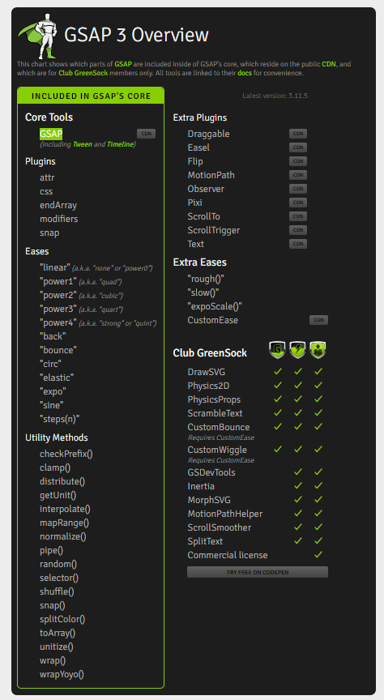

# V3-Greensock 如此简单

啥也不说先上官网：[v2-Greensock](https://greensock.com/docs/v3)

<!-- more -->

## GreenSock 动画平台文件组成



## GreenSock 动画平台文件组成说明（大概印象）

### 核心工具（8 款）

GSAP(including Tween、 Timeline、Utility Methods(17) and Core Plugins(5) )

### 插件（核心插件+拓展插件+商业插件=24 款）

- 核心插件(5 款)

  - AttrPlugin
  - CSSPlugin
  - EndArrayPlugin
  - ModifiersPlugin
  - SnapPlugin

- 拓展插件(9 款)

  - Draggable
  - EaselPlugin
  - Flip
  - MotionPathPlugin
  - Observer
  - PixiPlugin
  - ScrollToPlugin
  - ScrollTrigger
  - TextPlugin

- 商业插件(10 款)（官网将俩个 Ease 归结于插件，这里不包含）

  - DrawSVGPlugin
  - Physics2DPlugin
  - PhysicsPropsPlugin
  - ScrambleTextPlugin
  - InertiaPlugin
  - MorphSVGPlugin
  - MotionPathHelper
  - ScrollSmoother
  - SplitText
  - GSDevTools

### Ease（基础 Ease+拓展 Ease= 18 款）

- 基础 Ease

  - Power0 (a.k.a. "Linear")
  - Power1 (a.k.a. "Quad")
  - Power2 (a.k.a. "Cubic")
  - Power3 (a.k.a. "Quart")
  - Power4 (a.k.a. "Strong" or "Quint")
  - Back
  - Bounce
  - Circ
  - Elastic
  - Expo
  - Sine

**注意：在 GreenSock 2.0 后，Power0 取代了 Linear，Power1 取代了 Quad，Power2 取代了 Cubic，Power3 取代了 Quart，Power4 取代了 Quint/Strong。**

- 拓展 Ease=商业+Ease

  - RoughEase
  - SlowMo
  - ExpoScaleEase
  - SteppedEase
  - CustomEase
  - CustomBounce(商业 Eases)
  - CustomWiggle(商业 Eases)

- 弃用

  - Cubic [自 GSAP 2.0.0 起已弃用；改为使用 Power2，它是相同的]

### 工具函数(17 款)

- checkPrefix（）//获取属性的相关浏览器前缀
- clamp（）//将值箝位到范围
- distribute（）//在和数组之间分配值
- getUnit（）//获取字符串的单位
- interpolate（）//在值之间进行插值
- mapRange（）//将一个范围映射到另一个范围
- normalize（）//将范围映射到 0-1 范围
- pipe（）//序列函数调用
- random（）//生成一个随机值
- selector（）//获取一个作用域选择器函数
- shuffle（）//将数组打乱到位
- snap（）//将值捕捉到增量或数组
- splitColor（）//将颜色拆分为 RGB 数组
- toArray（）//将类似数组的东西转换为数组
- unitize（）//将指定的单位添加到函数结果中
- wrap（）//将数字放在范围内，换行开始
- wrapYoyo（）//将数字放在范围内，反向换行

```js:no-line-numbers
gsap.utils.clamp(0, 100, 105); // returns 100
gsap.utils.checkPrefix("filter");
```

## Usage

### Install（npm\pnpm）

```sh:no-line-numbers

pnpm add gsap

pnpm add -D @types/gsap

npm install gsap

npm install -D @types/gsap

```

### Import

- 最佳导出使用方式

```js:no-line-numbers
import { gsap } from "gsap";
import { PixiPlugin } from "gsap/PixiPlugin.js";
import { MotionPathPlugin } from "gsap/MotionPathPlugin.js";

//without this line, PixiPlugin and MotionPathPlugin may get dropped by your bundler (tree shaking)...
gsap.registerPlugin(PixiPlugin, MotionPathPlugin);
```

- 如果使用服务器端渲染，则可能需要在配置设置（如 nuxt.config）中将 GSAP 添加到 transfile 属性中：

```js:no-line-numbers
build: {
   transpile: ['gsap'],
},
```

- 如果使用服务器端渲染，您可能还需要检查进程是在服务器上还是在客户端上：

```js:no-line-numbers
import { gsap } from "gsap";
import { MorphSVGPlugin } from "gsap/MorphSVGPlugin";

if (process.client) {
  gsap.registerPlugin(MorphSVGPlugin);
}
```

- 我需要为每个插件添加 gsap.registerPlugin（）吗？

通常情况下，是的。如果您通过＜ script ＞标签（即不是构建工具）加载 GSAP，只要核心已经加载，GSAP 就会尝试自动注册插件，但我们仍然建议注册插件，这样构建工具就不会在树摇动时丢弃它们。

- Club Plugins

要访问 Club Plugins，请确保您已登录，然后下载文件并安装 gsap-banus.tgz 文件，而不是常规的 gsap 安装文件。

Club Plugins 仅适用于 Club GreenSock 会员，因此它们不在 CDN 上。您必须从（登录）帐户仪表板下载它们。

## 特殊属性

- target：目标 dom

- vars

  - **callbackScope: Object：我的理解提供给函数的作用域**
  - **delay: Number：动画开始前的延迟量（秒）**
  - **duration: Number：动画持续时间（秒）**
  - **ease: Ease (or Function or String)：你可以从各种 Easing 中进行选择，以控制动画过程中的变化率，给它一种特定的“感觉”。例如，Elastic.easeOut 或 Strong.easeInOut。为了获得最佳性能，使用 GreenSock 的其中一个简易程序（Linear、Power0、Power1、Power2、Power3、Power4、Quad、Cubic、Quart、Quint 和 Strong，每个程序都有.eseIn、.eseOut 和.eseInOut。当然你也可以使用它的扩展 Easing Elastic、Back、Bounce、SlowMo、SteppedEase、Rough、Circ、Expo 和 Sine）。通过名称（字符串）定义 Easing，如“Strong.eseOut”。默认值：“power1.out”。**
  - **id: 为 tween 实例分配一个唯一的标识符，以便 gsap.getById（）找到它.供其他使用**
  - immediateRender: Boolean：通常情况下，除非指定延迟，否则会等第一次渲染后，直到下一个刻度（更新周期）。将 immediateRender:true 设置为强制它在实例化时立即渲染。默认值：在 to（）函数为 false，对于 from（）和 fromTo（）函数为 true。
  - inherit: Boolean：不考虑
  - lazy: Boolean：官网：在大多数情况下，您不需要设置懒惰。官网有一个视频可以看看
  - onComplete: Function：动画完成后触发
  - onCompleteParams: Array： 用于传递 onComplete 函数的参数数组。例如，`gsap.to(“.class”，｛x:100，onComplete:myFunction，onCompleteParams:[“param1”，“param2”]})；`。
  - onInterrupt: Function：
  - onInterruptParams: Array：
  - onRepeat: Function：
  - onRepeatParams: Array：
  - onReverseComplete: Function：
  - onReverseCompleteParams: Array：
  - onStart: Function：
  - onStartParams: Array：
  - onUpdate: Function：
  - onUpdateParams: Array：
  - onUpdateScope: Object：
  - overwrite: String (or integer)：
  - paused: Boolean：paused:布尔值-如果为 true，动画将在创建时立即暂停。等待示例函数手动触发。
  - repeat: Number：
  - repeatDelay: Number：
  - repeatRefresh
  - reversed
  - runBackwards
  - stagger
  - startAt
  - yoyo: Boolea：
  - yoyoEase
  - keyframes: Boolean：
