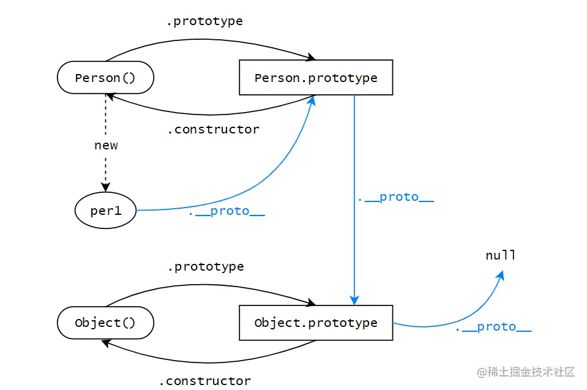
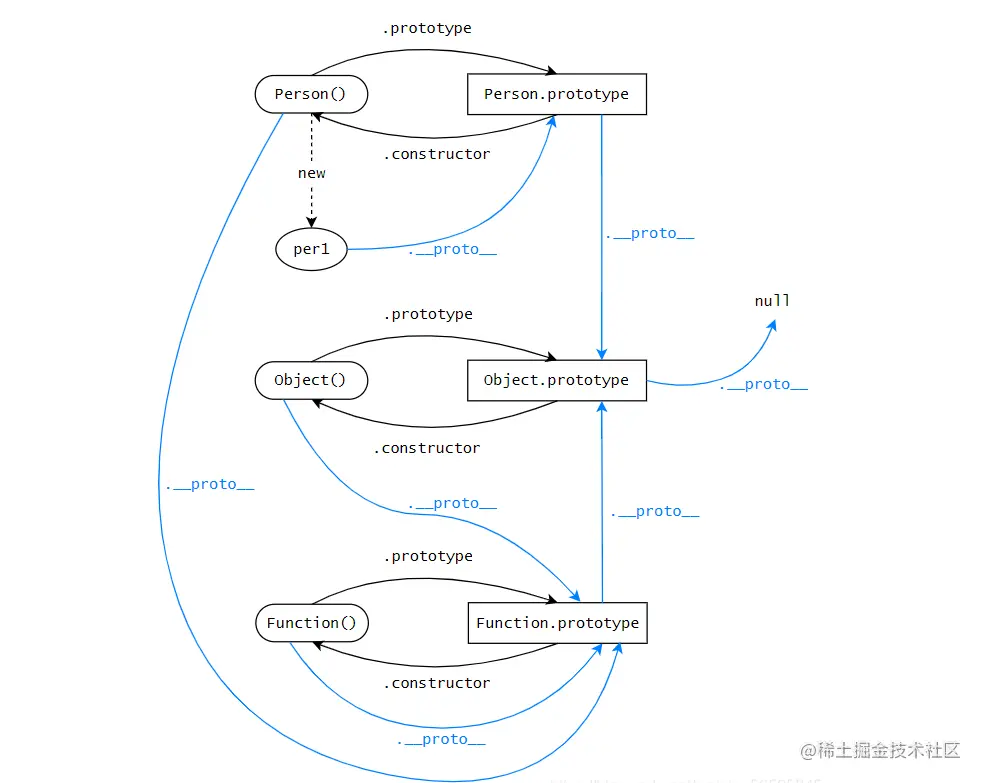

# 原型和原型链

prototype 是函数特有的属性，而函数又是引用数据类型，所以是 Object 的一种，只要是对象就有\_proto\_属性，所以函数有 prototype 和\_proto\_

通过构造函数 new 出来的对象，不再是函数了，所以没有 prototype，只有\_proto\_

<!-- more -->

## prototype 和 \_proto\_的区别

- prototype 是函数特有的属性，而函数又是引用数据类型，所以是 Object 的一种，只要是对象就有\_proto\_属性，所以函数有 prototype 和\_proto\_

- 通过构造函数 new 出来的对象，不再是函数了，所以没有 prototype，只有\_proto\_

- \_proto\_是一个对象，它有两个属性，constructor 和\_proto\_

- prototype 是一个对象，它有一个属性，constructor

- 构造函数通过 prototype 找到原型对象

- 实例对象通过\_proto\_找到原型对象，原型对象通过\_proto\_找到 Object



## constructor

构造函数（函数）通过 prototype 来访问到原型，那么原型也应该能够通过某种途径访问到构造函数，这就是 constructor

```js
console.log(Person.constructor === Function); // true
console.log(Object.constructor === Function); // true
console.log(Function.constructor === Function); // true
```

既然知道了函数的构造函数，那么函数的**proto**指向我们也就知道了，就是原型对象（注意层级可能少了，注意看图）

```js
console.log(Person.__proto__ === Function.prototype); // true
console.log(Object.__proto__ === Function.prototype); // true
console.log(Function.__proto__ === Function.prototype); // true
```


