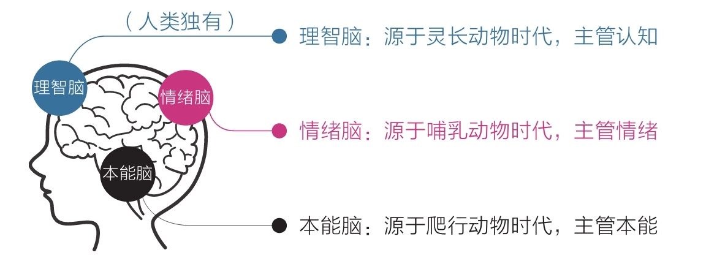

# 认知觉醒：开启自我改变的原动力

第一章：通过大脑重新认识自己

<!-- more -->

## 第一章：通过大脑重新认识自己

### 三重大脑

1. ==本能脑==

2. ==情绪脑==

3. ==理智脑==

::: center

:::
::: center

:::

### 三重大脑高低之分与权力之争

- 结论

高级的理智脑是我们人类所独有的，它使我们富有远见、善于权衡，能立足未来获得延时满足，从这个角度看，本能脑和情绪脑确实要低级些。不过我们若是因此而沾沾自喜，未免高兴得太早了，因为==理智脑虽然高级，但比起本能脑和情绪脑，它的力量实在是太弱小了==。细数起来，理智脑弱小的原因至少有以下四个方面。

- 弱小原因：

第一，从出现的年代看，本能脑已经有近 3.6 亿年的历史，情绪脑有近 2 亿年的历史，而理智脑出现的时间只有 250 万年不到。如果把本能脑比作 100 岁的老人，那情绪脑就相当于一个 55 岁的中年人，而理智脑则好比一个不满 1 岁的宝宝。可想而知，这个宝宝再聪明，若是在两个成年人面前，也会显得势单力薄。

第二，三重大脑发育成熟的时间不同。本能脑早在婴儿时期就比较完善了，情绪脑则要等到青春期早期才趋于完善，而理智脑最晚，要等到成年早期才基本发育成熟。

第三，我们的大脑里大约有 860 亿个神经元细胞，而本能脑和情绪脑拥有近八成，所以它们对大脑的掌控力更强。同时，它们距离心脏更近，一旦出现紧急情况，可以优先得到供血，这也是为什么当我们极度紧张时往往会感觉大脑一片空白，这是因为处于最外层的理智脑缺血了。

第四，本能脑和情绪脑虽然看起来很低级，但它们掌管着潜意识和生理系统，时刻掌控我们的视觉、听觉、触觉……调控着呼吸、心跳、血压……因此其运行速度极快，至少可达 11 000 000 次/秒，堪比当今世界上运行速度最快的个人计算机；而理智脑的最快运行速度仅为 40 次/秒，相比起来简直弱极了，并且理智脑运行时非常耗能。如果你是第一次听说这些，肯定会感到惊讶。

### 成长就是克服天性的过程

- 结论

让理智脑变强大并不意味着要抹杀本能脑和情绪脑，事实上也抹杀不了，它们三位一体，缺一不可。换一个角度看，也没有必要抹杀，因为本能脑强大的运算能力和情绪脑强大的行动能力，都是不可多得的宝贵资源，只要去深入了解、循循善诱，就能为己所用，甚至这些力量还是成就我们的关键。

同样，让理智脑变强也不是为了对抗或取代本能脑和情绪脑，因为用力量对抗无异于用一方的短板去挑战另一方的强项，注定是没有出路的。很多人在成长的过程中感到极度痛苦，就是因为他们总是用意志力去对抗本能和情绪，最后把自己搞得精疲力竭，却收效甚微。

为了避开这种误区，我们一定要记住：理智脑不是直接干活的，干活是本能脑和情绪脑的事情，因为它们的“力气”大；上天赋予理智脑智慧，是让它驱动本能和情绪，而不是直接取代它们。

- 理智脑发达的人更能

·立足长远，主动走出舒适区；

·为潜在的风险克制自己，为可能的收益延时满足；

·保持耐心，坚持做那些短期内看不到效果的“无用之事”；

·抵制诱惑，面对舒适和娱乐时，做出与其他人不同的选择……

### 耐心：得耐心者得天下

20 世纪八九十年代，金庸的武侠小说风靡全国。如今，虽然几十年过去了，金庸先生也已与世长辞，但他留下的作品依然广受欢迎，被奉为经典。如此成就，自然离不开他新奇的想象和优秀的文笔。但在我看来，还有一个更深层、更隐秘的原因，那就是他的故事击中了==人类天性中最原始、最本能的部分——即时满足。==

你看，金庸的故事里有很多这样的桥段：一个普通少年，经历一番奇遇，轻松练成神功，取得成就……常人需要几十年才能练成的神功，他们往往在很短的时间内就能学会，甚至一夜速成。并且故事还突出了主人公们善良的品性，似乎好运只会光顾那些心性单纯的人，让人们误以为心性单纯优于努力，要想获得成功，只要保持心性单纯就好了——人们当然愿意相信这样的结论，毕竟保持心性单纯比保持努力容易多了。

正是这种不用付出巨大努力就能获得超强能力的快感让人心驰神往，因为现实生活中无论读书、考试，还是工作、赚钱，要想表现出色都必须经受长时间的磨炼。可惜故事是故事，现实是现实，我们可以暂时沉浸在故事中，但终究要回到现实面对规则：==要想有所成就，必须保持耐心，延迟满足。==

- 那些年，我们一起误解过的耐心

从小到大，从来没有人告诉过我们耐心到底是什么、怎样才能有耐心。我们只是一次又一次地被教导：“要保持耐心！不要猴急！不要三心二意！”以至于人们对耐心这个概念的理解普遍倾向于忍受无趣、承受痛苦、咬牙坚持、硬扛到底。总之就是用意志力去对抗——如果做不到，只能说明自己意志力不强。

然而真相根本不是这样的。我们对耐心的理解过于肤浅，以致大部分时间都在痛苦中挣扎。既然耐心是如此重要的品质，我们没有理由不补上这一课。

- 缺乏耐心，是人类的天性

关于这一点，我们已经在本章第一节达成共识：缺乏耐心根本不是什么可耻的事，和自己的道德品质也全无关系，这仅仅是天生属性罢了，每个人都一样。如果你觉得这些共识仍有些虚无，那不妨再观察一下身边的婴儿、孩子和成人。

婴儿刚出生时，理智脑的作用极其微弱，全靠本能生活。出生 6 个月之内的宝宝会认为自己是全能的，整个世界会随着自己的意念而动，这可谓最强烈的即时满足；几岁的孩子可以瞬间切换笑脸和哭脸，得到满足就立即欢笑，不满足就马上暴怒，他们毫不掩饰自己即时满足和耐心不足的特性；等到上学之后，随着理智脑的发育和学识的增长，他们的耐心开始变得越来越强，小学、中学、大学时呈现明显的不同；成年后，其生理机能趋于稳定，但此时若停止自我探索，保持耐心的能力可能会永远停留在当时的水平，甚至倒退。如再仔细观察，我们不难发现，社会中的精英通常是那些能更好地克服天性的人，他们的耐心水平更高，延迟满足的能力更强。

无论从历史、现实考量，还是从生理角度看，一切关于耐心的线索都指向了理智脑这块人类独有的前额皮质上——了解这一点，对于解放自我意义重大。当然，仅仅认识自己是不够的，我们还需要将目光投向外部，看看有什么规律可以帮助我们提升耐心，毕竟内观自身和外观世界向来是一体的。

### 有用的概念

1. ==价值积累的普遍规律 :==前期增长非常缓慢，但到达一个拐点后会飞速增长。这个“世界第八大奇迹”揭示的正是这种力量，不过要想获得这种力量，我们需要冷静面对前期缓慢的增长并坚持到拐点。对于任何没有特殊资源的个体或群体来说，坚信并践行这个价值积累规律，早晚能有所成就。

   ::: center
   
   :::

2. ==舒适区边缘 :==另一个重要的规律是它揭示了能力成长的普遍法则：无论个体还是群体，其能力都以“舒适区—拉伸区—困难区”的形式分布，要想让自己高效成长，必须让自己始终处于舒适区的边缘，贸然跨到困难区会让自己受挫，而始终停留在舒适区会让自己停滞

   ::: center
   
   :::

3. ==成长权重对比 :==即对于学习而言，学习之后的思考、思考之后的行动、行动之后的改变更重要，如果不盯住内层的改变量，那么在表层投入再多的学习量也会事倍功半；因此，从权重上看，改变量﹥行动量﹥思考量﹥学习量。

   ::: center
   
   :::

很多人之所以痛苦焦虑，就是因为只盯着表层的学习量。他们读了很多书、报了很多课，天天打卡、日日坚持，努力到感动自己，但就是没有深入关注过自己的思考、和改变，所以总是感到学无所获，甚至会认为是自己不够努力，应该继续加大学习量，结果陷入了“越学越焦虑，越焦虑越学”的恶性循环。

原因仍然是我们的天性在作祟。因为单纯保持学习输入是简单的，而思考、行动和改变则相对困难。在缺乏觉知的情况下，我们会本能地避难趋易，不自觉地沉浸在表学习量中。

同时，表层学习也是最能直接看到效果的，比如今天读了一本书、学习了 5 小时、背了 100 个单词……结果都立即可见，而底层的改变则不那么容易发生，所以急于求天性也会促使我们选择前者。

“多即是少，少即是多”的辩证关系在图 1-5 中也体现得淋漓尽致：停在表层，我们就会陷入欲望漩涡，什么都想学、什么都想要，忙忙碌碌却收效甚微；若是能深入底盯住实际改变，我们就能跳出盲目、焦虑、浮躁的怪圈。

比如，读书时不求记住书中的全部知识，只要有一两个观点促使自己发生了切实的改变就足够了，其收获与意义比读很多书但仅停留在知道的层面要大得多。时常以这标准指导自己学习，我们的收获就会越来越多，焦虑就会越来越少，耐心自然也就越来越强了。

4. ==平台期 :==这个规律表明，学习进展和时间的关系并不是我们想象中的那种线性关系（学多少是多少），而是呈现一种波浪式上升曲线
   ::: center
   
   :::

几乎任何学习都是这样，刚开始的时候进步很快，然后会变慢，进入一个平台期。在平台期，我们可能付出了大量的努力，但看起来毫无进步，甚至可能退步，不过这仅仅是一个假象，因为大脑中的神经元细胞依旧在发生连接并被不停地巩固，到了某一节点后，就会进入下一个快速上升阶段。

比如在学习英语的过程中，建立一个新的语言“过滤器”，通常需要 6 个月才能突破平台期。很多人并不知道这个规律，努力坚持了 5 个月，发现自己没有进步就摇头放弃了。这样的做法真的很可惜，因为好不容易建立起的神经元连接会在放弃练习后弱化、消失，下次学习就得重新开始。而那些时常坚持用英语“熏耳朵”的人，往往会在某一天突然发现，原来听不懂的英语好像都能听懂了，这就是平台期突破的典型表现。我猜每个人在生活中都有过这样的体验。

当我们清楚了上述规律之后，就能在面对长期的冷寂或挫折失败时做出与他人不同的选择：有人选择放弃，而我们继续坚持。同时，我们不会因自己进步缓慢而沮丧，也不会因别人成长迅速而焦虑。就像写公众号，有耐心的人会牢牢盯住长远价值，他们的目光在 5 年、10 年之后，所以不会因眼下文章的阅读量低而缺失动力，也不会因别人写出了 10W+的文章（一篇文章的阅读量达到 10 万以上）而焦虑不安，毕竟各自所处的阶段不同，只要持续创造价值，别人的今天就是自己的明天。

从这个角度看，耐心不是毅力带来的结果，而是具有长远目光的结果。这也侧面回答了为什么我们需要终身学习。因为当我们知道的规律越多，就越能定位自己所处的阶段和位置、预估未来的结果，进而增强自己持续行动的耐心。毫无疑问，对外部世界的规律的认知能使我们耐心倍增。

### 怎样拥有耐心

明白缺乏耐心是自己的天性

#### ==首先，面对天性，放下心理包袱，坦然接纳自己。==

当我们明白缺乏耐心是自己的天性时，就坦然接纳吧！从现在开始，对自己表现出的任何急躁、焦虑、不耐烦，都不要感到自责和愧疚，一旦觉察自己开始失去耐心了，就温和地对自己说：“你看，我身体里那个原始人又出来了，让他离开丛林到城市生活，确实挺不容易的，要理解他。”只要你温和地与自己对话，“体内的原始人”就会愿意倾听你的意愿。当然，培养耐心的过程可能比较长，不要指望一下子就能很有耐心，如果对自己不能立即变好这件事感到焦虑，这本身就是缺乏耐心的表现。所以，培养耐心要从接受自己缺乏耐心这一事实开始。

#### ==其次，面对诱惑，学会延迟满足，变对抗为沟通。==

舒适和诱惑是本能脑与情绪脑的最爱，完全放弃舒适和诱惑就相当于和本能脑、情绪脑直接对抗，很显然，理智脑不是它们的对手，失败是迟早的事。明智的做法是和它们沟通，这也是理智脑最擅长的。就像上面自己和自己对话一样，温和地告诉它们：“该有的享受一点都不会少，只是不是现在享受，而是在完成重要的事情之后。”这是一个有效的策略，因为放弃享受，它们是不会同意的，但延迟享受，它们是能接受的。

这种“后娱乐”的好处是，将享乐的快感建立在完成重要任务后的成就感之上，很放松、踏实，就像一种奖赏；而“先娱乐”虽然刚开始很快活，但精力会无限发散，拖延重要的工作，随着时间的流逝，人会空虚、焦虑。

多次体验之后，身体里的原始人也会倾向于支持“后娱乐”，毕竟这样更舒适。如果你足够幸运，辛勤劳作之后产生的满足感也可能取代娱乐带来的直接快感——既然有高层次的享受可选，你对低层次的享受自然就不那么依赖了。

当然，习惯养成之路绝不像我讲的这般轻松，比如有时我们起床后伸手就点开了微信，那种不看不舒服的冲动实在是太强烈了。怎么办？策略依旧是和自己对话：“就看一眼推送的标题，知道有什么内容就好了，然后马上退出。”不要强行对抗，也不要自责，让冲动适当缓解一下也很有效。如果还是忍不住点进去了，那就再告诉自己：“看完这篇就立即结束。”

耐心就是这样，不能急于求成，允许自己缓慢地改变，甚至经常失败。无论结果如何，和自己对话都会产生效果。

#### ==最后，面对困难，主动改变视角，赋予行动意义。==

面对困难之事，为什么有的人很容易放弃，而有的人却能够持之以恒呢？除了知晓前面提到的各种规律，还有一个重要的原因是他们更擅长探索原理，会主动改变认知视角，来找到行动的意义和好处。比如当我们清楚了阅读的本质和意义，就可能放下手机，主动拿起书本；当我们明白了深度学习的意义，就可能放弃听书、速读，转而开始精读和输出；当我们明白了运动真正的好处，就可能告别慵懒，主动坚持锻炼。所以，要想办法看清那些想做之事的意义和好处，你看到的维度越多，耐心就会越强。

事实上，这还不是最高级的方法，你肯定想不到**最高级的方法是请本能脑和情绪脑出动来解决困难。**

是的，你没有听错！**本能脑和情绪脑确实畏惧困难、只会享乐，但谁说它们不能从困难的事情中感受到乐趣呢？对本能脑和情绪脑来说，它们根本不在乎你是在玩手机还是在解方程，它们只在乎是否舒适。科学家废寝忘食地沉迷于研究，是因为他们真的乐在其中；跑步者风雨无阻地迈腿奔跑，是因为他们自己不愿意停下，他们正舒服着呢！**

**所以，想办法让本能脑和情绪脑感受到困难事物的乐趣并上瘾，才是理智脑的最高级的策略。学会释放本能脑和情绪脑的强大力量，我们就会无往不胜！**

## 参考

- [认知觉醒：开启自我改变的原动力](认知觉醒：开启自我改变的原动力)
