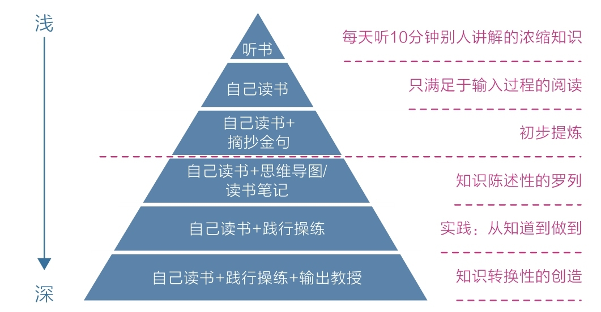

# 学习力——学习不是一味地努力

能解释的现象越多，这个概念就越底层

<!-- more -->

## 第一节　匹配：舒适区边缘，适用于万物的方法论

不管做什么，不管当前做得怎么样，只要让自己处在舒适区的边缘持续练习，你的舒适区就会不断扩大，拉伸区也就会不断扩展，原先的困难区也会慢慢变成拉伸区，甚至是舒适区，所以成长是必然的。

### 好的成长是始终游走在“舒适区边缘”

就在我写这部分内容的时候，碰巧读者“Amy 曹”跟我分享了她的几点体会，我一看内容就会心地笑了，因为她的体会正好印证了“匹配”这个关键词，所以我们不妨从她的故事开始。

第一件事说的是跑步，她说：“之前我要求自己每天跑步 1 小时，靠意志力，我坚持了蛮长一段时间，但是最后还是中断了。最近我调整了跑步的时间，改为每次 30 分钟，最好不要少于一周 4 次。调整以后发现，我可以不用太靠意志力去做这件事，而且会主动想办法坚持，并且跑完后会很放松，不像之前那样连续跑 1 小时会很累、很难受。我真的能感觉到现在这种'主动做’和原先那种'靠意志力做’完全不一样。”

第二件事说的是学英语，她说：“原来每天学习 1 小时我会烦躁，但现在改为每天学习 30 分钟，时间一到就不学了。这样，我反而可以坚持每天学，不厌倦。”

最后她总结道：“找一个自己能坚持做下去的方式，比单纯按照标准化的时间和方式做更重要。以前一直以为多花时间才能学好、才能达到效果，其实那是因为自己急于求成，想要快速见效，这样反而不容易坚持。现在降低了难度和标准，自己的行动力反而能持续增强，虽然达到目标所需的时间可能会变长，但是我相信这样的坚持最终可以产生复利效应。”

不知道你看了“Amy 曹”的故事后有何感想？在我看来，她最可贵的地方在于能够主动降低学习的强度和难度，使自己处在最佳承受范围，既保留了学习的成就感，也保证了学习的挑战性。

但是对大多数人来说，这种做法是反直觉的，因为我们想要做成一件事的时候，通常都会告诉自己要很努力、很拼，会给自己设定一个很高的标准，还会经常给自己“打鸡血”，告诉自己坚持就是胜利。这是我们默认的思考模式，只是默认的不代表就是科学的。那么科学的模式是什么呢？

回忆图 1-4 的内容，它告诉我们，最佳的学习区域在拉伸区内、舒适区边缘，在这个区域，我们既有成就又有挑战，进步最快。事实上，它就是难易匹配的意思：既不要太难，也不要太容易，难易适中的地带才是学习的心流通道。

“Amy 曹”一开始就处在困难区。由于想快速看到改变，她制订了远超自身水平的学习、训练计划，结果因体验太痛苦而中途放弃，这非常像我们常见的激励模式。很多缺少经历的年轻人都是这样的，总想同时实现太多、太大的目标，还希望在很短的时间内实现，于是不自觉地把自己推到了困难区内。他们总是兴冲冲地开始，热火朝天地做上几天，然后很快就没劲了——做事情半途而废就是这个原因。

当然，匹配原则不只适用于学习这一领域，在我能观察到的任何领域，几乎都遵循这个规律。

比如健身，我们每次推举受力的时候其实都是肌肉撕裂的过程，这种轻微的撕裂会让人产生酸痛感但不会造成伤害，经过休息和营养补充，肌肉就会开始修复，修复过后会变得更强壮，所以每次教练让我们再坚持一下，做到力竭，就是在逼迫我们走出肌肉的舒适区到拉伸区。

其他运动也是如此，比如很多人都想通过跑步来减肥，但有的人很刻苦，上来就猛冲，以为那种痛苦感就是努力的证据，其实不然，专业教练给出的方法看上去更像是一种偷懒的做法。比如教练会建议你先慢跑，到稍微气喘的时候就改为快走，等气匀了再改为慢跑，如此反复，运动半个小时。因为就减肥而言，有氧运动前 20 分钟消耗的主要是身体里的糖，30 分钟之后消耗脂肪的比例才会有较大幅度的上升。所以我们只需每次到舒适区的边缘坚持一下，然后回到舒适区停留一下，调整好了再到舒适区边缘……如此反复。在接下来的 10~15 分钟，如果体力允许，就尽量快跑，或者强度至少比前 30 分钟再大一点，以便消耗更多的脂肪，因为此时身体已经适应了一定的强度，可以离舒适区边缘再远一些。

再说阅读。很多人喜欢向能人索要书单，认为能人们推荐的书肯定很好。他们按照书单兴冲冲地买一大堆回家，读的时候才发现那些书根本没能人们说的那么好，有些书晦涩、难懂、根本读不下去，没过几天，他们的兴趣就消失了。这是因为每个人的知识背景不同，同样一本书，能人们读起来可能刚好在拉伸区，但我们读起来则在困难区。所以，这个时候，不妨先把这本书放一放，去看那些自己感兴趣、又刚好能读懂的书，让兴趣、难度、需求同时匹配到舒适区边缘，这样的书肯定会让你读得津津有味。

再说说学习。成绩不好的同学想要奋起直追，想到的第一件事往往是努力比拼，于是他们也和成绩好的同学一样去做那些比较难的题目，结果人家学得挺轻松，自己却学得很痛苦，差距越拉越大。因为学习同样的内容，成绩好的同学可能刚好在拉伸区，但自己可能在困难区。此时，正确的做法应该是先沉住气，主动降低学习难度。

知道了这个原理以后，我们就应该花大量的时间去梳理哪些内容处在自己的拉伸区，即梳理那些“会做但特别容易错或不会做但稍微努力就能懂”

的内容，然后在这个区域内努力。如果你已经为人父母，那就应该花大量的时间探寻孩子的拉伸区，然后指导他们在舒适区的边缘努力，而不是看到孩子考不好就一味冲着他们发脾气，说别人家的孩子如何如何，对标优等生，给孩子加学习量、加难度，这样做往往会适得其反。

另外，很多人说自己学习时经常分心走神、不够专注，其实原因也是一样的，因为他们可能并没有刻意关注自己学习内容的难易程度、调整学习的快慢节奏。

### 距离太远的，我们都把握不住

面对那些不需要努力，甚至是令人享受的事物时，我们又该如何呢？比如突然有了大量的时间和金钱。我想很多人肯定希望时间和金钱越多越好，不过我劝你一定要谨慎，因为距离我们太远的事物，我们通常无法把握，无论它们是令人痛苦的还是令人享受的。

面对那些不需要努力，甚至是令人享受的事物时，我们又该如何呢？比如突然有了大量的时间和金钱。我想很多人肯定希望时间和金钱越多越好，不过我劝你一定要谨慎，因为距离我们太远的事物，我们通常无法把握，无论它们是令人痛苦的还是令人享受的。

2019 年暑假，一位年轻的老师在向我提问的时候说：“别人羡慕我有寒暑假，但我一点也不喜欢，因为自己根本没有能力掌控这些大量的空余时间。不仅计划一个没实现，连作息时间也乱作一团。可以说，我对假期简直一点控制力都没有。”

很多学生也经常给我留言，说上了大学之后，一下子没有了高三时的那种紧张感，虽然刚开学的时候还算自律，但很快就开始变得懒散，宅在寝室里打游戏、刷抖音，无法专心学习，尤其是独处、时间由自己支配的时候，总是不自觉地选择最舒适的娱乐活动。这其实就是自由时间超出了自己的掌控——他们失控了。

千万不要认为没有管束的生活很美好，一旦进入完全自由的时间，虽然开始会很舒服，但很快，我们就会迷失在众多选项中——做这个也行，做那个也行。做选择是一件极为耗能的事情，如果没有与之匹配的清醒和定力，绝大多数人最终都会被强大的天性支配，去选择娱乐消遣。在有约束的环境下我们反而效率更高，生活更充实。

至于突然获得巨额财富这种事，估计大多数人都很难有这样的运气，不过我们可以看看别人的经历。2002 年，英国男子卡罗尔中了 970 万英镑奖金，一夜之间从垃圾工成了超级富翁，然后他开始买豪宅、买名车、吸毒、赌博，7 年后，其财富被挥霍一空，妻子离他而去，他不得不重做苦力，靠救济金生活；2006 年，英国女子温迪·格雷厄姆中了 100 万英镑奖金，结果奖金在一年内被花光，该女子沦为穷光蛋。据统计，在美国，每年彩票中奖者的破产率高达 75%。以此为戒，我们一定要保持清醒，认真审视自己控制欲望的能力，不要让悲剧发生。

理想的状态是持续获取与自己当前能力相匹配的财富或自由。这一点，做父母的应该有所启示：我们要关注孩子当前对自由、财富的掌控程度，在适当的时候适当放权或鼓励，这样的父母才是真正明智的。那些溺爱孩子的父母，往往在孩子很小的时候就给他们很大的决策权，让他们自己决定吃什么、玩什么、做什么，但孩子根本没有相应的掌控能力，最后变成了自以为是、自私自利的人，造成这些后果的原因正是我们缺少对匹配这个概念的认识。

人们常说底层概念、底层规律，那到底什么是底层呢？在我眼中，能解释的现象越多，这个概念就越底层。所以你掌握了匹配原则之后，就可以自己解释其他事情了，比如有人问你：“练习写作是日更好还是周更好？”你可以这样回答：“不管采用哪种方式，关键是你有没有让自己处在舒适区的边缘进行练习。如果输出的东西都是在舒适区随便写写的，那写再多也没用。”这样的回答既能给出开放的答案，又能抓住问题的本质。

从这个底层概念中我们可以得到这样一个结论：**不管做什么，不管当前做得怎么样，只要让自己处在舒适区的边缘持续练习，你的舒适区就会不断扩大，拉伸区也就会不断扩展，原先的困难区也会慢慢变成拉伸区，甚至是舒适区，所以成长是必然的。**

同时，我们也可以肯定：速成是不可能的。因为能力圈只能一点一点扩大，所以只要我们遵循匹配规律，不断在舒适区边缘拓展自己，同时愿意和时间做朋友，那么我们注定可以持续成长，重塑自己。

### 一切为了匹配

推导出从舒适区到拉伸区的策略

- 拆解目标

比如，我们每次行动遇阻时都会一筹莫展，但只要细想就能发现，不管你遇到的是什么问题，其根源都是一样的，那就是：这个问题太大、太模糊。所以，你只要拆解目标——把大目标拆分为小目标，任务就会立即从困难区转移到拉伸区，这样你就愿意行动了。不信的话，你可以细心观察一下，几乎所有的行动达人都是拆解任务的高手。

- 提炼目标

在舒适区内行动最大的特点就是不动脑筋地重复，这种状态下，人们凭习惯和感觉做事，没有特别需要关注的东西，所以学习的时候分心走神，跑步的时候分心走神，睡觉的时候也分心走神，这样，做什么事都不会有太大的长进。

在拉伸区练习的一大特点就是要有关注点。关注点越多、越细致，我们的注意力就越集中，提升的效果就越明显，因此，跳出舒适区的最好办法就是去发现和收集那些要点，也就是每次行动的小目标。比如练习弹钢琴的时候，不是一遍一遍地重复，而是只练出错最多的地方；比如背单词的时候，不是一遍一遍地重复，而是看完之后合上书进行自我测试，把出错的单词找出来，然后不停地重复记这些出错的单词，直到全部掌握。

目标清晰了之后，“极度专注”也自然能做到了，然后通过自我测试、反思、错题本这些方式获得反馈，这样做能不断优化自己关注的要点和小目标。

学习不只是一味地努力，成长也不只需要“打鸡血”、拼意志力。只要站在舒适区边缘，一点一点往外走，同时和时间做朋友，你肯定会在不经意间发生蜕变。

## 第二节　深度：深度学习，人生为数不多的好出路

时间拨到数十年之后，我们的社会发生了巨变，人类进入了前所未有的物质和信息丰富时代。现今，学习已经不必如此费劲、艰辛，人们有太多方式可以让自己轻松地获取知识，比如每天听一本书、参加名人的线上课、订阅名家专栏或参加某某学习社群，等等，轻松高效，干货满满，只要自己持之以恒，就肯定能有所成就。

可惜这只是一种错觉。科技和信息虽然在我们这一代发生了巨大的发展，但人类的学习机制并未随之快速变化，我们大脑的运作模式几乎和几百年前一样。更坏的消息是，丰富的信息和多元的方式带来便捷的同时，也深深地损耗着人们深度学习的能力，并且这种倾向越来越明显。

**种种迹象表明，快速、简便、轻松的方式使人们避难趋易、急于求成的天性得到了放大，理智脑的潜能受到了抑制，而深度学习的能力几乎全部依赖高级理智脑的支撑。**

我隐约看到：一小部分知识精英依旧直面核心困难，努力地进行深度钻研，生产内容；而大多数信息受众始终在享受轻度学习，消费内容。如果我们真的希望在时代潮流中占据一席之地，那就应该尽早抛弃轻松学习的幻想，锤炼深度学习能力，逆流而上，成为稀缺人才，否则人生之路势必会越走越窄。

### 何为深度学习

1946 年，美国学者埃德加·戴尔提出了“学习金字塔”理论。之后，美国缅因州国家训练实验室也通过实验发布了“学习金字塔”报告，报告称：人的学习分为被动学习和主动学习两个层次（见图 5-1）。

被动学习：如听讲、阅读、视听、演示，这些活动对学习内容的平均留存率为 5%、10%、20%和 30%。

主动学习：如通过讨论、实践、教授给他人，将被动学习的内容留存率提升到 50%、75%和 90%。

::: center

:::

这个模型很好地展示了不同学习深度和层次之间的对比。反观自身的学习，我们同样可以清晰地划分出不同的层次。如图 5-2 所示，以阅读为例，从浅到深依次为：听书、自己读书、自己读书+摘抄金句、自己读书+思维导图/读书笔记、自己读书+践行操练、自己读书+践行操练+输出教授。

::: center

:::

**当前有很多听书产品，读书达人用十几分钟解读一本书，假设我们一天听一本，一年就能听 300 多本，这种便捷新颖、浓缩干货的学习方式看似轻松高效，实则处于被动学习的最浅层。**

**好一点的情况是读原书，但若是读完从不回顾、思考，只满足于输入的过程，这类学习的知识留存率很低。几天之后就想不起自己读了什么。更糟的是，这种努力会让人盲目追求阅读的速度和数量，让人产生勤奋的感觉，实际上，这是低水平的勤奋，投入越多损失越大。**

**还有一类人的数量也不少。这类人能够自己阅读，也做读书笔记或思维导图，但遗憾的是，他们的读书笔记往往只是把书中的内容梳理罗列了一番，看起来更像是一个大纲。很多人醉心于此，似乎对全书的知识了然于胸，殊不知，自己只是做了简单的搬运工作而已。虽然这种做法在一定程度上属于主动学习，但它仅仅是简单的知识陈述，与高级别的知识转换有很大的不同。**

**更深一层的是，读完书能去实践书中的道理，哪怕有那么一两点内容让生活发生了改变，也是很了不起的，因为从这一刻开始，书本中的知识得到了转化。**

从知道到做到是一种巨大的进步，然而自己知道或做到是一回事，让别人知道或做到又是另外一回事。不信你可以试着将自己知道的东西向别人清晰地陈述，你会发现这并不容易。明明心里想得挺明白，讲的时候就开始语无伦次了，如果再让你把知道的东西写下来呢？你可能会觉得根本无从下笔。

请注意，遇到这种困难才是深度学习真正的开始！因为你必须动用已有的知识去解释新知识，当你能够把新学的知识解释清楚时，就意味着把它纳入了自己的知识体系，同时达到了可以教授他人的水平，并可能创造新的知识。

罗振宇曾提到他是这样学习的：“我每天要求自己写够五篇阅读心得，不用长篇大论，短短几个词就行。因为真正的学习就像是缝扣子，把新知识缝接到原有的知识结构中，每天写五篇阅读心得就是逼迫自己原来的知识结构对新知识做出反应，然后把这些反应用文字固化下来，缝接的过程就完成了。”

可见“缝接”是深度学习的关键，而大多数人只完成了“获取知识”，却忽略了“缝接知识”这一步，因此，他们的学习过程是不完整的。有些人做了一定的缝接，但缝接得不够深入，没有高质量的产出，也使学习深度大打折扣。

浅层学习满足输入，深度学习注重输出。从想法到语言再到文字，即将网状的思维变成树状的结构再变成线性的文字，相当于把思想从气态变成液态再变成固态——那些固态的东西才真正属于自己。毕竟任何知识都不可避免地会损耗，并且这种损耗一直存在，如果不想办法把自己学到的东西固定下来，时间一长，这些知识就会烟消云散，留不下多少痕迹。

有了自己的东西，便一定要教授出去，教授和缝接会相互巩固，形成循环。《暗时间》的作者刘未鹏说：“教”是最好的“学”，如果一件事情你不能讲清楚，十有八九你还没有完全理解。当然，教的最高境界是用最简洁的话让一个外行人明白你讲的东西。

**所以，逼迫自己获取高质量的知识以及深度缝接新知识，再用自己的语言或文字教授他人，是为深度学习之道。**

### 如何深度学习

深度学习有以下 3 个步骤：

- （1）获取高质量的知识；

- （2）深度缝接新知识；

- （3）输出成果去教授。

**这样的学习必然要放弃快学、多学带来的安全感，要耗费更多的时间，面临更难的处境，甚至还会“备受煎熬”。但请一定相信：正确的行动往往是反天性的，让你觉得舒服和容易的事往往得不到好结果，而一开始你认为难受和困难的事才能让你真正产生收获，所以我们可以通过以下几个方法逐步改进。**

- **一是尽可能获取并亲自钻研一手知识。**

比如，我们可以读经典、读原著，甚至读学术论文。经典的一手知识已经经过时间的沉淀，其价值已被证明，值得精耕细读。我们要放弃那些“几分钟读完……”“每天一本……”“十堂……课”的干货幻想，虽然这些方法也能带来一些启示，但终究是支离破碎、被人咀嚼过的。亲自钻研虽然更艰辛，但能感受到深度理解产生的真正快感，这比吸收浅薄的二手知识不知道要舒服多少倍。读书这件事最好不要请人代劳，从长远看，终归是要自己获得挖矿的能力的。

- **二是尽可能用自己的话把所学的知识写出来。**

每读完一本有价值的好书，就用写作的方式把作者的思想用自己的语言重构出来，尽力结合自身经历、学识、立场，去解释、去延伸，而不是简单地把书本的要点进行罗列。因为简单的知识陈述无法达到深度缝接的效果，只有做到知识转换才能用旧知识体系对新知识进行深度缝接，所以在重构时，我们可以只取最触动自己的观点，其他观点可以放弃，即使它们很有道理。如有机会，我们还可以花足够长的时间去打磨一个主题或观点，当一个你精心打磨的作品打动了别人，它产生的影响力将远比每天都写但缺乏深度的思考要大得多。而且，写作具有复利效应，我们写的文章随时可能被他人读到，这样也间接达到了讨论交流和教授他人的目的。

- **三是反思生活。**

学习不止读书，生活经历同样可以被深度学习。比如《好好学习》一书的作者成甲就非常注重反思，他每天早上大约要花 2 小时进行复盘反思，还要求自己的员工也这样做。他在书中花大量笔墨阐述了反思的方法和好处，他说：人与人之间的差距不是来自年龄，甚至不是来自经验，而是来自经验总结、反思和升华的能力。

受这个理念的影响，我从 2017 年 2 月开始坚持每天写复盘反思，有时几句话，有时上千字。通过持续反思，很多没想明白的事情想清楚了，很多模糊的概念变清晰了，很多看似并无关联的事情居然有了底层的联通。持续反思让我对生活细节的感知能力变得越来越强，从生活中获得的东西也越来越多。这部分内容的立意与构思也来自平日的反思。如果让我推荐一个不可或缺的习惯，我必推每日反思。

### 深度学习的好处

**深度学习除了能让我们不再浮躁，能磨炼理智，还能带来诸多好处，比如跨界能力的提升。**古典在《你的生命有什么可能》一书中提到，人的能力分为知识、技能和才干三个层次：知识是最不具迁移能力的，你成为医学博士，也照样有可能不会做麻婆豆腐；技能通常由 70%的通用技能和 30%的专业技能组成，迁移性要好一些；而到了才干层面，职业之间的界限就完全被打破了。

这就解释了为什么一些人能够轻易地跨界，因为他们通过深度学习已经拥有了某些才干，而这些才干在其他领域同样适用，所以他们只需要花少量的时间熟悉知识与技能就玩得转。但反过来，如果你不具备某些才干，当你换到其他行业时，只能重新开始培养底层的知识和技能，这就非常吃力了。

**深度学习还能让人产生更多灵感。**我们知道爱因斯坦是在去专利局上班的路上，看到伯尔尼钟楼时突然冒出了一个假设：“如果公交车以光速移动，那么从车上看，钟楼的指针会不会是静止的呢？”这个假设使 20 世纪最伟大的发现之一——狭义相对论走入人们的视野。而德国化学家凯库勒是在非常疲劳的情况下做了个梦，梦到一条首尾相咬的蛇，这条蛇成了他发现苯分子结构的线索。人们都惊叹科学家们的直觉和灵感，但假设爱因斯坦和凯库勒不具备深度学习的能力，他们就不会获得这些直觉和灵感。只有在自己的领域探索得足够深入时，灵感才可能在潜意识的帮助下显现。虽然我们不是科学家，但深度学习也能让我们更大概率地收获意外的惊喜。

**与此同时，深度学习还能让我们看到不同事物之间更多的关联，产生洞见。**比如我曾带女儿去看电影《西游记之女儿国》，剧中女儿国国王与唐僧经历生死之后对他说：“我做了一个梦，多年以后，你蓄满长发，和我一起慢慢变老，但是，你并不开心。”我立即感慨道，这就是“未来视角”啊，国王用未来视角回望现在，然后做出了理智的决定，克制了自己的感情，放唐僧西行。因为一周前我正好写了一篇关于未来视角的文章——《用什么来拯救你的行动力》，换作以前，我肯定是对此无感的。而女儿看到的只是国王好漂亮，孙悟空好搞笑……

不仅如此，如果自己在一些领域的认知积累得足够多，那么，即便是面对影视节目、娱乐八卦或新闻热点等这些分散人们注意力的事物时，也同样能调动高级认知，把它们与有益的思考关联起来，产生更深刻、更独特的见解。

据我所知，很多严肃的成长者同样喜欢娱乐消遣，比如李笑来就喜欢看电影。我敢说，当他们身处娱乐环境时，依旧是理智脑作主导，他们能不自觉地关联认知、获得启发，而非单纯地满足本能脑和情绪脑的原始需求。

娱乐热点并非没有价值，浅层知识也同样具有意义，但前提是你需要具备一定的认知深度——深度之下的广度才是有效的。

### 为浅学习正名

说了这么多深度学习，那么我们应该如何对待网络上那些知识专栏、精品课、听书等产品呢？彻底拒绝或远离吗？我觉得并不需要，因为深度学习与浅学习其实并不冲突，浅学习也有其价值，关键是不要搞反它们的权重关系。我们可以把浅学习作为了解新信息的入口，但不能把成长的需求全部寄托于此，更合理的态度是：专注于深度学习，同时对浅学习保持开放。

选择一些值得关注的人，和他们保持联结。他们释放的一些有价值的信息会引领我们走向更广阔的世界，但无论如何，最终要自己去读、自己去想、自己去做。

就像这本书，如果它触动了你，也仅仅是为你开启了一个新的视角，最终能否获取深度学习的能力，只能靠你自己行动，没有人能够代替。

## 第三节　关联：高手的“暗箱”

关联，正是高手们的秘密，但因形式隐蔽，常不为人所知，故而形成了暗箱。

### 无关联，不学习

::: center

:::

如果你了解人类大脑的学习原理，就很容易从这幅图联想到大脑中神经元工作的情景。因为无论是学习动作，还是背记公式，从本质上来说都是大脑中神经细胞建立连接的过程。用神经科学术语解释就是：通过大量的重复动作，大脑中两个或者多个原本并不关联的神经元经过反复刺激产生了强关联。如果没有关联这个过程，就算有再多脑细胞，你也不会变得更聪明。

鉴于此，我时常也鼓励人们写作。因为单纯阅读时，人容易满足于获取新知识，而一旦开始写作，就必须逼迫自己把所学的知识关联起来，所以写作就是一条深度学习的自然路径。

放眼看去，按照关联意识的强弱，人在不知不觉间被分成了两个群体：绝大多数人习惯以孤立的思维看待事物，喜欢花大量时间收集和占有信息；而另一批先行者则更喜欢拨弄信息之间的关联，从而在不知不觉间变得聪明了起来。

### 事不关己，不关联

充分运用关联，确实能快速提高人的能力，但这并不意味着我们需要随时随地把所见所闻通通关联起来，那既不可能，也无必要。天下事物之多，如何能关联殆尽？所以，我们在关联时，需要牢牢聚焦自身最迫切的需求，换句话说，就是让**一切与自己有关。**

一次，考文带着一大摞新书在机场等飞机起飞，他一边翻书一边跟记者聊天，2 小时过去了，飞机快起飞了，考文也翻得差不多了。他留下一两本，把剩下的书都丢给了记者，说：“你要感兴趣你就拿走，你要不感兴趣就直接扔了吧。”

普通人觉得要是不把书读完，实在是对不起作者或是自己花出去的钱，但经济学家考文却觉得他这样做很划算。因为只有真正和自己有关的内容才对自己有用，**在这个注意力非常匮乏的时代，没有必要把所有的书或是书中所有的内容都读完。**

想来也是，一本书再好，我们也无法记住全部内容。回头一翻，很多内容就像没看过一样，但那些被自己关联过的观点和知识却很难被忘记，让自己发生改变的观点必定印象更加深刻。这也反过来印证了前文：知识的获取不在于多少，而在于是否与自己有关联，以及这种关联有多充分。对别人有用的东西可能与自己并没有关系，那就果断将其放弃，把握“与自己有关”的筛选原则，会让关联效能大大提升。

当然，还有一个更重要的隐蔽条件不能忽视：你需要明确的目标或强烈的需求。张继钢之所以能将佛像关联为舞蹈，把薄膜关联成五环图案，是因为他是一个艺术工作者，有强烈的创作需求。这就好比你手中有了一把锤子，其他事物看起来才会更像是钉子，能为你所用的东西才会变多。一个心中迷茫、漫无目的人，即使置身各种情景和知识中，也看不到有益的关联，纵使辛勤努力，也终是竹篮打水一场空。

### 如何获取关联能力

成为大师并不神奇，只要开启了暗箱，我们也有机会成为大师。关联能力能够让人加速演化，获取杠杆。结合上文，我们很容易梳理出几条实现路径。

- 首先，手中有锤子。

**如果你对某件事情没有足够的热爱和投入，没有极致的专注和思考，恐怕任何事物对你都没有意义。**张继钢的访谈节目是我 10 年前看的，如果不是因为现在手中有了写作这把“锤子”，这个故事可能再也不会被我想起。

- 其次，输入足够多。

不管是阅读获取，还是现实经历，知识和阅历越丰富，成功关联的概率就越大。很难想象空白的头脑和苍白的人生如何建立精彩的关联。所谓巧妇难为无米之炊，面对满屋子的食材，拙妇也能随便弄出点花样来，所以，**多走走、多看看，多阅读、多反思。人生没有白走的路，每一步都算数。**

- 再次，保持好奇心。

瓦特好奇壶盖为什么会被热气顶起来，牛顿好奇苹果为什么会往地上落……这世间最伟大的哲思蕴藏在万事万物中，越不起眼的小事越有可能通过关联产生至深的启发。**不过对于成人来说，做到这一点可不容易，若不时常净化自己，像孩子一样保持纯净，怕也只是遇到了任何事都见怪不怪、视而不见，所以，成长这件事不仅仅是提高认知，更是一种自我修炼。**

- 最后，常说一句话。

**总有一些话让人听过一次就难以忘记，比如李笑来的这句话我就一直记在脑中：“这个道理还能用在什么地方？”很多高手都是这样学习的，比如混沌大学创办人李善友看书的时候，每看到一个有用的知识，都会停下来寻找联系，看看有什么其他的现象能够被这个理论解释。不找出 5 个现象他是不会罢休的。**

他们都有意无意地坚持着这个思维准则：但凡收获一个感悟、了解一个观点或是学到一个知识，只要触动了自己，就要想办法让它效率最大化，而效率最大化的办法就是主动关联到别处，并让自己的行动发生改变。所以你不妨也把这句话当作口头禅，时常问自己：这个道理还能用在什么地方？

### 一切在于主动

瓦特关联了壶盖，牛顿关联了苹果，爱因斯坦关联了钟，凯库勒关联了蛇，伟大的方法论始终存在，只是被极小部分人运用了，若是我们打开了暗箱，可不能再对其熟视无睹，全凭运气撞进暗箱啊！

我们很小就学过“关联”这个词，也在无数场合听过“关联”这个词，但谁能想到它竟是进阶的天梯呢？从今日起，请你重新认识它，主动运用它、传递它，让它不再隐藏、不再模糊。我相信肯定有人会因为主动使用了它而变得与众不同。

放眼未来，我似乎看到一大波有识之士正在知识和技能的进阶之路上不断崛起……
