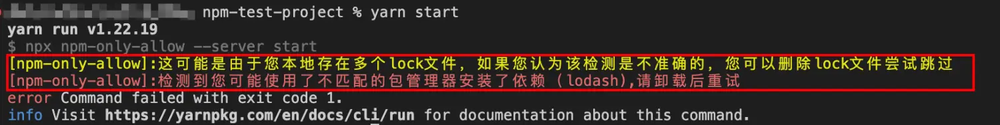
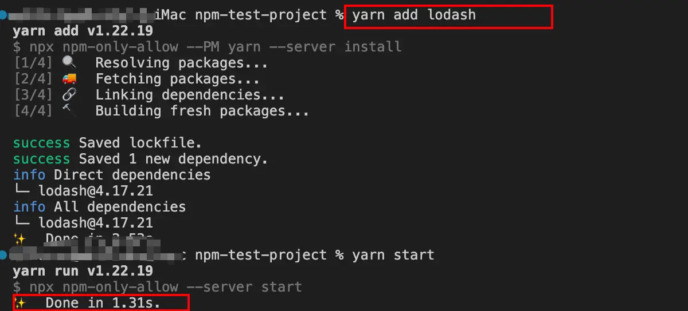

# NPM 工程化插件

## npm-run-all

<!-- more -->

npm-run-all 是一个 cli 工具，可以并行、或者按顺序执行多个 npm 脚本；npm-run-all 在 vite 工具源码中有使用；

通俗点讲就是为了解决官方的 npm run 命令 无法同时运行多个脚本的问题，它可以把诸如 npm run clean && npm run build:css && npm run build:js && npm run build:html 的一长串的命令通过 glob 语法简化成 npm-run-all clean build:\* 一行命令。

提供三个命令：

-s：为 npm-run-all --serial 的缩写(串行)；
-p：为 npm-run-all --parallel 的缩写(并行)；

### 依次执行(串行)这三个任务命令

```sh:no-line-numbers
npm-run-all clean lint build
```

### 同时执行(并行)这两个任务命令

```sh:no-line-numbers
npm-run-all --parallel lint build
```

### 先串行执行 a 和 b, 再并行执行 c 和 d

```sh:no-line-numbers
npm-run-all -s a b -p c d
```

## concurrently

并行执行多个任务命令

```sh:no-line-numbers
"start": "concurrently \"command1 arg\" \"command2 arg\""

npm run start
```

## wait-on

提供了一种方便的方法来确保进程只在某些进程就绪时发生

```sh:no-line-numbers
wait-on file1 && NEXT_CMD # wait for file1, then exec NEXT_CMD
wait-on f1 f2 && NEXT_CMD # wait for both f1 and f2, the exec NEXT_CMD
wait-on http://localhost:8000/foo && NEXT_CMD # wait for http 2XX HEAD
wait-on https://myserver/foo && NEXT_CMD # wait for https 2XX HEAD
wait-on http-get://localhost:8000/foo && NEXT_CMD # wait for http 2XX GET
wait-on https-get://myserver/foo && NEXT_CMD # wait for https 2XX GET
wait-on tcp:4000 && NEXT_CMD # wait for service to listen on a TCP port
wait-on socket:/path/mysock # wait for service to listen on domain socket
wait-on http://unix:/var/SOCKPATH:/a/foo # wait for http HEAD on domain socket
wait-on http-get://unix:/var/SOCKPATH:/a/foo # wait for http GET on domain socket
```

```sh:no-line-numbers
"electron:serve": "concurrently \"pnpm run serve\" \"wait-on tcp:3100 && pnpm run start\""
```

## npm-only-allow

```shell
"preinstall": "npx npm-only-allow@latest --PM pnpm"
```

只允许 pnpm preinstall 脚本会在 install 之前执行，现在，只要有人运行 npm install 或 yarn install，就会调用 npm-only-allow 去限制只允许使用 pnpm 安装依赖。

### 统一安装

npm i 它可以正确给出提示（而且是中文的，更加友好），且不会生产 node_modules。 可以看到，安装错误后生成了.pnpm-debug.log 文件



### 单个安装

执行 npm i lodash，我发现是没有被拦截掉的，翻了下文档后发现，是需要在项目执行时才会针对单独安装进行检测的，则执行 npm run start，发现会被正确拦截，并且列出了哪个依赖被错误安装了

此时，再使用正确的包管理器 pnpm (pnpm add lodash）后，再重启测试，发现程序运行正常



## pnpm

-F 后面是子目录 package.json 的 name
-C 后面是子目录 名称

```shell
"project:report": "pnpm run -F @jingluo/project report",
"project:build": "pnpm run -C project build",
```
