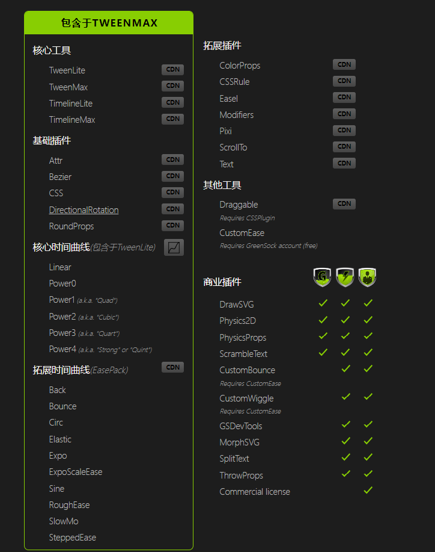

# V2-Greensock 如此简单

啥也不说先上官网：[v2-Greensock](https://greensock.com/docs/v2)

<!-- more -->

## GreenSock 动画平台文件组成



## GreenSock 动画平台文件组成说明（大概印象）

### 工具（核心工具+其他工具=8 款）

- 核心工具 4 款

  - TweenLite
  - TweenMax
  - TimelineLite
  - TimelineMax

- 其他工具 4 款
  - VelocityTracker
  - Draggable
  - SplitText（按照官网解释也属于插件）
  - GSDevTools（按照官网解释也属于插件）

### 插件（基础插件+拓展插件+商业插件=20 款）

- AttrPlugin
- BezierPlugin
- CSSPlugin
- DirectionalRotationPlugin
- RoundPropsPlugin
- ColorPropsPlugin
- CSSRulePlugin
- EaselPlugin
- ModifiersPlugin
- MorphSVGPlugin
- PixiPlugin
- ScrollToPlugin
- TextPlugin
- 商业
  - DrawSVGPlugin
  - Physics2DPlugin
  - PhysicsPropsPlugin
  - ScrambleTextPlugin
  - RaphaelPlugin
  - SplitText
  - GSDevTools
  - ThrowPropsPlugin
  - TweenPlugin

### 时间轴（核心时间轴+拓展时间轴=26 款）

- 核心时间轴

  - Linear
  - Power0
  - Power1
  - Power2
  - Power3
  - Power4
  - Quad
  - Quart
  - Quint
  - Strong

- 拓展时间轴

  - Back
  - Bounce
  - Circ
  - Elastic
  - Expo
  - ExpoScaleEase
  - Sine
  - SlowMo
  - SteppedEase
  - Ease
  - EaseLookup
  - RoughEase

- 弃用

  - Cubic [自 GSAP 2.0.0 起已弃用；改为使用 Power2，它是相同的]

- 待考察

  - CustomBounce
  - CustomWiggle
  - CustomEase

## Usage

### Install（npm\pnpm）

```sh:no-line-numbers
pnpm add gsap

npm install gsap
```

### Import

最佳导出使用方式

TweenMax 包括 TweenSite、TimelineLite、TimelineMax、CSSPlugin、RoundPropsPlugin、BezierPlugin、DirectionalRotationPlugin、AttrPlugin，以及除 CustomEase、CustomWiggle 和 CustomBounce 之外的 All Eases ）

```js:no-line-numbers
import { TweenMax, TimelineLite, Power2, Elastic, CSSPlugin } from "gsap/TweenMax";
```

## 特殊属性

- target：目标 dom

- duration：动画持续时间

- vars

  - **autoCSS: Boolean：默认情况下情况下该插件会自动解析 vars 对象中的 css 属性，无需再定义 css 对象将其包含。但是有时并非需要，可设置 false。当然官网说如果不信任此设置，可手动创建 css 对象包含 css 属性，事实上，这会稍微提高速度(除非你同时在 tweet 上处理数千个 DOM 元素，否则速度的提高可能是无法察觉的)。**
  - callbackScope: Object
  - **delay: Number：动画开始前的延迟量（秒）**
  - **ease: Ease (or Function or String)：你可以从各种 Easing 中进行选择，以控制动画过程中的变化率，给它一种特定的“感觉”。例如，Elastic.easeOut 或 Strong.easeInOut。为了获得最佳性能，使用 GreenSock 的其中一个简易程序（Linear、Power0、Power1、Power2、Power3、Power4、Quad、Cubic、Quart、Quint 和 Strong，每个程序都有.eseIn、.eseOut 和.eseInOut。当然你也可以使用它的扩展 Easing Elastic、Back、Bounce、SlowMo、SteppedEase、Rough、Circ、Expo 和 Sine）。通过名称（字符串）定义 Easing，如“Strong.eseOut”。当然开通会员开可以自定义,上官网[Easing](https://greensock.com/docs/v2/Easing)**
  - immediateRender: Boolean：通常，当您创建一个 tween 时，它会在下一帧（更新周期）开始渲染，除非您指定延迟。但是，如果希望在创建 tween 时强制其立即渲染，请将 immediateRender 设置为 true。（并非立即触发动画和等待触发条件动画而是针对浏览器帧动画）
  - lazy: Boolean：官网最后一句话在大多数情况下，您不需要设置懒惰。
  - onComplete: Function
  - onCompleteParams: Array
  - onCompleteScope: Object
  - onOverwrite: Function
  - onReverseComplete: Function
  - onReverseCompleteParams: Array
  - onReverseCompleteScope: Object
  - onStart: Function
  - onStartParams: Array
  - onStartScope: Object
  - onUpdate: Function
  - onUpdateParams: Array
  - onUpdateScope: Object
  - overwrite: String (or integer)
  - paused: Boolean：paused:布尔值-如果为 true，动画将在创建时立即暂停。等待示例函数手动触发。
  - useFrames: Boolean
  - repeat: Number
  - yoyo: Boolea
  - repeatDelay: Number
  - smoothChildTiming: Boolean

## TweenLite

<ClientOnly>
  <TweenLite></TweenLite>
</ClientOnly>
