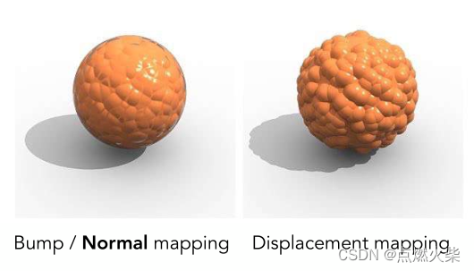

# 深入理解

<!-- more -->

## Three 内部顶点坐标转化

视图矩阵=包含：视点（camera.position）、上方向（camera.up）、观察目标（camera.lookAt）

顶点坐标=透视投影矩阵（PerspectiveCamera） X 视图矩阵 X 模型矩阵（平移、缩放、旋转） X 原始顶点坐标（物理模型、几何模型）

顶点坐标=正射投影矩阵（OrthographicCamera） X 视图矩阵 X 模型矩阵（平移、缩放、旋转） X 原始顶点坐标（物理模型、几何模型）

## 点线三角形立体 (BufferGeometry 的探讨)

==WebGL 只提供了点、线、三角形开发技巧==

==当有索引顶点存在时，Three 更改的只有绘制函数 drawElement==

==Three 对多面体采用的是索引顶点绘制==

### 从 WeBGl 中分析缓存区的创建

==注意，数据：包含多个类型：点坐标、点大小、点颜色等==

- 创建缓存区
- 绑定缓存区到 webgl 内部目标（目标缓存区）
- 向目标缓存区写入数据
- 分配包含数据的目标缓存区指定变量（顶点着色器或片元着色器变量）

  ==注意：这里并不是把坐标交给变量，我理解类似一个关联引用==

- 开启（我理解给变量赋值）

### 从 Three 中分析缓存区的创建

```js
const points = new THREE.Points(geometry, material); //点模型对象
```

我理解这一步才是缓存区创建的真正过程，只是省略了。

```js
const geometry = new THREE.BufferGeometry(); //
const vertices = new Float32Array([
  0,
  0,
  0, //顶点1坐标
  50,
  0,
  0, //顶点2坐标
  0,
  100,
  0, //顶点3坐标
  0,
  0,
  10, //顶点4坐标
  0,
  0,
  100, //顶点5坐标
  50,
  0,
  10, //顶点6坐标
]);
// 3个为一组，表示一个顶点的xyz坐标
const attribue = new THREE.BufferAttribute(vertices, 3);
geometry.attributes.position = attribue;
const material = new THREE.PointsMaterial({
  color: 0xffff00,
  size: 10.0, //点对象像素尺寸
});
```

这几步只是对点坐标的融合

## BufferAttribute

```class
class  BufferAttribute{
  constructer(array : TypedArray, itemSize : Integer, normalized : Boolean){

  }
}
```

我理解：在 WebGL 中顶点坐标是复杂的：可能包含顶点、颜色和索引。所以在分配数据到目标缓存区，要指明 size、 stride 和 offset。

size=itemSize（分量个数）

stride=TypedArray.BYTES_PER_ELEMENT\*itemSize

offset:偏移

我理解：Three 的顶点坐标设计是分开的顶点、颜色和索引始终不会在一起。所以 size=itemSize（分量个数）、 stride=0、offset=0

综上：BufferAttribute 中的构造 itemSize 也就是分量个数

## 关于顶点坐标的变化的探讨

先看公式：

视图矩阵=包含：视点（camera.position）、上方向（camera.up）、观察目标（camera.lookAt）

顶点坐标=透视投影矩阵（PerspectiveCamera） X 视图矩阵 X 模型矩阵（平移、缩放、旋转） X 原始顶点坐标（物理模型、几何模型）

顶点坐标=正射投影矩阵（OrthographicCamera） X 视图矩阵 X 模型矩阵（平移、缩放、旋转） X 原始顶点坐标（物理模型、几何模型）

## 材质

==Three、WebGL 材质可以是纹理，可以是颜色。==

== 获取纹理的网站：https://www.poliigon.com/ 、https://www.unrealengine.com/zh-CN/bridge==

==物理网格材质(MeshPhysicalMaterial)比标准网格材质(MeshStandardMaterial)更高级、更逼真，代价也高出很多。==

Three 材质设置哪些纹理

- .side : Integer

定义将要渲染哪一面 - 正面，背面或两者。 默认为 THREE.FrontSide。其他选项有 THREE.BackSide 和 THREE.DoubleSide。

- .transparent : Boolean 。默认值为 false。

定义此材质是否透明。这对渲染有影响，因为透明对象需要特殊处理，并在非透明对象之后渲染。
设置为 true 时，通过设置材质的 opacity 属性来控制材质透明的程度。

- .opacity : Float。默认值为 1.0。

在 0.0 - 1.0 的范围内的浮点数，表明材质的透明度。值 0.0 表示完全透明，1.0 表示完全不透明。
如果材质的 transparent 属性未设置为 true，则材质将保持完全不透明，此值仅影响其颜色。 默认值为 1.0。

- .map：颜色贴图。可以选择包括一个 alpha 通道，通常与.transparent 或.alphaTest。默认为 null。

- .alphaMap：alpha 贴图是一张灰度纹理，用于控制整个表面的不透明度。（黑色：完全透明；白色：完全不透明）。 默认值为 null。

仅使用纹理的颜色，忽略 alpha 通道（如果存在）。 对于 RGB 和 RGBA 纹理，WebGL 渲染器在采样此纹理时将使用绿色通道， 因为在 DXT 压缩和未压缩 RGB 565 格式中为绿色提供了额外的精度。 Luminance-only 以及 luminance/alpha 纹理也仍然有效。

- .aoMap : Texture

该纹理的红色通道用作环境遮挡贴图。默认值为 null。==aoMap 需要第二组 UV==。

- .aoMapIntensity : Float

环境遮挡效果的强度。默认值为 1。零是不遮挡效果。

**环境遮挡效果使折痕、洞、交叉点和彼此靠近的表面变暗。在现实世界中，这些区域往往会遮挡或遮挡环境光，所以它们看起来更暗。**

**环境光遮挡是指阻挡对象上的间接或漫反射光线。它指对象的较暗区域，通常为折痕、裂缝和缺口这些地方较暗。**

- .bumpMap : Texture

用于创建凹凸贴图的纹理。黑色和白色值映射到与光照相关的感知深度。凹凸实际上不会影响对象的几何形状，只影响光照。如果定义了法线贴图，则将忽略该贴图。

- .bumpScale : Float

凹凸贴图会对材质产生多大影响。典型范围是 0-1。默认值为 1。

**凹凸贴图是只有黑白一维的图，它这个黑白值表示模型表面的高度。注意不是最后生成黑白，而是指 bumpMap 需要的是黑白图**

**凹凸贴图是指计算机图形学中在三维环境中通过纹理方法来产生表面凹凸不平的视觉效果。它主要的原理是通过改变表面光照方程的法线，而不是表面的几何法线来模拟凹凸不平的视觉特征，如褶皱、波浪等等。凹凸贴图的实现方法主要有：偏移向量凹凸纹理和改变高度场。**

- .displacementMap : Texture

位移贴图会影响网格顶点的位置，与仅影响材质的光照和阴影的其他贴图不同，移位的顶点可以投射阴影，阻挡其他对象， 以及充当真实的几何体。位移纹理是指：网格的所有顶点被映射为图像中每个像素的值（白色是最高的），并且被重定位。

- .displacementScale : Float

位移贴图对网格的影响程度（黑色是无位移，白色是最大位移）。如果没有设置位移贴图，则不会应用此值。默认值为 1。

- .displacementBias : Float

位移贴图在网格顶点上的偏移量。如果没有设置位移贴图，则不会应用此值。默认值为 0。

**位移贴图可以使曲面的几何体产生位移。 它的效果与使用位移修改器相类似。 与凹凸贴图不同，位移贴图实际上更改了曲面的几何体或面片细分。**

**位移贴图和凹凸贴图使用的是一样的纹理，输入是一样的，但位移贴图会真的把顶点做一个位置移动（前后）。呈现的效果也是不一样的，如下图左侧凹凸贴图在渲染过程中改变法线，欺骗人们的眼睛，仔细观察会发现表面虽然看起来凹凸不平，凸起的部分也没有阴影，而位移贴图是实际改变了几何体的顶点，凸起部分会有阴影，效果也更加真实，但是是需要代价的，几何体的顶点数量要足够多，多到可以支持凹凸部分平滑变化**



== 注意 1：几何体的顶点数量与细分有关系。例如：BoxGeometry 构造函数最后分量可以增多几何体的顶点。==

== 注意 2：displacementScale 的设置需要结合，几何体宽、高、半径等去计算。例如设置 BoxGeometry(1,1,1,10,10,10),而这时 displacementScale 默认为 1，就导致立方体表面的顶点突出都为 1。所以导致 BoxGeometry 不好看。这是就要将 displacementScale 设置的小于 1，现在我想到的设置办法只能自己去实践。==

- .roughness : Float

材质的粗糙程度。0.0 表示平滑的镜面反射，1.0 表示完全漫反射。默认值为 1.0。如果还提供 roughnessMap，则两个值相乘。

- .roughnessMap : Texture

该纹理的绿色通道用于改变材质的粗糙度。

- .metalness : Float

材质与金属的相似度。非金属材质，如木材或石材，使用 0.0，金属使用 1.0，通常没有中间值。 默认值为 0.0。0.0 到 1.0 之间的值可用于生锈金属的外观。如果还提供了 metalnessMap，则两个值相乘。

- .metalnessMap : Texture

该纹理的蓝色通道用于改变材质的金属度。

**金属度， 粗糙度 :这两张是黑白的**

- .normalMap : Texture

用于创建法线贴图的纹理。RGB 值会影响每个像素片段的曲面法线，并更改颜色照亮的方式。法线贴图不会改变曲面的实际形状，只会改变光照。 In case the material has a normal map authored using the left handed convention, the y component of normalScale should be negated to compensate for the different handedness.

- .normalMapType : Integer

法线贴图的类型。

选项为 THREE.TangentSpaceNormalMap（默认）和 THREE.ObjectSpaceNormalMap。

- .normalScale : Vector2

法线贴图对材质的影响程度。典型范围是 0-1。默认值是 Vector2 设置为（1,1）。

**呈蓝紫色的 RGB 图，通过 Normal map 的法线信息改变对模型上的光照计算，表现在不增加顶点的情况下增加物体表面凹凸细节的视觉效果。**

- .envMap : Texture

环境贴图，为了能够保证物理渲染准确，您应该添加由 PMREMGenerator 预处理过的环境贴图，默认为 null。

- .envMapIntensity : Float

通过乘以环境贴图的颜色来缩放环境贴图的效果。

**环境贴图表示你所绘制物体的环境。如果你正在绘制室外场景它将表示室外环境。如果你正在绘制舞台上的人它将表示会场。如果你正在绘制外太空那它会是星星。 如果我们有能够展现从空间中一点看向 6 个方向的 6 张图片，我们可以用这 6 张图片实现环境贴图。当然也可以是一张图实现。**

> > 补：

关于场景 Scene 中的环境贴图

- .background : Object

若不为空，在渲染场景的时候将设置背景，且背景总是首先被渲染的。 可以设置一个用于的“clear”的 Color（颜色）、一个覆盖 canvas 的 Texture（纹理）， 或是 a cubemap as a CubeTexture or an equirectangular as a Texture。默认值为 null。

- .backgroundBlurriness : Float

设置背景的模糊度。仅影响分配给 Scene.background 的环境贴图。有效输入是介于 0 和 1 之间的浮点值。默认值为 0。

- .environment : Texture

若该值不为 null，则该纹理贴图将会被设为场景中所有物理材质的环境贴图。 然而，该属性不能够覆盖已存在的、已分配给 MeshStandardMaterial.envMap 的贴图。默认为 null。

**六张图设置 Scene.background 实现环境贴图效果，不需要任何设置直接采用 CubeTextureLoader 加载**

**一张图设置 Scene.background 实现环境贴图效果，需要加载出纹理后，修改属性.mapping 映射方式。具体属性参考官网选择**

> > THREE.UVMapping
> > THREE.CubeReflectionMapping
> > THREE.CubeRefractionMapping
> > THREE.EquirectangularReflectionMapping（使用这个是属性）
> > THREE.EquirectangularRefractionMapping
> > THREE.CubeUVReflectionMapping

## 纹理（Texture）

### 纹理（Texture）

- .offset : Vector2

贴图单次重复中的起始偏移量，分别表示 U 和 V。 一般范围是由 0.0 到 1.0。

- .center : Vector2

旋转中心点。(0.5, 0.5)对应纹理的正中心。默认值为(0,0)，即左下角。.center : Vector2

- .rotation : number

纹理将围绕中心点旋转多少度，单位为弧度（rad）。正值为逆时针方向旋转，默认值为 0。

- .repeat : Vector2

决定纹理在表面的重复次数，两个方向分别表示 U 和 V，如果重复次数在任何方向上设置了超过 1 的数值， 对应的 Wrap 需要设置为 THREE.RepeatWrapping 或者 THREE.MirroredRepeatWrapping 来 达到想要的平铺效果。

- .wrapS : number

这个值定义了纹理贴图在水平方向上将如何包裹，在 UV 映射中对应于 U。
默认值是 THREE.ClampToEdgeWrapping，即纹理边缘将被推到外部边缘的纹素。 其它的两个选项分别是 THREE.RepeatWrapping 和 THREE.MirroredRepeatWrapping。 请参阅 texture constants 来了解详细信息。

==ClampToEdgeWrapping 是默认值，纹理中的最后一个像素将延伸到网格的边缘。==

==使用 MirroredRepeatWrapping， 纹理将重复到无穷大，在每次重复时将进行镜像。==

==使用 RepeatWrapping，纹理将简单地重复到无穷大。 With RepeatWrapping the texture will simply repeat to infinity.==

- .wrapT : number

这个值定义了纹理贴图在垂直方向上将如何包裹，在 UV 映射中对应于 V。
可以使用与 .wrapS : number 相同的选项。

- .mapping : number

图像将如何应用到物体（对象）上。默认值是 THREE.UVMapping 对象类型， 即 UV 坐标将被用于纹理映射。
请参阅 texture constants（映射模式常量）来了解其他映射类型。

> > THREE.UVMapping
> > THREE.CubeReflectionMapping
> > THREE.CubeRefractionMapping
> > THREE.EquirectangularReflectionMapping
> > THREE.EquirectangularRefractionMapping
> > THREE.CubeUVReflectionMapping

这些常量定义了纹理贴图的映射模式。
UVMapping 是默认值，纹理使用网格的坐标来进行映射。

其它的值定义了环境映射的类型。

CubeReflectionMapping 和 CubeRefractionMapping 用于 CubeTexture —— 由 6 个纹理组合而成，每个纹理都是立方体的一个面。 对于 CubeTexture 来说，CubeReflectionMapping 是其默认值。

EquirectangularReflectionMapping 和 EquirectangularRefractionMapping 用于等距圆柱投影的环境贴图，也被叫做经纬线映射贴图。等距圆柱投影贴图表示沿着其水平中线 360° 的视角，以及沿着其垂直轴向 180° 的视角。贴图顶部和底部的边缘分别对应于它所映射的球体的北极和南极。

==待解==

- .magFilter : number

  当一个纹素覆盖大于一个像素时，贴图将如何采样。默认值为 THREE.LinearFilter， 它将获取四个最接近的纹素，并在他们之间进行双线性插值。 另一个选项是 THREE.NearestFilter，它将使用最接近的纹素的值。
  请参阅 texture constants 页面来了解详细信息。

==这些常量用于纹理的 magFilter 属性，它们定义了当被纹理化的像素映射到小于或者等于 1 纹理元素（texel）的区域时，将要使用的纹理放大函数。==

==NearestFilter 返回与指定纹理坐标（在曼哈顿距离之内）最接近的纹理元素的值。==

==LinearFilter 是默认值，返回距离指定的纹理坐标最近的四个纹理元素的加权平均值， 并且可以包含纹理的其他部分中，被包裹或者被重复的项目，具体取决于 wrapS 和 wrapT 的值，and on the exact mapping。==

- .minFilter : number

当一个纹素覆盖小于一个像素时，贴图将如何采样。默认值为 THREE.LinearMipmapLinearFilter， 它将使用 mipmapping 以及三次线性滤镜。

==这些常量用于纹理的 minFilter 属性，它们定义了当被纹理化的像素映射到大于 1 纹理元素（texel）的区域时，将要使用的纹理缩小函数。==

==除了 NearestFilter 和 LinearFilter， 下面的四个函数也可以用于缩小：==

==NearestMipmapNearestFilter 选择与被纹理化像素的尺寸最匹配的 mipmap， 并以 NearestFilter（最靠近像素中心的纹理元素）为标准来生成纹理值。==

==NearestMipmapLinearFilter 选择与被纹理化像素的尺寸最接近的两个 mipmap， 并以 NearestFilter 为标准来从每个 mipmap 中生成纹理值。最终的纹理值是这两个值的加权平均值。==

==LinearMipmapNearestFilter 选择与被纹理化像素的尺寸最匹配的 mipmap， 并以 LinearFilter（最靠近像素中心的四个纹理元素的加权平均值）为标准来生成纹理值。==

==LinearMipmapLinearFilter 是默认值，它选择与被纹理化像素的尺寸最接近的两个 mipmap， 并以 LinearFilter 为标准来从每个 mipmap 中生成纹理值。最终的纹理值是这两个值的加权平均值。==

### 纹理加载器（TextureLoader、CubeTextureLoader、DataTextureLoader）

- TextureLoader

基本纹理映射加载器

- CubeTextureLoader

加载六面的环境贴图

p 代表坐标轴的正方向

n 代表坐标轴负方向

- DataTextureLoader

RGBELoader 作为其子类

加载更高质量的图片文件，例如：hdr（HDR）

用于加载二进制文件格式的(rgbe, hdr, ...)的抽象类。 内部使用 FileLoader 来加载文件， 和创建一个新的 DataTexture.

### 纹理加载管理器（LoadingManager,）

## 阴影

- 材质要满足能够对光照有反应
- 设置渲染器开启阴影的计算 renderer.shadowMap.enabled=true
- 设置光照投射阴影 light.castShadow=true
- 设置物体投射阴影 mesh.castShadow : Boolean
- 设置物体接受阴影 mesh.receiveShadow : Boolean

灯光阴影属性

==不是所有光都会产生阴影==

### .shadow : DirectionalLightShadow

DirectionalLightShadow 对象，用于计算该平行光产生的阴影。
