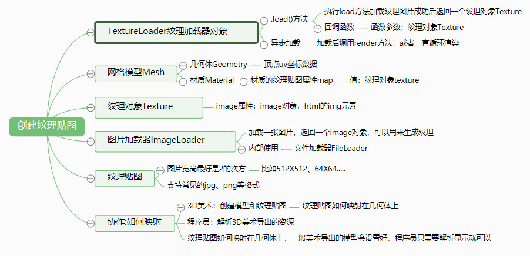
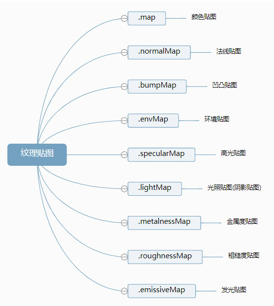
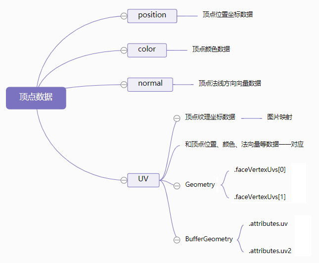
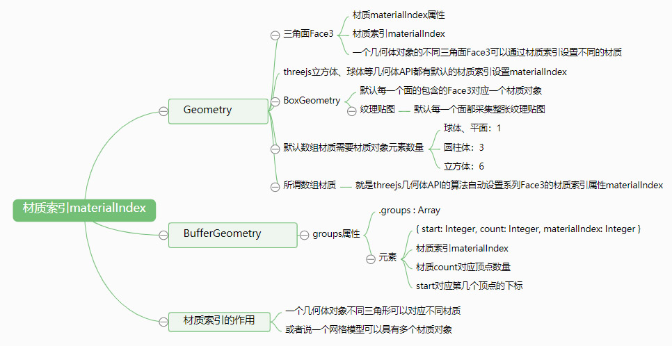

# 理解 ThreeJS API 以及属性

Three 纹理贴图



<!-- more -->

## 纹理对象 Texture

通过图片加载器 ImageLoader 可以加载一张图片，所谓纹理对象 Texture 简单地说就是，纹理对象 Texture 的.image 属性值是一张图片。

```js
// 图片加载器
var ImageLoader = new THREE.ImageLoader();
// load 方法回调函数，按照路径加载图片，返回一个 html 的元素 img 对象
ImageLoader.load("/img/earth.jpg", function (img) {
  // image 对象作为参数，创建一个纹理对象 Texture
  var texture = new THREE.Texture(img);
  // 下次使用纹理时触发更新
  texture.needsUpdate = true;
  var material = new THREE.MeshLambertMaterial({
    map: texture, //设置纹理贴图
  });
  var mesh = new THREE.Mesh(geometry, material); //网格模型对象 Mesh
  scene.add(mesh); //网格模型添加到场景中
});
```

## 纹理对象 TextureLoader

材质的颜色贴图属性.map 设置后，模型会从纹理贴图上采集像素值，这时候一般来说不需要再设置材质颜色.color。.map 贴图之所以称之为颜色贴图就是因为网格模型会获得颜色贴图的颜色值 RGB。

```js
// 纹理贴图映射到一个矩形平面上
var geometry = new THREE.PlaneGeometry(204, 102); //矩形平面
// TextureLoader创建一个纹理加载器对象，可以加载图片作为几何体纹理
var textureLoader = new THREE.TextureLoader();
// 执行load方法，加载纹理贴图成功后，返回一个纹理对象Texture
textureLoader.load("/img/earth.jpg", function (texture) {
  var material = new THREE.MeshLambertMaterial({
    // color: 0x0000ff,
    // 设置颜色纹理贴图：Texture对象作为材质map属性的属性值
    map: texture, //设置颜色贴图属性值
  }); //材质对象Material
  var mesh = new THREE.Mesh(geometry, material); //网格模型对象Mesh
  scene.add(mesh); //网格模型添加到场景中
  //纹理贴图加载成功后，调用渲染函数执行渲染操作
  // render();
});
```

## 纹理





从图纹理坐标可以看出几何体都有两组 UV 坐标（BufferGeometry 对应 uv，uv2|Geometry 对应 UVS[0],UVS[1]），第一组组用于.map、.normalMap、.specularMap 等贴图的映射，第二组用于阴影贴图.lightMap 的映射，这里不过过多阐述，本章除了即将讲述的“光照贴图添加阴影”小节，用到的是第二组 UV（uv2、UVS[1]） 坐标，其它的章节内部程序用到的都是第一组 UV（uv、UVS[0]） 坐标。

## 自动定义纹理坐标

### Geometry 自定义顶点 UV 坐标

几何体 Geometry 自定义了一个由两个三角形组成的矩形几何体，并且通过几何体的.faceVertexUvs[0]属性设置了每个顶点对应的第一组 UV 坐标。

### BufferGeometry 自定义顶点 UV 坐标

几何体 BufferGeometry 自定义了一个由两个三角形组成的矩形几何体，并且通过几何体的.attributes.uv 属性设置了每个顶点对应的第一组 UV 坐标。

### 加载一个包含 UV 坐标的模型文件

下面案例代码是通过 Threejs 加载一个包含 UV 坐标的外部三维模型文件，加载成功后，给模型设置一张贴图：

```js
// 创建一个加载threejs格式JSON文件的加载器
var loader = new THREE.ObjectLoader();
// TextureLoader创建一个纹理加载器对象，可以加载图片作为几何体纹理
var textureLoader = new THREE.TextureLoader();
loader.load("model.json", function (obj) {
  console.log(obj);
  scene.add(obj); //加载返回的对象插入场景中
  // 执行load方法，加载纹理贴图成功后，返回一个纹理对象Texture
  textureLoader.load("Earth.png", function (texture) {
    // 设置球体网格模型材质的map属性
    obj.children[0].material.map = texture;
    // 告诉threejs渲染器系统，材质对象的map属性已更新
    obj.children[0].material.needsUpdate = true;
  });
});
```

### 数组材质

你可以测试把数组材质作为几何体的纹理贴图，所谓数组材质就是多个材质对象构成一个数组作为模型对象的材质。

```js
var geometry = new THREE.BoxGeometry(100, 100, 100); //立方体
// var geometry = new THREE.PlaneGeometry(204, 102, 4, 4); //矩形平面
// var geometry = new THREE.SphereGeometry(60, 25, 25); //球体
// var geometry = new THREE.CylinderGeometry(60, 60, 25,25); //圆柱
//
// 材质对象1
var material_1 = new THREE.MeshPhongMaterial({
  color: 0xffff3f,
});
var textureLoader = new THREE.TextureLoader(); // 纹理加载器
var texture = textureLoader.load("/img/earth.jpg"); // 加载图片，返回Texture对象
// 材质对象2
var material_2 = new THREE.MeshLambertMaterial({
  map: texture, // 设置纹理贴图
  // wireframe:true,
});
// 设置材质数组
var materialArr = [material_2, material_2, material_1, material_2, material_1, material_1];

// 设置数组材质对象作为网格模型材质参数
var mesh = new THREE.Mesh(geometry, materialArr); //网格模型对象Mesh
scene.add(mesh); //网格模型添加到场景中
```

### 材质索引属性

三角形面 Face3 可以设置材质索引属性.materialIndex,Face3.materialIndex 指向数组材质中的材质对象，表达的意思是数组材质中哪一个元素用于渲染该三角形面 Face3。

通过材质属性 Face3.materialIndex 的介绍，你应该可以明白上面案例代码中数组材质的渲染规律。

```js
var geometry = new THREE.BoxGeometry(100, 100, 100); //立方体
// 你可以测试 BoxGeometry、PlaneGeometry、CylinderGeometry 三角形面的材质索引
// 查看 face3 对象的 materialIndex 属性
console.log(geometry.faces);
geometry.faces.forEach((elem) => {
  console.log(elem.materialIndex);
});
```

自定义 Face3 的材质索引案例（部分版本 three.js 不支持）：

```js
var geometry = new THREE.PlaneGeometry(204, 102, 4, 4); //矩形平面
// 材质对象 1
var material1 = new THREE.MeshPhongMaterial({
  color: 0xffff3f,
  // wireframe:true,
});
// 材质对象 2
var material2 = new THREE.MeshPhongMaterial({
  color: 0x0000ff,
  // wireframe:true,
}); //材质对象 Material
// 数组材质
var materialArr = [material1, material2];
// 设置几何体的材质索引(对于 PlaneGeometry 而言所有 Face3 的材质索引默认 0)
geometry.faces[4].materialIndex = 1; // 这里的值是materialArr的索引
geometry.faces[5].materialIndex = 1; // 这里的值是materialArr的索引
var mesh = new THREE.Mesh(geometry, materialArr); //网格模型对象 Mesh
```



## 纹理对象 Texture 阵列、偏移、旋转

### 阵列

纹理贴图阵列映射。

```js
var texture = textureLoader.load("太阳能板.png");
// 设置阵列模式   默认ClampToEdgeWrapping  RepeatWrapping：阵列  镜像阵列：MirroredRepeatWrapping
texture.wrapS = THREE.RepeatWrapping;
texture.wrapT = THREE.RepeatWrapping;
// uv两个方向纹理重复数量
texture.repeat.set(4, 2);
```

### 偏移

**不设置阵列纹理贴图，只设置偏移：**

```js
var textureLoader = new THREE.TextureLoader();
var texture = textureLoader.load("太阳能板2.png"); // 加载纹理贴图
// 不设置重复  偏移范围-1~1
texture.offset = new THREE.Vector2(0.3, 0.1);
```

**阵列纹理贴图的同时，进行偏移设置：**

```js
// 设置阵列模式
texture.wrapS = THREE.RepeatWrapping;
texture.wrapT = THREE.RepeatWrapping;
// uv两个方向纹理重复数量
texture.repeat.set(4, 2);
// 偏移效果
texture.offset = new THREE.Vector2(0.5, 0.5);
```

**纹理旋转**

```js
var texture = textureLoader.load("太阳能板.png"); // 加载纹理贴图
// 设置纹理旋转角度
texture.rotation = Math.PI / 4;
// 设置纹理的旋转中心，默认(0,0)
texture.center.set(0.5, 0.5);
console.log(texture.matrix);
```

### 案例：草地效果

提供一张宽高尺寸比较小的草地贴图，然后通过该贴图设置一片范围比较广的草地效果，这时候阵列贴图是比较好的选择。

```js
/**
 * 创建一个地面
 */
var geometry = new THREE.PlaneGeometry(1000, 1000); //矩形平面
// 加载树纹理贴图
var texture = new THREE.TextureLoader().load("grass.jpg");
// 设置阵列
texture.wrapS = THREE.RepeatWrapping;
texture.wrapT = THREE.RepeatWrapping;
// uv两个方向纹理重复数量
texture.repeat.set(10, 10);
var material = new THREE.MeshLambertMaterial({
  map: texture,
  side: THREE.DoubleSide,
});
var mesh = new THREE.Mesh(geometry, material); //网格模型对象Mesh
scene.add(mesh); //网格模型添加到场景中
mesh.rotateX(-Math.PI / 2);
```

### 纹理动画

纹理动画比较简单，必须要在渲染函数中 render()一直执行 texture.offset.x -= 0.06 动态改变纹理对象 Texture 的偏移属性.offset 就可以。

```js
// 渲染函数
function render() {
  renderer.render(scene, camera); //执行渲染操作
  requestAnimationFrame(render);
  // 使用加减法可以设置不同的运动方向
  // 设置纹理偏移
  texture.offset.x -= 0.06;
}
render();
/**
 * 创建一个设置重复纹理的管道
 */
var curve = new THREE.CatmullRomCurve3([new THREE.Vector3(-80, -40, 0), new THREE.Vector3(-70, 40, 0), new THREE.Vector3(70, 40, 0), new THREE.Vector3(80, -40, 0)]);
var tubeGeometry = new THREE.TubeGeometry(curve, 100, 0.6, 50, false);
var textureLoader = new THREE.TextureLoader();
var texture = textureLoader.load("/img/threejs/run.jpg");
// 设置阵列模式为 RepeatWrapping
texture.wrapS = THREE.RepeatWrapping;
texture.wrapT = THREE.RepeatWrapping;
// 设置x方向的偏移(沿着管道路径方向)，y方向默认1
//等价texture.repeat= new THREE.Vector2(20,1)
texture.repeat.x = 20;
var tubeMaterial = new THREE.MeshPhongMaterial({
  map: texture,
  transparent: true,
});
```

.jpg)
