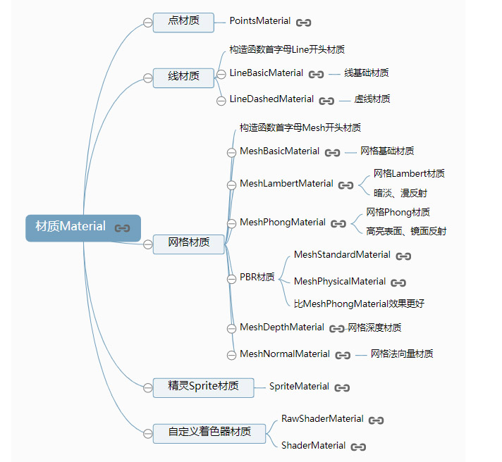

# 理解 ThreeJS API 以及属性

Three 材质



<!-- more -->

## 点材质

```js
var geometry = new THREE.SphereGeometry(100, 25, 25); //创建一个球体几何对象
// 创建一个点材质对象
var material = new THREE.PointsMaterial({
  color: 0x0000ff, //颜色
  size: 3, //点渲染尺寸
});
//点模型对象  参数：几何体  点材质
var point = new THREE.Points(geometry, material);
scene.add(point); //网格模型添加到场景中

// 几何体直接使用点材质
var geometry1 = new THREE.SphereGeometry(100, 25, 25);
var material1 = new THREE.PointsMaterial({
  //点材料
  color: 0xff0000, //颜色
  size: 3, //点渲染尺寸
}); //材质对象
var mesh1 = new THREE.Mesh(geometry1, material1); //网格模型对象Mesh
scene.add(mesh1); //网格模型添加到场景中
```

## 球体表面都是线(线材质)：LineBasicMaterial 和 LineDashedMaterial

线材质有基础线材质 LineBasicMaterial 和虚线材质 LineDashedMaterial 两个，通常使用使用 Line 等线模型才会用到线材质。

### 基础线材质 LineBasicMaterial。

```js
var geometry = new THREE.SphereGeometry(100, 25, 25); //球体
// 直线基础材质对象
var material = new THREE.LineBasicMaterial({
  color: 0x0000ff,
});
var line = new THREE.Line(geometry, material); //线模型对象
scene.add(line); //点模型添加到场景中
```

### 虚线材质 LineDashedMaterial。

```js
// 虚线材质对象：产生虚线效果
var material = new THREE.LineDashedMaterial({
  color: 0x0000ff,
  dashSize: 10, //显示线段的大小。默认为 3。
  gapSize: 5, //间隙的大小。默认为 1
});
var line = new THREE.Line(geometry, material); //线模型对象
// computeLineDistances 方法 计算 LineDashedMaterial 所需的距离数组
line.computeLineDistances();
```

## 网格材质：MeshBasicMaterial、MeshLambertMaterial 和 MeshPhongMateria
