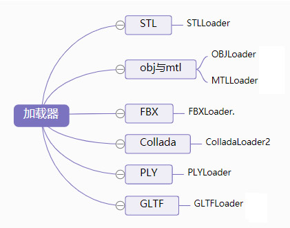

# 理解 ThreeJS API 以及属性

模型导出导入

使用三维软件导出.obj 模型文件的时候，会同时导出一个材质文件.mtl， .obj 和.stl 文件包含的信息一样都是几何体顶点相关数据，材质文件.mtl 包含的是模型的材质信息，比如颜色、贴图路径等。



<!-- more -->

## 加载 Three.js 导出的模型数据

### 缓冲几何体数据加载器：

```js
var loader = new THREE.BufferGeometryLoader();
loader.load("bufferGeometry.json", function (geometry) {
  // 控制台查看加载放回的 threejs 对象结构
  console.log(geometry);
  var material = new THREE.MeshLambertMaterial({
    color: 0x0000ff,
  }); //材质对象 Material
  var mesh = new THREE.Mesh(geometry, material); //网格模型对象 Mesh
  scene.add(mesh); //网格模型添加到场景中
});
```

### 网格模型 Mesh 加载，包含几何体 Geometry 和材质 Material：

```js
var loader = new THREE.ObjectLoader();
loader.load("model.json", function (obj) {
  console.log(obj);
  console.log(obj.type);
  obj.scale.set(100, 100, 100);
  scene.add(obj);
});
```

### 加载组 Group 对象，模型对象构成的树结构：

```js
var loader = new THREE.ObjectLoader();
loader.load("group.json", function (obj) {
  console.log(obj);
  console.log(obj.type);
  scene.add(obj);
});
```

### 加载场景对象，场景对象不仅包含模型，还包括光源对象：

```js
var loader = new THREE.ObjectLoader();
loader.load("scene.json", function (obj) {
  console.log(obj);
  console.log(obj.type);
  obj.scale.set(100, 100, 100);
  scene.add(obj);
});
```

## mtl 和 threejs 贴图对应关系：

|   mtl 贴图    | Threejs 贴图 |
| :-----------: | :----------: |
|    map_kd     |     map      |
|    map_ks     | specularMap  |
| map_bump/bump |   bumpMap    |
