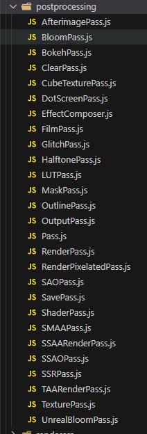

# 理解 ThreeJS API 以及属性

查看 threejs 文件包目录 examples/jsm/postprocessing/，你可以看到 Three.js 提供了一个扩展库 EffectComposer.js,通过 EffectComposer 可以实现一些后期处理效果。

所谓 threejs 后期处理，就像 ps 一样，对 threejs 的渲染结果进行后期处理，比如添加发光效果。

<!-- more -->

## 不同功能后处理通道

查看 threejs 文件包目录 examples/jsm/postprocessing/，你可以看到 threejs 提供了很多后处理通道，想实现什么样的后期处理效果，需要调用 threejs 对应的后处理通道扩展库。

- OutlinePass.js：高亮发光描边

- UnrealBloomPass.js：Bloom 发光

- GlitchPass.js：画面抖动效果

- FilmPass.js： 通道可以通过扫描线和失真模拟电视屏幕

  - nIntensity 通过该属性可以控制屏幕的颗粒程度
  - sIntensity 通过该属性控制屏幕上扫描线的显著程度
  - sCount 通过该属性控制显示出来的扫描线的数量
  - grayscale 该属性接收一个布尔值，指定是否将图像转换为灰度图

- DotScreenPass.js： 通道将场景输出成点集展示在屏幕上

  - center 该属性接收一个 Vector2 类型的向量，通过该属性可以微调点的偏移量
  - angle 输出的点集是按某种方式对齐的，通过该属性可以改变这些点对齐的角度
  - scale 通过该属性可以设置点的大小，值越小点越大

- GlitchPass.js： 通道产生模拟电磁风暴效果



## 案例

### OutlinePass.js

扩展库提供的类 OutlinePass 就可以给一个模型添加一个高亮发光描边，下面就给大家演示下如何实现。

- 引入 EffectComposer.js

你可以在 threejs 文件包目录 examples/jsm/postprocessing/找到扩展库 EffectComposer.js。

代码中引入后处理扩展库 EffectComposer.js

```js
import { EffectComposer } from "three/addons/postprocessing/EffectComposer.js";
```

大家都知道 three.js WebGL 渲染器执行渲染方法.render()会得到一张图像，如果你需要对一个 webgl 渲染器的渲染结果进行后期处理，就把它作为 EffectComposer 的参数。

```js
// 创建后处理对象 EffectComposer，WebGL 渲染器作为参数
const composer = new EffectComposer(renderer);
```

- 渲染器通道 RenderPass

RenderPass.js 扩展库目录：examples/jsm/postprocessing/

```js
// 引入渲染器通道 RenderPass
import { RenderPass } from "three/addons/postprocessing/RenderPass.js";
```

通过 EffectComposer(renderer)指定了需要后处理的渲染器 WebGLRenderer，渲染器通道 RenderPass 的作用是指定后处理对应的相机 camera 和场景 scene。

```js
// 创建一个渲染器通道，场景和相机作为参数
const renderPass = new RenderPass(scene, camera);
```

给 EffectComposer 添加一个渲染器通道 RenderPass。

```js
// 设置 renderPass 通道
composer.addPass(renderPass);
```

- OutlinePass 通道

OutlinePass 可以给指定的某个模型对象添加一个高亮发光描边效果。

OutlinePass.js 扩展库目录：examples/jsm/postprocessing/

```js
// 引入OutlinePass通道
import { OutlinePass } from "three/addons/postprocessing/OutlinePass.js";
```

创建 OutlinePass 通道

```js
// OutlinePass第一个参数v2的尺寸和canvas画布保持一致
const v2 = new THREE.Vector2(window.innerWidth, window.innerWidth);
// const v2 = new THREE.Vector2(800, 600);
const outlinePass = new OutlinePass(v2, scene, camera);
```

- OutlinePass 属性.selectedObjects

three.js 场景中有多个模型的话，你希望给哪个模型对象设置发光描边效果，就可以通过 OutlinePass 的选择对象属性.selectedObjects 设置。

```js
// 一个模型对象
OutlinePass.selectedObjects = [mesh];
// 多个模型对象
OutlinePass.selectedObjects = [mesh1, mesh2, group];
```

- 渲染循环执行 EffectComposer.render()

渲染循环中后处理 EffectComposer 执行.render()，会调用 webgl 渲染器执行.render()，也就是说 renderer.render(scene, camera)不用再执行。

```js
// 渲染循环
function render() {
  composer.render();
  // renderer.render(scene, camera);
  requestAnimationFrame(render);
}
render();
```

> 可以监听窗口变动时，自动改变渲染尺寸
> composer.setSize(window.innerWidth,window.innerHeight);

## 添加各种处理效果

- 初始化效果组合器

```js
composer = new THREE.EffectComposer(renderer);
//该参数是WebGLRenderer对象
```

- 为了保证组合器的正常使用，有三个必要的引用包，在工程文件下可找到，并且注意引用的顺序，如果顺序不对，浏览器控制台会报错的

```js
<script src="js/postprocessing/EffectComposer.js"></script>
<script src="js/postprocessing/ShaderPass.js"></script>
<script src="js/shaders/CopyShader.js"></script>
```

- 新建场景通道，如果不再建一个场景，什么也看不到

```js
var renderPass = new THREE.RenderPass(scene, camera);
composer.addPass(renderPass);
```

- 添加各种处理效果

```js
//1.将原始图像输出为灰度点集
var dotScreenShader = new THREE.ShaderPass(THREE.DotScreenShader);
dotScreenShader.uniforms["scale"].value = 4;
composer.addPass(dotScreenShader);

//2.将RGB三种颜色分离
var RGBshiftShader = new THREE.ShaderPass(THREE.RGBShiftShader);
RGBshiftShader.uniforms["amount"].value = 0.0015;
composer.addPass(RGBshiftShader);
```

- 最后渲染，注意放在帧循环中

```js
function render() {
  composer.render();
  //renderer.render(scene,camera);//可以去掉原来的渲染
}
```

> 可以监听窗口变动时，自动改变渲染尺寸
> composer.setSize(window.innerWidth,window.innerHeight);

## 后处理基础包：

### EffectComposer.js：

效果组合对象， 在该对象上可以添加后期处理通道，使用它来渲染场景、应用通道和输出结果。

引用：js/postprocessing/EffectComposer.js

参数：

- renderer，是 WebGLRenderer 对象

- rendererTarget，可选，渲染缓冲区域对象

方法：

- composer.render()，可选参数,time，时间，如 Date.now()

用法示例：

```js
composer = new THREE.EffectComposer(renderer);
//其他用法：
var rendererTarget = new THREE.WebGLRenderTarget(window.innerWidth, window.innerHeight, {
  //minFilter:THREE.LinearFilter,
  //magFilter:THREE.LinearFilter,
  //format:THREE.RGBFormat,
  //stencilBuffer:true//渲染到模板缓冲区。默认true.
});
composer = new THREE.EffectComposer(renderer, rendererTarget);
```

## 后处理通道包：

### RenderPass.js：

该通道会在当前场景和摄像机的基础上渲染出一个新场景，和普通的 webGLRenderer 一样。

引用：js/postprocessing/RenderPass.js

参数：

- scene，场景对象

- camera，相机对象

属性：

- enabled，开启通道，默认为 true，设置为 false，则通道关闭，一般通道都有该属性

- clear，清除渲染，默认为 true，设置 false，可以避免影响其他后通道的使用

用法示例：

```js
var renderPass = new THREE.RenderPass(scene, camera);
composer.addPass(renderPass);

renderPass.enabled = false;
```

### ShaderPass.js：

该通道接受自定义的着色器作为参数，以生成一个高级、自定义的后期处理通道, 产生各种模糊效果和高级滤镜。

引用：js/postprocessing/ShaderPass.js

参数：各种 threejs 内置着色器包或自定义着色器

- THREE.DotScreenShader：输出灰度点集
- THREE.MirrorShader：创建镜面效果
- THREE.HueSaturationShader：改变颜色的色调和饱和度
- THREE.VignetteShader：添加晕映效果
- THREE.ColorCorrectionShader：调整颜色的分布
- THREE.RGBShiftShader：将红绿蓝三种颜色分开
- THREE.BrightnessContrastShader：改变亮度和对比度
- THREE.ColorifyShader：将某种颜色覆盖到整个屏幕
- THREE.SepiaShader：创建类似于乌贼墨的效果
- THREE.KaleidoShader：类似于万花筒的效果
- THREE.LuminosityShader：提高亮度
- THREE.TechnicolorShader：模拟类似老电影里面的两条彩色效果
- THREE.HorizontalBlurShader 和 THREE.VerticalBlurShader：可以向水平和垂直方向创建模糊效果
- THREE.HorizontalTiltShiftShader 和 THREE.VerticalTileShiftShader：可以在水平和垂直方向创建倾斜平移的效果
- THREE.TriangleBlurShader：基于三角形的方法创造一种模糊效果
- THREE.BleachBypassShader：创造一种镀银的效果
- THREE.EdgeShader：找到图片的边界并显示
- THREE.FXAAShader：添加抗锯齿的效果
- THREE.FocusShader：创建中间比较尖锐，周围比较模糊的效果。

用法示例：

```js
var dotScreenShader = new THREE.ShaderPass(THREE.DotScreenShader);
dotScreenShader.uniforms["scale"].value = 4;
composer.addPass(dotScreenShader);
```

### GlitchPass.js：

该通道会随机在屏幕上显示电脉冲。使用时需要引入对应的着色器包（js/shaders/DigitalGlitch.js）。

引用：js/postprocessing/GlitchPass.js

参数：无

属性：

- goWild，默认为 false，为 true 则会持续显示全屏电子脉冲

用法示例：

```js
glitchPass = new THREE.GlitchPass(); //该通道需要添加着色器依赖包
composer.addPass(glitchPass);
glitchPass.goWild = true; //持续全屏电子脉冲
```

> 在使用该通道时需要添加对应的着色器依赖包（js/shaders/DigitalGlitch.js），添加后就能直接看到效果。

### MaskPass.js：

该通道可以在当前图像上添加掩码，后续的通道只会影响掩蔽区域，并且使用完后必须清除掩码区域。

引用：js/postprocessing/MaskPass.js

参数：

- scene，场景对象

- camera，相机对象

用法示例：

```js
var rendererTarget = new THREE.WebGLRenderTarget(window.innerWidth, window.innerHeight, {
  //minFilter:THREE.LinearFilter,
  //magFilter:THREE.LinearFilter,
  //format:THREE.RGBFormat,
  //stencilBuffer:true//渲染到模板缓冲区。默认true.
}); //渲染缓冲区
composer = new THREE.EffectComposer(renderer, rendererTarget);

//清除通道，当掩蔽物移动时，不会增大掩蔽区域，如果不添加该通道，掩蔽区域会跟着掩蔽物的移动而变大
var clearPass = new THREE.ClearPass(); //该对象在js/postprocessing/ClearPass.js包中
composer.addPass(clearPass);

var clearMaskPass = new THREE.ClearMaskPass(); //清除掩蔽物通道，该对象在js/postprocessing/MaskPass.js包中

//立方体掩蔽物
box = new THREE.Mesh(new THREE.BoxBufferGeometry(4, 4, 4));
scene.add(box);

var maskPass = new THREE.MaskPass(scene, camera);
composer.addPass(maskPass);

var texture = new THREE.TextureLoader().load("textures/mask1.jpg");
texture.minFilter = THREE.LinearFilter;
var texturePass = new THREE.TexturePass(texture);
composer.addPass(texturePass);

composer.addPass(clearMaskPass); //如果有多个掩码通道，每次都需要重新清除掩蔽通道

//该通道不能直接输出效果，需求使用CopyShader输出。
//输出通道
var outputPass = new THREE.ShaderPass(THREE.CopyShader);
composer.addPass(outputPass);
```

### TexturePass.js：

纹理贴图通道，如设置背景贴图。

引用：js/postprocessing/TexturePass.js

参数：

- texture，Texture 纹理对象

属性：

- map，等同于直接在构造函数中赋值

- opacity，贴图透明度，默认 1，范围 0-1

用法示例：

```js
var texture = new THREE.TextureLoader().load("textures/mask1.jpg");
texture.minFilter = THREE.LinearFilter;
var texturePass = new THREE.TexturePass(texture);
composer.addPass(texturePass);

texturePass = new THREE.TexturePass();
composer.addPass(texturePass);
new THREE.TextureLoader().load("textures/hardwood2_diffuse.jpg", function (map) {
  texturePass.map = map;
});
```

### AfterimagePass.js：

该通道可以让通道场景内的物体在运动时，产生残影效果。使用时需要引入相对应的着色器包（js/shaders/AfterimageShader.js）。

引用：js/postprocessing/AfterimagePass.js

参数：无

用法示例：

```js
afterimage = new THREE.AfterimagePass();
composer.addPass(afterimage);
afterimage.uniforms["damp"].value = 0.97;
```

### OutlinePass.js：

该通道可以为物体（场景中被添加到通道中的物体）的边缘添加一个发光效果。

引用：js/postprocessing/OutlinePass.js

参数：

- vec2，一个 2 维分量，表示效果范围

- scene，场景对象

- camera，相机对象

配置项：

- edgeStrength：边缘强度 ，默认 3.0，最基础的属性，后面 4 个配置项都基于该项

- edgeGlow:：边缘流， 默认 0.0

- edgeThickness:：边缘厚度，默认 1.0

- pulsePeriod:：闪烁频率 ，默认 0 ，值越大频率越低

- usePatternTexture：选中对象使用图案纹理，默认 false，不使用

- visibleEdgeColor：边缘可见部分发光颜色，默认#FFFFFF

- hiddenEdgeColor：边缘遮挡部分发光颜色，默认#190A05

- selectedObjects，一个对象数组，表示使用该效果的对象

用法示例：

```js
outlinePass = new THREE.OutlinePass(new THREE.Vector2(window.innerWidth, window.innerHeight), scene, camera);
composer.addPass(outlinePass);

//添加纹理
new THREE.TextureLoader().load("textures/disturb.jpg", function (texture) {
  outlinePass.patternTexture = texture;
  texture.wrapS = texture.wrapT = THREE.RepeatWrapping;
});
//添加物体对象
outline_objects.push(obj);
outlinePass.selectedObjects = outline_objects;

//使用dat.GUI测试
outline
  .add(settings, "edgeStrength", 0.01, 10)
  .name("边缘强度")
  .onChange(function (e) {
    outlinePass.edgeStrength = e;
  });
outline
  .add(settings, "edgeGlow", 0.0, 1.0)
  .name("边缘流")
  .onChange(function (e) {
    outlinePass.edgeGlow = e;
  });
outline
  .add(settings, "edgeThickness", 1, 4)
  .name("边缘厚度")
  .onChange(function (e) {
    outlinePass.edgeThickness = e;
  });
outline
  .add(settings, "pulsePeriod", 0.0, 5)
  .name("跳动周期")
  .onChange(function (e) {
    outlinePass.pulsePeriod = e;
  });
outline
  .addColor(settings, "visibleEdgeColor")
  .name("可见边缘颜色")
  .onChange(function (e) {
    outlinePass.visibleEdgeColor.set(e);
  });
outline
  .addColor(settings, "hiddenEdgeColor")
  .name("隐藏边缘颜色")
  .onChange(function (e) {
    outlinePass.hiddenEdgeColor.set(e);
  });
outline
  .add(settings, "usePatternTexture")
  .name("使用图案纹理")
  .onChange(function (e) {
    outlinePass.usePatternTexture = e;
  });
```

### UnrealBloomPass.js：

该通道会产生类似于虚幻引擎的效果，需搭配对应的着色器包使用（js/shaders/LuminosityHighPassShader.js）。

引用：js/postprocessing/UnrealBloomPass.js

参数：

- vec2,2 维分量，作用范围

- strength，光晕强度，默认为 1

- radius，光晕半径

- threshold，光晕阈值，值越小，效果越明显

用法示例：

```js
unrealBloomPass = new THREE.UnrealBloomPass(new THREE.Vector2(window.innerWidth, window.innerHeight), 1.0, 0.5, 0.1);
composer.addPass(unrealBloomPass);

gui
  .add(settings, "strength", 0.0, 3.0)
  .name("光晕强度")
  .onChange(function (e) {
    unrealBloomPass.strength = e;
  });
gui
  .add(settings, "threshold", 0.0, 1.0)
  .name("光晕阈值")
  .onChange(function (e) {
    unrealBloomPass.threshold = e;
  });
gui
  .add(settings, "radius", 0.0, 1.0)
  .name("光晕半径")
  .onChange(function (e) {
    unrealBloomPass.radius = e;
  });
```

### ClearPass.js：

清除背景通道，设置背景颜色等。

引用：js/postprocessing/ClearPass.js

参数：

- clearColor，背景颜色，默认 0

- clearAlpha，背景透明度，默认 0

用法示例：

```js
clearPass = new THREE.ClearPass("white", 1.0);
composer.addPass(clearPass);
```

### CubeTexturePass.js：

立方体盒子（天空盒子）贴图通道，设置全景贴图。

引用：js/postprocessing/CubeTexturePass.js

参数：

- camera，相机对象

属性：

- envmap，全景贴图，六张图片

- opacity，透明度

- enabled，是否开启通道，默认为 true

用法示例：

```js
cubeTexturePass = new THREE.CubeTexturePass(camera);
composer.addPass(cubeTexturePass);
new THREE.CubeTextureLoader().setPath("textures/cube/pisa/").load(["px.png", "nx.png", "py.png", "ny.png", "pz.png", "nz.png"], function (map) {
  cubeTexturePass.envMap = map;
});
```

### BokehPass.js：

该通道可以设置背景虚化程度，类似相机变焦产生的效果。

引用：js/postprocessing/BokehPass.js

参数：

- scene，场景对象

- camera，相机对象

- options，{
  - focus，焦距，调整远近，对焦时才会清晰
  - apertrue，孔径，类似相机孔径调节
  - maxblur，最大模糊程度
- }

用法示例：

```js
bokehPass = new THREE.BokehPass(scene, camera, {
  focus: 500,
  aperture: 5 * 0.00001,
  maxblur: 1.0,

  width: window.innerWidth,
  height: window.innerHeight,
});
composer.addPass(bokehPass);

gui
  .add(settings, "focus", 10, 3000, 10)
  .name("焦距")
  .onChange(function (e) {
    bokehPass.uniforms["focus"].value = e;
  });
gui
  .add(settings, "aperture", 0, 10, 0.1)
  .name("孔径")
  .onChange(function (e) {
    bokehPass.uniforms["aperture"].value = e * 0.00001;
  });
gui
  .add(settings, "maxblur", 0, 3, 0.025)
  .name("最大模糊")
  .onChange(function (e) {
    bokehPass.uniforms["maxblur"].value = e;
  });
```

### HalftonePass.js：

该通道可以给场景添加 RGB 三色效果，并且可以设置参数调节，需搭配对应着色器使用（js/shaders/HalftoneShader.js）。

引用：js/postprocessing/HalftonePass.js

参数：

- width，覆盖宽度，

- height，覆盖长度

- para，各配置项

用法示例：

```js
para = {
  shape: 1,
  radius: 4,
  rotateR: Math.PI / 12,
  rotateG: (Math.PI / 12) * 3,
  rotateB: (Math.PI / 12) * 2,
  scatter: 0,
  blending: 1,
  blendingMode: 1,
  greyscale: false,
  disable: false,
};

halftonePass = new THREE.HalftonePass(window.innerWidth, window.innerHeight, para);
composer.addPass(halftonePass);

halftone
  .add(para, "shape", { Dot: 1, Ellipse: 2, Line: 3, Square: 4 })
  .name("形状")
  .onChange(function (e) {
    halftonePass.uniforms["shape"].value = e; //点，椭圆，线，正方形
  });
halftone
  .add(para, "radius", 1, 25, 1)
  .name("半径")
  .onChange(function (e) {
    halftonePass.uniforms["radius"].value = e;
  });
halftone
  .add(para, "rotateR", 0, 90, 2)
  .name("R色旋转")
  .onChange(function (e) {
    halftonePass.uniforms["rotateR"].value = e * (Math.PI / 180);
  });
halftone
  .add(para, "rotateG", 0, 90, 2)
  .name("G色旋转")
  .onChange(function (e) {
    halftonePass.uniforms["rotateG"].value = e * (Math.PI / 180);
  });
halftone
  .add(para, "rotateB", 0, 90, 2)
  .name("B色旋转")
  .onChange(function (e) {
    halftonePass.uniforms["rotateB"].value = e * (Math.PI / 180);
  });
halftone
  .add(para, "scatter", 0, 10, 0.01)
  .name("分散度")
  .onChange(function (e) {
    halftonePass.uniforms["scatter"].value = e;
  });
halftone
  .add(para, "blending", 0, 1, 0.01)
  .name("融合度")
  .onChange(function (e) {
    halftonePass.uniforms["blending"].value = e;
  });
halftone
  .add(para, "blendingMode", { Linear: 1, Multiply: 2, Add: 3, Lighter: 4, Darker: 5 })
  .name("融合模式")
  .onChange(function (e) {
    halftonePass.uniforms["blendingMode"].value = e; //线性，相乘，相加，明亮，昏暗
  });
halftone
  .add(para, "greyscale")
  .name("灰度级")
  .onChange(function (e) {
    halftonePass.uniforms["greyscale"].value = e;
  });
halftone
  .add(para, "disable")
  .name("禁用通道")
  .onChange(function (e) {
    halftonePass.uniforms["disable"].value = e;
  });
```

### FilmPass.js：

该通道会使用扫描线和失真来模拟电视屏幕效果。

配置项：

- noiseIntensity：场景的粗糙程度

- scanlinesIntensity：扫描线的显著程度

- scanLinesCount：扫描线的数量

- gratScale：是否使用灰度图输出

用法示例：

### BloomPass.js：

该通道会增强场景中的亮度。

配置项：

- Strength：光的强度

- kernelSize：光的偏移

- sigma：光的锐利程度

- Resolution：光的精确度，值越低，光的方块化越严重

用法示例：

```js
var renderPass = new THREE.RenderPass(scene, camera);
var effectCopy = new THREE.ShaderPass(THREE.CopyShader);
//CopyShader是为了能将结果输出，普通的通道一般都是不能输出的，要靠CopyShader进行输出
effectCopy.renderToScreen = true; //设置这个参数的目的是马上将当前的内容输出

var bloomPass = new THREE.BloomPass(3, 25, 5.0, 256);

composer1.addPass(renderScene); //渲染当前场景
composer1.addPass(bloomPass); //添加光效
composer1.addPass(effectCopy); //输出到屏幕
```

## 常用着色器包：

### CopyShader.js：

该着色器会将效果输出，普通的通道一般都是不能输出的，要靠 CopyShader 进行输出。

引用：js/shaders/CopyShader.js

用法示例：

```js
var outputPass = new THREE.ShaderPass(THREE.CopyShader);
composer.addPass(outputPass);
```

### DotScreenShader.js：

该着色器会将原始图像输出为灰度点集。

引用：js/shaders/DotScreenShader.js

配置项：

- scale：点的大小

- center：点的偏移量

- angle：点的对其方式

用法示例：

```js
var dotScreenShader = new THREE.ShaderPass(THREE.DotScreenShader);
dotScreenShader.uniforms["scale"].value = 4;
composer.addPass(dotScreenShader);
```

### RGBShiftShader.js：

该着色器会将图像的红绿蓝三种颜色分离。

引用：js/shaders/RGBShiftShader.js

配置项：

- amount：颜色深浅度

用法示例：

```js
var RGBshiftShader = new THREE.ShaderPass(THREE.RGBShiftShader);
RGBshiftShader.uniforms["amount"].value = 0.0015;
composer.addPass(RGBshiftShader);
```

### DigitalGlitch.js：

该着色器会使屏幕显示电子脉冲，搭配对应通道使用（js/postprocessing/GlitchPass.js）。

引用：js/shaders/DigitalGlitch.js

### AfterimageShader.js：

该着色器主要使运动的模型产生残影，搭配对应通道使用（js/postprocessing/AfterimagePass.js）。

引用：js/shaders/AfterimageShader.js

配置项：

- damp：阻尼系数，即产生残影范围大小

用法示例：

```js
afterimage = new THREE.AfterimagePass();
composer.addPass(afterimage);
afterimage.uniforms["damp"].value = 0.97;
```

### FXAAShader.js：

该着色器主要用于抗锯齿。

引用：js/shaders/FXAAShader.js

配置项：

- resolution：分辨率，根据窗口设置大小

用法示例：

```js
//抗锯齿着色器
effectFXAA = new THREE.ShaderPass(THREE.FXAAShader);
effectFXAA.uniforms["resolution"].value.set(1 / window.innerWidth, 1 / window.innerHeight);
composer.addPass(effectFXAA);
```

### LuminosityHighPassShader.js：

该着色器主要用于物体亮度通道实现，搭配对应通道使用（js/postprocessing/UnrealBloomPass.js）

引用：js/shaders/LuminosityHighPassShader.js

### BokehShader.js：

该着色器主要用于背景虚化，类似相机变焦，搭配对应通道使用（js/postprocessing/BokehPass.js）

引用：js/shaders/BokehShader.js

### HalftoneShader.js：

该着色器能在场景中添加 rgb 三色元素，搭配对应通道使用（js/postprocessing/HalftonePass.js）
引用：js/shaders/HalftoneShader.js

### PixelShader.js：

该着色器能给场景中的物体添加马赛克效果

引用：js/shaders/PixelShader.js

配置项：

- resolution，分辨率

- pixelSize，像素大小

用法示例：

```js
pixelShader = new THREE.ShaderPass(THREE.PixelShader);
composer.addPass(pixelShader);
var pixelRatio = renderer.getPixelRatio();
pixelShader.uniforms["resolution"].value = new THREE.Vector2(window.innerWidth * pixelRatio, window.innerHeight * pixelRatio);
pixelShader.uniforms["pixelSize"].value = 16;
```

## gltf 后处理颜色异常(伽马校正)

- 加载 gltf 模型如果出现颜色偏差，需要设置 renderer.outputEncoding 解决。

如果你使用 threejs 后处理功能 EffectComposer，renderer.outputEncoding 会无效，自然会出现颜色偏差。

> renderer.outputEncoding = THREE.sRGBEncoding;

- 引入 GammaCorrectionShader.js

GammaCorrectionShader.js 扩展库的目录：examples/jsm/shaders/

examples/jsm/shaders/目录下有很多不同功能的 shader 文件,GammaCorrectionShader.js 的功能就是进行伽马校正，具体点说就是可以用来解决 gltf 模型后处理时候，颜色偏差的问题。

```js
// 伽马校正后处理 Shader
import { GammaCorrectionShader } from "three/addons/shaders/GammaCorrectionShader.js";
```

- 引入 ShaderPass.js

ShaderPass.js 扩展库目录：examples/jsm/postprocessing/

```js
// ShaderPass 功能：使用后处理 Shader 创建后处理通道
import { ShaderPass } from "three/addons/postprocessing/ShaderPass.js";
```

- 创建伽马校正后处理通道

threejs 并没有直接提供伽马校正的后处理通道，提供了一个伽马校正的 Shader 对象 GammaCorrectionShader，这时候可以把 Shader 对象作为 ShaderPass 的参数创建一个通道。

```js
// 创建伽马校正通道
const gammaPass = new ShaderPass(GammaCorrectionShader);
composer.addPass(gammaPass);
```

## 抗锯齿后处理

gltf 模型使用后处理带来的锯齿

### FXAA 抗锯齿通道

FXAA 减弱了锯齿，但是并不完美。

```js
// ShaderPass功能：使用后处理Shader创建后处理通道
import { ShaderPass } from "three/addons/postprocessing/ShaderPass.js";
// FXAA抗锯齿Shader
import { FXAAShader } from "three/addons/shaders/FXAAShader.js";
// 设置设备像素比，避免canvas画布输出模糊
renderer.setPixelRatio(window.devicePixelRatio);
```

.getPixelRatio()获取 renderer.setPixelRatio()设置的值

```js
// .getPixelRatio()获取设备像素比
const pixelRatio = renderer.getPixelRatio();
```

设置 FAXX 抗锯齿通道

```js
const FXAAPass = new ShaderPass(FXAAShader);
// `.getPixelRatio()`获取`renderer.setPixelRatio()`设置的值
const pixelRatio = renderer.getPixelRatio(); //获取设备像素比
// width、height是canva画布的宽高度
FXAAPass.uniforms.resolution.value.x = 1 / (width * pixelRatio);
FXAAPass.uniforms.resolution.value.y = 1 / (height * pixelRatio);
composer.addPass(FXAAPass);
```

### SMAA 抗锯齿通道

SMAA 相比较 FXAA 抗锯齿效果更好一些。

```js
// SMAA 抗锯齿通道
import { SMAAPass } from "three/addons/postprocessing/SMAAPass.js";
```

创建 SMAAPass 抗锯齿通道

```js
//获取.setPixelRatio()设置的设备像素比
const pixelRatio = renderer.getPixelRatio();
// width、height 是 canva 画布的宽高度
const smaaPass = new SMAAPass(width * pixelRatio, height * pixelRatio);
composer.addPass(smaaPass);
```
