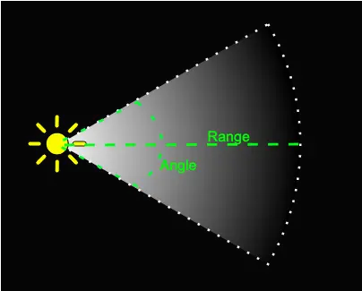

# SpotLight(聚光灯)

光线从一个点沿一个方向射出，随着光线照射的变远，光线圆锥体的尺寸也逐渐增大。

该光源可以投射阴影 - 跳转至 SpotLightShadow 查看更多细节。

像点光源一样，聚光灯具有指定的位置和光线衰减范围。不同的是聚光灯有一个角度约束，形成锥形的光照区域。锥体的中心指向光源对象的发光 (Z) 方向。聚光灯锥体边缘的光线也会减弱。加宽该角度会增加锥体的宽度，并随之增加这种淡化的大小，称为“半影”。

<!-- more -->

## 属性

### .angle : Float

光线照射范围的角度，用弧度表示。==不应超过 Math.PI/2。默认值为 Math.PI/3。==

==圆锥体的主要参数在于圆锥角，这也就是聚光灯照明范围的决定因素。一般情况下，这个角度在 0° 到 90° 之间。==

### .castShadow : Boolean

此属性设置为 true 灯光将投射阴影。注意：这样做的代价比较高，需要通过调整让阴影看起来正确。 查看 SpotLightShadow 了解详细信息。 默认值为 false。

### .decay : Float

光线随着距离增加变暗的衰减量。默认值为 2。

==在物理正确渲染的上下文中，不应更改默认值。==

### .distance : Float

光源照射的最大距离。默认值为 0（无限远）

默认模式下 — 当值为零时，光线不会衰减。当值不为零时，光线会从灯光的位置开始，到指定的距离之间，随着距离的增加线性衰减为零。

禁用 legacy lighting mode 的情况下 — 当值为零时，光线将根据平方反比定律衰减到无限远。 当值不为零时，光线会先按照平方反比定律衰减，直到距离截止点附近，然后线性衰减到 0。

默认值为 0.0。

### .intensity : Float

光源的强度。默认值为 1。,可以无限大

禁用 legacy lighting mode 的情况下，单位是坎德拉（cd）。

改变该值会影响到 power 的值。

### .isSpotLight : Boolean

只读，用于检查对象的类型是否为 SpotLight。

### .penumbra : Float

该属性设置照明区域在边缘附近的平滑衰减速度，取值范围在 0 到 1 之间。默认值为 0.0。

### .position : Vector3

假如这个值设置为 Object3D.DEFAULT_UP (0, 1, 0)，光线将会从上往下照射。

### .power : Float

光源的功率。

禁用 legacy lighting mode 的情况下，单位为流明（lm）。

改变该值会影响到 intensity 的值。

### .shadow : SpotLightShadow

SpotLightShadow 对象，用与计算此光照的阴影。

### .target : Object3D

灯光从它的位置（position）指向目标位置。默认的目标位置为(0, 0, 0)。

注意：对于目标的位置，如果要改为除默认值之外的其他位置，该位置必须被添加到场景（scene）中去。scene.add( light.target );这是为了让目标的 matrixWorld 在每一帧自动更新。

也可以将目标设置为场景中的其他对象（任意拥有 position 属性的对象），如:

> > const targetObject = new THREE.Object3D();
> > scene.add(targetObject);
> > light.target = targetObject;

通过上述操作，光源就可以追踪目标对象了。

### .map : Texture

用于调节光线颜色的纹理（Texture），聚光灯颜色会与该纹理的 RGB 值混合，其比例与其 alpha 值相对应。

The cookie-like masking effect is reproduced using pixel values (0, 0, 0, 1-cookie_value).

==注意: 如果 castShadow 值为 false 时，map 不可用。==

## 方法（Methods）

公共方法请查看基类 Light。

### .dispose () : undefined

释放由该实例分配的 GPU 相关资源。 当这个实例不再在你的应用中使用时，调用这个方法。

### .copy ( source : SpotLight ) : this

将所有属性的值从源 source 复制到此聚光灯光源对象。
