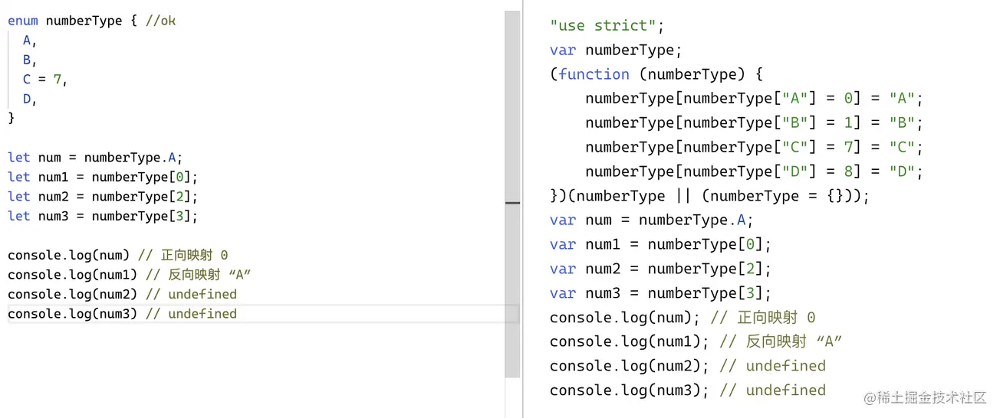
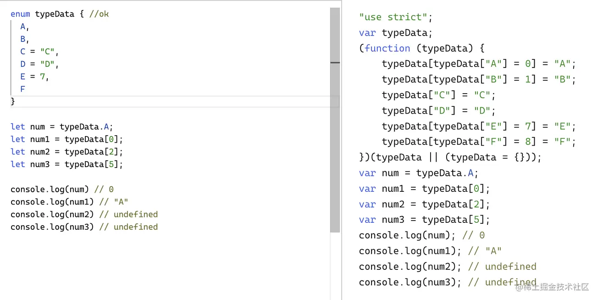

# 数据类型

<!-- more -->

## boolean

```ts:no-line-numbers
let is：boolean=false
```

## string

```ts:no-line-numbers
let name: string = "bob";
```

和 JavaScript 一样，可以使用双引号（ "）或单引号（'）表示字符串。你还可以使用模版字符串

## number

```ts:no-line-numbers
let num：number=6，
```

支持十进制和（0X\0x）十六进制字面量，（0B\0b）二进制和（0o）八进制字面量。

## Symbol

```ts:no-line-numbers
let sym: symbol = Symbol();
```

## bigint

```ts:no-line-numbers
let big: bigint = 10n
```

## null 和 undefined：

==默认情况下 null 和 undefined 是所有类型的子类型。 就是说你可以把 null 和 undefined 赋值给 number 类型、string 类型等的变量。==

==当你指定了--strictNullChecks 标记，null 和 undefined 只能赋值给 any、unknown、和它们各自本身。多余的 void 类型，只有 undefined 才可以赋值。==

```ts:no-line-numbers
//假设：tsconfig.json 里配置了"strictNullChecks": true，
let a:null=null //ok
let a:null=undefined //error
let a:any=null //ok
let a:unknown=null //ok
let a:number=null //error

```

## Array

### 定义

第一种，可以在元素类型后面接上 [];

```ts:no-line-numbers
let list: number[] = [1, 2, 3];
```

第二种方式是使用数组泛型，Array\<T\>;

```ts:no-line-numbers
let list: Array<number> = [1, 2, 3];
```

第三种联合类型数组;

```ts:no-line-numbers
let list (string|number)[]=[1,2,3,'5'] // let list: Array<string|number> = [1, 2, 3];
```

### 只读

只读数组类型(ReadonlyArray\<T\>)：只读数组中的数组成员和数组本身的长度等属性都不能够修改,并且也不能赋值给原赋值的数组

```ts:no-line-numbers
let arr4:ReadonlyArray<Number>=[1,2,3,4,5]
```

TypeScript 3.4 引入了一种新语法，该语法用于对数组类型 ReadonlyArray 使用新的 readonly 修饰符

```ts:no-line-numbers
let arr5: readonly string[]=['1','2','3']
```

## 元组：已知元素数量和类型的数组，各元素的类型不必相同。

越界赋值：采用联合类型

```ts:no-line-numbers
let tuple:[string,number]=[‘1’，1]

tuple[3]='str'//ok 字符串可以赋值给(string | number)类型：联合类型

tuple[3]=false //报错：联合类型中没有 boolean
```

这里存在一个问题：在 TS 中是允许对元组扩增的（也就是允许使用  push 方法），但在访问上不允许。报错

```ts:no-line-numbers
let t5: [number, string] = [1, '2']; // ok
t5.push(2); // [1, '2', 2]
let a = t[0] // ok
let b = t[1] // ok
let c = t[2] // error
```

定义声明越界：报错

```ts:no-line-numbers
let x: [string, number];

x = ['Hi', 666]; // OK
x = ['Hi', 666, 888]; // error 声明越界
```

赋值类型不对应：报错

```ts:no-line-numbers
x = [666, 'Hi']; // error 注意顺序
```

元组同样支持解构赋值：另外需要注意，解构数组元素的个数是不能超过元组中元素个数的

```ts:no-line-numbers
let arr: [string, number] = ['德玛西亚!', 666];
let [lol, action] = arr;
console.log(lol); // 德玛西亚!
console.log(action); // 666
let [lol, action, hero] = arr; // Tuple type '[string, number]' of length '2' has no element at index '2'
```

元组类型的可选元素
例如：// 要求包含一个必须的字符串属性，和一个可选的布尔值属性

```ts:no-line-numbers
let arr: [string, boolean?];
arr = ['一个能打的都没有', true]; console.log(arr); // ['一个能打的都没有', true]
arr = ['如果暴力不是为了杀戮']; console.log(arr); // ['如果暴力不是为了杀戮']。

```

只读元组类型

```ts:no-line-numbers
const arr: readonly [string, number] = ['断剑重铸之日', 666];
```

## enum

### 数字枚举

枚组的类型默认为数字类型，默认从 0 开始以此累加，如果有设置默认值，则只会对下面的值产生影响。同时支持反向映射及从成员值到成员名的映射），但智能映射无默认值的情况，并且只能是默认值的前面



### 字符串枚举

字符串枚举要注意的是必须要有默认值，不支持反向映射


### 常量枚举

除了数字类型和字符串类型之外，还有一种特殊的类型，那就是常量枚组，也就是通过 const 去定义 enum，但这种类型不会编译成任何  JS,只会编译对应的值。


### 异构枚举

包含了数字类型和字符串类型的混合，反向映射一样的道理



## object、Object 和 {} 类型

object 表示非原始类型，也就是除 number，string，boolean，symbol，bigInt，null 或 undefined 之外的类型。我们不能把 number string 等原始类型赋值给小 object。null 和 undefined 类型也不能赋值给小 object。
使用很简单：

```ts:no-line-numbers
let stu: object;
stu={ name: '张三', age: 18 } // console.log(stu) //{name: "张三", age: 18}
stu = 1; // error
stu = '人在塔在!'; // error
stu = true; // error
stu = null; // error
stu = undefined; // error
stu = 100n; // error
stu = Symbol(); // error
stu = {}; // ok
```

在定义上直接使用 object 是可以的，但你要更改对象的属性就会报错，原因是并没有使对象的内部具体的属性做限制，所以需要使用  {Key:type,....y:type,....}  来定义内部类型

```ts:no-line-numbers
let obj1: object = { a: 1, b: 2}
obj1.a = 3 // error
let obj2: { a: number, b: number } = {a: 1, b: 2}
obj2.a = 3 // o
```

大 Object  代表所有拥有 toString、hasOwnProperty 方法的类型 所以所有原始类型、非原始类型都可以赋给 Object(null  和  undefined  不可以)

```ts:no-line-numbers
let obj: Object;
obj = 1; // ok
obj = '人在塔在!'; // ok
obj = true; // ok
obj = null; // error
obj = undefined; // error
obj = 100n; // ok
obj = Symbol(); // ok
obj = {}; // ok
```

注： 一般对象类型不会这样申明，而是直接写让 TypeScript 做自动类型判断或者更加精确的指示，如接口等。使用接口替代 Object 类型。

首字母大写的 Number String Boolean Symbol 很容易与小写的原始类型 number string boolean symbol 混淆，前者是相应原始类型的包装对象，我愿称之为对象类型。

{} 空对象类型和大 Object 一样 也是表示原始类型和非原始类型的集合

## 函数类型

有多种声明方式，最简单直观的是用 Function 表示函数类型，在写函数表达式的时候可以直接写声明是一个函数类型（不过一般我们不这样做，要么是不在表达式左边直接写 Function 而是靠类型推断，要么是直接将一个函数的类型写全），具体介绍在后面函数中单独介绍

```ts:no-line-numbers
let a:Function

a = function():void =>console.log("function")
```

## void

声明一个 void 类型的变量没有什么意义，一般只有在函数没有返回值时才会使用到它。

## never

never 类型表示的是那些永不存在的值的类型（永远也不会有返回值）。

同样使用在会抛出异常或根本就不会有返回值的函数表达式或箭头函数表达式的返回值类型
never 类型是任何类型的子类型，也可以赋值给任何类型；然而，没有类型是 never 的子类型或可以赋值给 never 类型（除了 never 本身之外）。 即使 any，null，undefined 等也不可以赋值给 never 类型。

## any

任何类型的值都可以赋值给 any，同时 any 类型的值也可以赋值给任何类型（never 除外）。

## unknown 类型

TypeScript 3.0 引入了新的 unknown 类型，它是 any 类型对应的安全类型。就像所有类型都可以被归为 any，所有类型也都可以被归为 unknown。 这使得 unknown 成为 TypeScript 类型系统的另一种顶级类型（另一种是 any）。unknown 和 any 的主要区别是 unknown 类型会更加严格：在对 unknown 类型的值执行大多数操作之前，会进行某种形式的检查。 而在对 any 类型的值执行操作之前，我们不必进行任何检查。

任何类型的值都可以赋值给 unknown

```ts:no-line-numbers
let a: unknown = 250;
a = '面对疾风吧!';
a = true;
```

但 unknown 类型的值只能赋值给 unknown 和 any

```ts:no-line-numbers
let a: unknown = 520;
let b: any = a; // ok
let a: any = 520;
let b: unknown = a // ok
let a: unknown = 520;
let b: number = a; // error
```

在对 unknown 类型的值执行大多数操作之前，会进行某种形式的检查。

```ts:no-line-numbers
const foo: unknown = 'string';
foo.substr(1); // Error: 静态检查不通过报错
```
