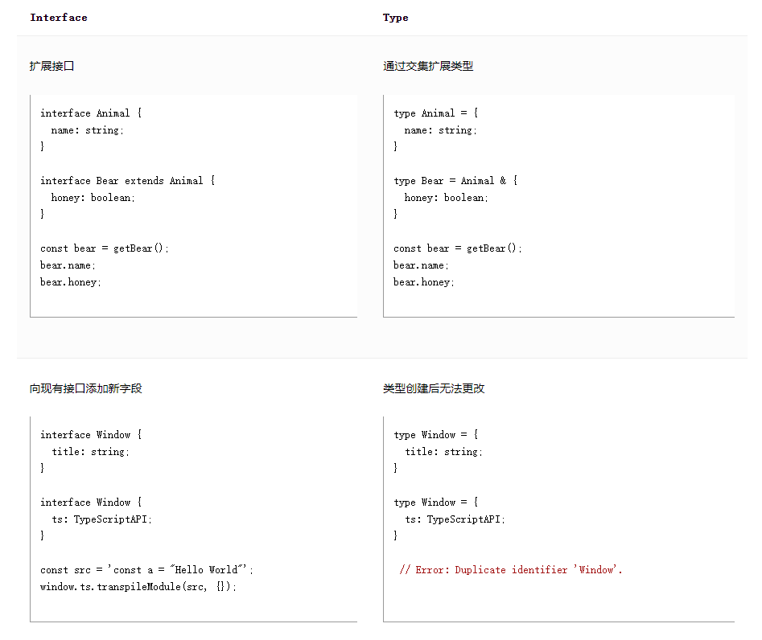

# 日常类型

<!-- more -->

## 原语：string、number 和 boolean

JavaScript 有三个非常常用的 原语： string、number 和 boolean。 每个在 TypeScript 中都有对应的类型。

> 类型名称 String、Number 和 Boolean（以大写字母开头）是合法的，但指的是一些很少出现在代码中的特殊内置类型。 始终使用 string、number 或 boolean 作为类型。

## 数组

要指定像 [1, 2, 3] 这样的数组类型，可以使用语法 number[]； 此语法适用于任何类型（例如，string[] 是一个字符串数组，等等）。 你也可以看到这个写成 Array\<number\>，意思是一样的。 当我们介绍泛型时，我们将了解更多关于语法 T\<U\> 的信息。

> 请注意，[number] 是另一回事； 请参阅 元组 部分。

## any

TypeScript 在无法确定表达式的类型时使用类型 any。它只是在出现的任何地方关闭类型检查器。

要在 TypeScript 生成 any 时出现错误，请在 tsconfig.json 中使用 "noImplicitAny": true 或 "strict": true。

## 推断类型

TypeScript 了解 JavaScript 语言，并会在许多情况下为你生成类型。 例如，当你使用 const、var 或 let 声明变量时，你可以选择添加类型注释以显式指定变量的类型。但是，在大多数情况下，这不是必需的。 TypeScript 会尽可能地尝试自动推断代码中的类型。 例如，变量的类型是根据其初始化程序的类型推断的。

```ts
let helloWorld = "Hello World";
//  ^?
```

> 通过了解 JavaScript 的工作原理，TypeScript 构建一个接受 JavaScript 代码推断类型的类型系统。

## 函数

### 参数类型注解

声明函数时，可以在每个参数后面加上类型注解，声明函数接受哪些类型的参数。 参数类型注释在参数名称之后

> 当参数具有类型注释时，将检查该函数的参数
> 即使你的参数上没有类型注释，TypeScript 仍会检查你是否传递了正确数量的参数。

### 返回类型注解

你还可以添加返回类型注释。 返回类型注释出现在参数列表之后

与变量类型注解非常相似，你通常不需要返回类型注解，因为 TypeScript 会根据其 return 语句推断函数的返回类型。 上面例子中的类型注解并没有改变任何东西。 一些代码库将明确指定返回类型以用于文档目的，以防止意外更改，或仅出于个人喜好。

### 匿名函数

匿名函数与函数声明有点不同。 当一个函数出现在 TypeScript 可以确定如何调用它的地方时，该函数的参数会自动被赋予类型。

```ts
const names = ["Alice", "Bob", "Eve"];

// Contextual typing for function - parameter s inferred to have type string
names.forEach(function (s) {
  console.log(s.toUpperCase());
});

// Contextual typing also applies to arrow functions
names.forEach((s) => {
  console.log(s.toUpperCase());
});
```

即使参数 s 没有类型注释，TypeScript 还是使用 forEach 函数的类型以及推断的数组类型来确定 s 将具有的类型。

这个过程称为上下文类型，因为函数发生的上下文告知它应该具有什么类型。

与推断规则类似，你不需要明确了解这是如何发生的，但了解它确实发生可以帮助你注意到何时不需要类型注释。 稍后，我们将看到更多关于值出现的上下文如何影响其类型的示例。

## 对象类型

每个属性的类型部分也是可选的。 如果不指定类型，则假定为 any。

### 可选属性

对象类型还可以指定它们的部分或全部属性是可选的。 为此，请在属性名称后添加 ?：

```ts
function printName(obj: { first: string; last?: string }) {
  // ...
}
// Both OK
printName({ first: "Bob" });
printName({ first: "Alice", last: "Alisson" });
```

在 JavaScript 中，如果你访问一个不存在的属性，你将获得值 undefined 而不是运行时错误。 因此，当你从可选属性中读取数据时，你必须在使用它之前检查 undefined。

```ts
function printName(obj: { first: string; last?: string }) {
  // Error - might crash if 'obj.last' wasn't provided!
  console.log(obj.last.toUpperCase());
'obj.last' is possibly 'undefined'.
  if (obj.last !== undefined) {
    // OK
    console.log(obj.last.toUpperCase());
  }

  // A safe alternative using modern JavaScript syntax:
  console.log(obj.last?.toUpperCase());
}
```

## 联合类型

### 定义联合类型

使用"|"来定义联合类型

```ts
function printId(id: number | string) {
  console.log("Your ID is: " + id);
}
// OK
printId(101);
// OK
printId("202");
// Error
printId({ myID: 22342 });
//Argument of type '{ myID: number; }' is not assignable to parameter of type 'string | number'.
```

### 使用联合类型

> TypeScript 只有在对联合的每个成员都有效的情况下才允许操作。 例如，如果你有联合 string | number，则不能使用仅在 string 上可用的方法

```ts
function printId(id: number | string) {
  console.log(id.toUpperCase());
Property 'toUpperCase' does not exist on type 'string | number'.
  Property 'toUpperCase' does not exist on type 'number'.
}
```

解决方案是用代码缩小联合，就像在没有类型注释的 JavaScript 中一样。 当 TypeScript 可以根据代码的结构为某个值推断出更具体的类型时，就会发生缩小。

例如，TypeScript 知道只有 string 值才会有 typeof 值 "string"：

```ts
function printId(id: number | string) {
  if (typeof id === "string") {
    // In this branch, id is of type 'string'
    console.log(id.toUpperCase());
  } else {
    // Here, id is of type 'number'
    console.log(id);
  }
}
```

另一个例子是使用像 Array.isArray 这样的函数：

```ts
function welcomePeople(x: string[] | string) {
  if (Array.isArray(x)) {
    // Here: 'x' is 'string[]'
    console.log("Hello, " + x.join(" and "));
  } else {
    // Here: 'x' is 'string'
    console.log("Welcome lone traveler " + x);
  }
}
```

**请注意，在 else 分支中，我们不需要做任何特别的事情 - 如果 x 不是 string[]，那么它一定是 string。**

有时你会有一个联合，所有成员都有共同点。 例如，数组和字符串都有一个 slice 方法。 如果联合中的每个成员都有一个共同的属性，则可以使用该属性而不会缩小类型：

```ts
// Return type is inferred as number[] | string
function getFirstThree(x: number[] | string) {
  return x.slice(0, 3);
}
```

> 类型的联合似乎具有这些类型的属性的交集，这可能会令人困惑。 这不是偶然的 - 联合这个名字来源于类型论。 联合 number | string 是通过取每种类型的值的联合组成的。 请注>> 意，给定两个具有关于每个集合的相应事实的集合，只有这些事实的交集适用于集合本身的并集。 例如，如果我们有一个房间里有戴帽子的高个子，而另一个房间里有戴帽子的说西班牙语的 v 人，在组合这些房间后，我们对每个人的唯一了解就是他们必须戴帽子。

## 类型别名

我们一直通过直接在类型注释中编写对象类型和联合类型来使用它们。 这很方便，但通常希望多次使用同一个类型并用一个名称引用它。

类型别名就是这样 - 任何类型的名称。 类型别名的语法是,通过"type"来定义类型别名:

```ts
type Point = {
  x: number;
  y: number;
};

// Exactly the same as the earlier example
function printCoord(pt: Point) {
  console.log("The coordinate's x value is " + pt.x);
  console.log("The coordinate's y value is " + pt.y);
}

printCoord({ x: 100, y: 100 });
```

实际上，你可以使用类型别名来为任何类型命名，而不仅仅是对象类型。 例如，类型别名可以命名联合类型：

```ts
type ID = number | string;
```

请注意，别名只是别名 - 你不能使用类型别名来创建相同类型的不同的或独特的 “versions”。 当你使用别名时，就好像你已经编写了别名类型。 换句话说，这段代码可能看起来非法，但根据 TypeScript 是可以的，因为这两种类型都是同一类型的别名：

```ts
declare function getInput(): string;
declare function sanitize(str: string): string;
// ---cut---
type UserInputSanitizedString = string;

function sanitizeInput(str: string): UserInputSanitizedString {
  return sanitize(str);
}

// Create a sanitized input
let userInput = sanitizeInput(getInput());

// Can still be re-assigned with a string though
userInput = "new input";
```

## 接口

接口声明是命名对象类型的另一种方式：

```ts
interface Point {
  x: number;
  y: number;
}

function printCoord(pt: Point) {
  console.log("The coordinate's x value is " + pt.x);
  console.log("The coordinate's y value is " + pt.y);
}

printCoord({ x: 100, y: 100 });
```

## 类型别名和接口的区别

类型别名和接口非常相似，在很多情况下你可以在它们之间自由选择。 interface 的几乎所有功能都在 type 中可用，主要区别在于无法重新打开类型以添加新属性，而接口始终可扩展。



你将在后面的章节中了解有关这些概念的更多信息，因此如果你不能立即理解所有这些概念，请不要担心。

- 在 TypeScript 4.2 版之前，类型别名 可能出现在错误信息中，有时代替等效的匿名类型（可能需要也可能不需要）。 接口将始终在错误消息中命名。
- 类型别名不得参与 在声明合并中，但接口可以。
- 接口只能用于 声明对象的形状，而不是重命名基元。
- 接口名称将在错误消息中显示为 总是以原来的形式出现，但仅当它们被名称使用时。

> 在大多数情况下，你可以根据个人喜好进行选择，TypeScript 会告诉你是否需要其他类型的声明。 如果你想要启发式方法，请使用 interface，直到你需要使用 type 中的功能。

### 交集&并集

除了并集，TypeScript 还有交集：

```ts
type Combined = { a: number } & { b: string };
type Conflicting = { a: number } & { a: string };
```

Combined 有两个属性，a 和 b，就像它们被写成一个对象字面量类型一样。 交集和并集在冲突的情况下是递归的，所以 Conflicting.a: number & string.

## 类型断言

有时你会得到关于 TypeScript 无法知道的值类型的信息

例如，如果你使用的是 document.getElementById，TypeScript 只知道这将返回某种 HTMLElement，但你可能知道你的页面将始终具有具有给定 ID 的 HTMLCanvasElement。
在这种情况下，你可以使用类型断言来指定更具体的类型：

```ts
const myCanvas = document.getElementById("main_canvas") as HTMLCanvasElement;
```

TypeScript 只允许类型断言转换为更具体或更不具体的类型版本。 此规则可防止 “impossible” 强制，例如：

```ts
const x = "hello" as number;
//Conversion of type 'string' to type 'number' may be a mistake because neither type sufficiently overlaps with the other. If this was intentional, convert the expression to 'unknown' first.
```

**有时，此规则可能过于保守，并且不允许可能有效的更复杂的强制转换。 如果发生这种情况，你可以使用两个断言，首先是 any（或 unknown，我们稍后会介绍），然后是所需的类型：**

```ts
const a = expr as any as T;
```

## 字面类型（数字字面类型和字符串字面量类型）

除了通用类型 string 和 number 之外，我们还可以在类型位置引用特定的字符串和数字。

考虑这一点的一种方法是考虑 JavaScript 如何使用不同的方法来声明变量。 var 和 let 都允许更改变量中保存的内容，而 const 不允许。 这反映在 TypeScript 如何为字面创建类型。

```ts
let changingString = "Hello World";
changingString = "Olá Mundo";
// Because `changingString` can represent any possible string, that
// is how TypeScript describes it in the type system
changingString;

let changingString: string;

const constantString = "Hello World";
// Because `constantString` can only represent 1 possible string, it
// has a literal type representation
constantString;
// => const constantString: "Hello World"
```

就其本身而言，字面类型并不是很有价值：

```ts
let x: "hello" = "hello";
// OK
x = "hello";
// ...
x = "howdy";
//Type '"howdy"' is not assignable to type '"hello"'.
```

变量只能有一个值并没有多大用处！

但是通过将字面组合成联合，你可以表达一个更有用的概念 - 例如，只接受一组已知值的函数：

```ts
function printText(s: string, alignment: "left" | "right" | "center") {
  // ...
}
printText("Hello, world", "left");
printText("G'day, mate", "centre");
Argument of type '"centre"' is not assignable to parameter of type '"left" | "right" | "center"'.
```

数字字面类型的工作方式相同：

```ts
function compare(a: string, b: string): -1 | 0 | 1 {
  return a === b ? 0 : a > b ? 1 : -1;
}
```

当然，你可以将这些与非字面类型结合使用：

```ts
interface Options {
  width: number;
}
function configure(x: Options | "auto") {
  // ...
}
configure({ width: 100 });
configure("auto");
configure("automatic");
Argument of type '"automatic"' is not assignable to parameter of type 'Options | "auto"'.
```

还有一种字面类型： 布尔字面量。 只有两种布尔字面类型，正如你可能猜到的，它们是 true 和 false 类型。 类型 boolean 本身实际上只是联合 true | false 的别名。

### 字面推断

先看一个案例：

```ts
declare function handleRequest(url: string, method: "GET" | "POST"): void;

const req = { url: "https://example.com", method: "GET" };
handleRequest(req.url, req.method);
//Argument of type 'string' is not assignable to parameter of type '"GET" | "POST"'.
```

在上面的例子中，req.method 被推断为 string，而不是 "GET"| "POST"。 因为可以在 req 的创建和 handleRequest 的调用之间评估代码，这可以将一个新的字符串（如 "GUESS" 分配给 req.method），TypeScript 认为此代码有错误。

有两种方法可以解决这个问题。

- 你可以通过在任一位置添加类型断言来更改推断

```ts
// Change 1:
const req = { url: "https://example.com", method: "GET" as "GET" };
// Change 2
handleRequest(req.url, req.method as "GET");
```

更改 1 表示 “我打算让 req.method 始终具有 _ 字面类型 _"GET"“，防止之后可能将 "GUESS" 分配给该字段。 更改 2 表示 “由于其他原因，我知道 req.method 的值为 "GET"“。

- 你可以使用 as const 将整个对象转换为类型字面：

```ts
const req = { url: "https://example.com", method: "GET" } as const;
handleRequest(req.url, req.method);
```

as const 后缀的作用类似于 const，但用于类型系统，确保为所有属性分配字面类型，而不是更通用的版本，如 string 或 number。

## readonly 和 const

在 JavaScript 中，可变性是默认值，尽管它允许使用 const 的变量声明来声明引用是不可变的。 引用对象仍然是可变的

```ts
const a = [1, 2, 3];
a.push(102); // ):
a[0] = 101; // D:
```

TypeScript 还有一个 readonly 属性修饰符。

```ts
interface Rx {
  readonly x: number;
}
let rx: Rx = { x: 1 };
rx.x = 12; // error
```

它还附带一个映射类型 Readonly\<T\>，使所有属性成为 readonly：

```ts
interface X {
  x: number;
}
let rx: Readonly<X> = { x: 1 };
rx.x = 12; // error
```

它有一个特定的 ReadonlyArray\<T\> 类型，可以删除副作用方法并防止写入数组的索引，以及这种类型的特殊语法：

```ts
let a: ReadonlyArray<number> = [1, 2, 3];
let b: readonly number[] = [1, 2, 3];
a.push(102); // error
b[0] = 101; // error
```

你还可以使用常量断言，它对数组和对象字面进行操作：

```ts
let a = [1, 2, 3] as const;
// let a: readonly [1, 2, 3]
a.push(102); // error
a[0] = 101; // error
```

## null 和 undefined

JavaScript 有两个原始值用于表示值不存在或未初始化的值： null 和 undefined。

### strictNullChecks 关闭

关闭 strictNullChecks，可能是 null 或 undefined 的值仍然可以正常访问，并且值 null 和 undefined 可以分配给任何类型的属性。

### strictNullChecks 开启

启用 strictNullChecks 时，当值为 null 或 undefined 时，你需要在对该值使用方法或属性之前测试这些值。 就像在使用可选属性之前检查 undefined 一样，我们可以使用缩小来检查可能是 null 的值

```ts
function doSomething(x: string | null) {
  if (x === null) {
    // do nothing
  } else {
    console.log("Hello, " + x.toUpperCase());
  }
}
```

### 非空断言运算符（后缀!）

TypeScript 还具有一种特殊的语法，可以在不进行任何显式检查的情况下从类型中删除 null 和 undefined。 在任何表达式之后写 ! 实际上是一个类型断言，该值不是 null 或 undefined：

```ts
function liveDangerously(x?: number | null) {
  // No error
  console.log(x!.toFixed());
}
```

就像其他类型断言一样，这不会改变代码的运行时行为，所以当你知道值不能是 null 或 undefined 时，只使用 ! 很重要。

## 枚举

- [枚举](./10)
