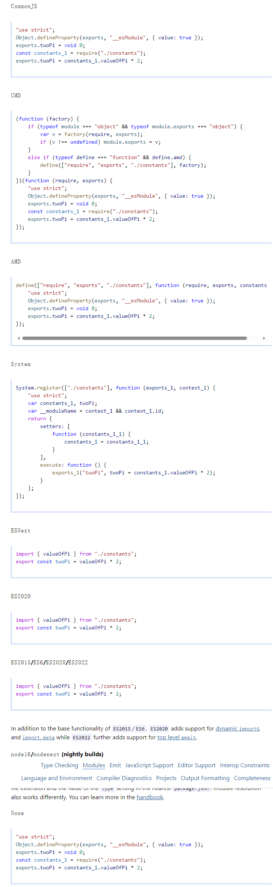

# tsconfig.js

## target

现代浏览器支持 ES6 的所有功能，因此 ES6 是一个不错的选择。如果您的代码部署到较旧的环境中，您可能会选择设置较低的目标，或者如果代码保证在较新的环境中运行，则可以选择设置较高的目标。

目标设置更改了哪些 JS 功能被降级，哪些保持不变。例如，如果目标为 ES5 或更低，则箭头函数（）=>将转换为等效函数表达式。

更改 target 还会更改 lib 的默认值。您可以根据需要“混合和匹配”目标和库设置，但为了方便起见，您可以设置目标。

对于像 Node 这样的开发人员平台，根据平台的类型及其版本，有目标的基线。您可以在 tsconfig/bases 中找到一组社区组织的 tsconfig，其中包含通用平台及其版本的配置。

特殊的 ESNext 值指的是 TypeScript 版本支持的最高版本。应该谨慎使用此设置，因为在不同的 TypeScript 版本之间这并不意味着相同的事情，并且可能会降低升级的可预测性。

Default:ES3

Allowed:es3、es5、es6/es2015、es2016、es2017、es2018、es2019、es2020、es2021、es2022、esnext

## module

Default:CommonJS if target is ES3 or ES5, ES6/ES2015 otherwise.

> 默认 CommonJS，如果目标(target)是 ES3 或 ES5，则为 ES6/ES2015

Allowed:none、commonjs、amd、umd、system、es6/es2015、es2020、es2022、esnext、node16、nodenext

Related:moduleResolution

输入：

```ts
// @filename: index.ts
import { valueOfPi } from "./constants";

export const twoPi = valueOfPi * 2;
```

输出:



## moduleResolution

指定模块解析策略：

- node.js CommonJS 实现的 node

- Node.js 的 ECMAScript 模块支持从 TypeScript 4.7 起的“node16”或“nodenext”

- 在 1.6 版本之前，TypeScript 中使用了“classic”。您可能不需要在现代代码中使用 classic

Default:Classic if module is AMD, UMD, System or ES6/ES2015, Matches if module is node16 or nodenext, Node otherwise.

> 如果模块(module)是 AMD、UMD、System 或 ES6/ES2015，则为 Classic，如果模块是 node16 或 nodenext，则为 Matches，否则为 Node

Allowed:classic、node10/node、node16、nodenext、bundler

Related:module
