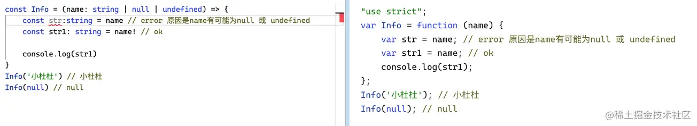

# 类型关键字

<!-- more -->

## 类型推论

如果没有明确的指定类型，那么 TypeScript 会依照类型推论的规则推断出一个类型

```ts:no-line-numbers
let x = 1;
x = true; // 报错

===>

let x: number = 1;
x = true; // 报错
```

==在 TS 中，函数返回值、具有初始化值的变量、有默认值的函数参数的类型都可以根据上下文推断出来。==

==如果定义变量的时候没有赋值，不管之后有没有赋值，都会被推断为 any 类型==

## 类型断言

### as

使用 as 语法做类型断言

```ts:no-line-numbers
interface Props {
    name: string;
    age: number;
    money?: number;
}
let p: Props = {
    name: "兔神",
    age: 25,
    money: -100000,
    girl: false
} as Props; // OK
```

### 尖括号

尖括号格式会与 react 中的 JSX 产生语法冲突，因此更推荐使用 as 语法。

### 非空断言（数据类型、函数使用）

在上下文中当类型检查器无法断定类型时，一个新的后缀表达式操作符 ! 可以用于断言操作对象是非 null 和非 undefined 类型。==即 x!的值不会为 null 或 undefined==

- !可以帮助我们过滤 null 和 undefined 类型

- 变成 ES5 后 !会被移除，所以当传入 null 的时候，还是会打出 null

```ts:no-line-numbers
let v: null | undefined | string;
v.toString(); // 报错：Object is possibly 'null' or 'undefined'
v!.toString(); // ok
```



```ts:no-line-numbers
type FuncType = () => number;
function fn(getNum: FuncType | undefined) {
  // Object is possibly 'undefined'    // Cannot invoke an object which is possibly 'undefined'
  const value1 = getNum();
  const value2 = getNum!(); // ok
}
```

### 确定赋值断言

在 TS 2.7 版本中引入了确定赋值断言，即允许在实例属性和变量声明后面放置一个 ! 号，以告诉 TS 该属性会被明确赋值。class 类定义

```ts:no-line-numbers
let value:number
console.log(value); // Variable 'value' is used before being assigned.
```

我们定义了变量, 没有赋值就使用，则会报错

通过 let x!: number; 确定赋值断言，TypeScript 编译器就会知道该属性会被明确地赋值。

```ts:no-line-numbers
let value!:number
console.log(value); // undefined 编译正确
```

### as const 断言

const 断言告诉编译器为表达式推断出它能推断出的最窄或最特定的类型。如果不使用它，编译器将使用其默认类型推断行为，这可能会导致更广泛的类型。

```ts:no-line-numbers
const obj = {
  name: "zhangsan",
  age: 18
} //has type { name: string，age：number }
obj.age = 10; //ok 因为类型推断是标准的
const/let/var obj = {
  name: "zhangsan",
  age: 18
} as const;
obj.age = 10;//Cannot assign to 'age' because it is a read-only property.无法分配给“age”，因为它是只读属性。
// const/let/var obj: {readonly name: "zhangsan";readonly age: 18;} ：具体的类型推论
const a = 'x'; // has the type 'x'  默认类型推断为字面量类型
let y = 'x';   // has the type string 默认类型推断为string，否和编译器类型推断结论
var y = 'x';   // has the type string 默认类型推断为string，否和编译器类型推断结论
// 如果
let  y  ='x' as const // y has type 'x'`  let被转为字面量类型，导致这时修改赋值其他会报错赋值错误。
// 如果
var  y  ='x' as const // y has type 'x'`  var被转为字面量类型，导致这时修改赋值其他会报错赋值错误。
// 如果
const  y  ='x' as const //  y has type 'x'  const被转为字面量类型，导致这时修改赋值其他会报错赋值错误。
```

### 双重断言【断言失效后，可能会用到，但一般情况下不会使用】：注意双重断言一个类型必须更加宽松。

```ts:no-line-numbers
//失效的情况：基础类型不能断言为接口
interface Info{
  name: string;
  age: number;
}
const name = '小杜杜' as Info; // error, 原因是不能把 string 类型断言为 一个接口
const name1 = '小杜杜' as any as Info; //ok
```

## 联合类型

联合类型用|分隔，表示取值可以为多种类型中的一种

## 类型别名

类型别名就是用 type 关键字给一个类型取个新名字，常用于联合类型

## 交叉类型（&）

交叉类型就是将多个类型合并为一个类型，使用&符号连接产生一个新类型

```ts:no-line-numbers
type Value = string & number; // 即never。无意义会报错：因为任何类型都不能满足同时属于多种原子类型：即使string又是number

type AProps = { a: string }//类型别名
type BProps = { b: number }//类型别名
type allProps = AProps & BProps
const Info: allProps = {
  a: '小杜杜',
  b: 7
}
interface Type1 {name: string;sex: string;}
interface Type2 {age: number;}
type NewType = Type1 & Type2;
const person: NewType = {name: '金克丝',sex: '女',age: 19,address: '诺克萨斯', // error address is not defined}
```

### 扩展：如果合并的多个接口类型中存在同名属性同类型，同名不同类型会是什么效果呢？

- 基本类型：同名同类型会合并为一个、同名不同类型在使用时会报错，因为原子类型的变量无法同时满足俩个。
- 非基本类型（接口）：
  - 如果合并的多个接口类型存在同名属性：
    - 如果同名属性的类型不兼容，比如上面示例中两个接口类型同名的 name 属性类型一个是 number，另一个是 string，合并后，name 属性的类型就是 number 和 string 两个原子类型的交叉类型，即 never。导致复制任何值都报错。
    - 如果同名属性的类型兼容，比如一个是 number，另一个是 number 的子类型、数字字面量类型，合并后 name 属性的类型就是两者中的子类型。
  - 同名属性是非基本数据类型的话：在混入多个类型时，若存在相同的成员，且成员类型为非基本数据类型，那么是可以成功合并。

```ts:no-line-numbers
type PersonType = {name: string, sex: string} & {age: number, name: number};
// 如果同名属性的类型不兼容，如上例中的 name 属性，那么合并后的类型就是string & number，即never。无意义会报错
interface X {o: {a: string}}
interface Y {o: {b: number}}
interface Z {o: {c: boolean}}
type XYZ = X & Y & Z;
const xyz: XYZ = {o: {a: '啊哈哈',b: 666,c: true}}
```

## 字面量类型

在 TS 中，我们可以指定参数的类型是什么，目前支持字符串、数字、布尔三种类型。比如说我定义了 str 的类型是 '小杜杜' 那么 str 的值只能是小杜杜

- string 类型的子类型：字符串字面量类型【重点】
- number 类型的子类型未：数字字面量类型【重点】
- boolean 类型的子类型未：boolean 字面量类型【重点】

```ts:no-line-numbers
let str:'小杜杜'
let num: 1 | 2 | 3 = 1
let flag:true

str = '小杜杜' //ok
str = 'Donmesy' // error

num = 2 //ok
num = 7 // error

flag = true // ok
flag = false // error

let specifiedStr: 'this is string' = 'this is string';// ok
let specifiedNum: 1 = 1;// ok
let specifiedBoolean: true = true;// ok
```

## let 和 const 分析

const:一个不可变更的常量，在缺省类型注解的情况下，TypeScript 推断出它的类型直接由赋值字面量的类型决定。

let、var:缺省显式类型注解的可变更的变量的类型转换为了赋值字面量类型的父类型，比如 str 的类型是 'this is string' 类型（这里表示一个字符串字面量类型）的父类型 string，num 的类型是 1 类型的父类型 number。

```ts:no-line-numbers
//const 定义为一个不可变更的常量，在缺省类型注解的情况下，TypeScript 推断出它的类型直接由赋值字面量的类型决定，这也是一种比较合理的设计。接下来我们看看如下所示的 let 示例:
{
  const str = 'this is string'; // str: 'this is string'
  const num = 1; // num: 1
  const bool = true; // bool: true
}
//缺省显式类型注解的可变更的变量的类型转换为了赋值字面量类型的父类型，比如 str 的类型是 'this is string' 类型（这里表示一个字符串字面量类型）的父类型 string，num 的类型是 1 类型的父类型 number。
{
  let str = 'this is string'; // str: string
  let num = 1; // num: number
  let bool = true; // bool: boolean
}
```

## 索引签名

一旦定义了任意属性，那么确定属性和可选属性的类型都必须是它的类型的子集。

```ts:no-line-numbers
interface Person {
    name: string;
    age?: number;
    [propName: string]: any; //索引签名
}
```

一个接口中只能定义一个任意属性。如果接口中有多个类型的属性，则可以在任意属性中使用联合类型

```ts:no-line-numbers
interface Person {
    name: string;
    age?: number; // 这里真实的类型应该为：number | undefined
    [propName: string]: string | number | undefined;
}
```

## 类型守卫

### in：用于判断这个是否存在和遍历属性或者类型

```ts:no-line-numbers
interface Info {name: string，age: number}
interface Info1{name: string，flage: true}
const setInfo = (data: Info | Info1) => {
    if("age" in data){console.log(`我的名字是：${data.name}，年龄是：${data.age}`)}
    if("flage" in data){console.log(`我的名字是：${data.name}，性别是：${data.flage}`)}
}
setInfo({name: '小杜杜', age: 7}) // "我的名字是：小杜杜，年龄是：7"
setInfo({name: '小杜杜', flage: true}) // "我的名字是：小杜杜，性别是：true"

// 遍历的时使用中括号(实现了一个新类型)
type ProKeys = 'x' | 'y' | 'z';
type Type2 = {[Key in ProKeys]:number}
```

### typeof：用于判断基本类型，如 string ｜ number 等

```ts:no-line-numb
const setInfo = (data: number | string | undefined) => {
     if(typeof data === "string"){console.log(`我的名字是：${data}`)}
     if(typeof data === "number"){console.log(`我的年龄是：${data}`) }
     if(typeof data === "undefined"){console.log(data)}
 }
 setInfo('小杜杜') // "我的名字是：小杜杜"
 setInfo(7) // "我的年龄是：7"
 setInfo(undefined) // undefined"
```

### interfaceof：用于判断一个实例是不是构造函数，或使用类的时候

```ts:no-line-numb
class Name {name: string = '小杜杜'    }
class Age extends Name{ age: number = 7}
const setInfo = (data: Name) => {if (data instanceof Age) {console.log(`我的年龄是${data.age}`)}
else {console.log(`我的名字是${data.name}`)}}
setInfo(new Name()) // "我的名字是小杜杜"
setInfo(new Age()) // "我的年龄是7
```

### keyof 获取所有的属性 key

```ts:no-line-numb
type Props = {a: number; b: string; c: boolean};
type Type3 = {[key in keyof Props]: number}
// 相当于
type Type3 = {a: number; b: number; c: number};
// 1. 首先，先执行 keyof Props 获取对象类型 Props所有建的联合类型（'a'|'b'|'c'）
// 2. 然后，key in ...就表示Key可以是Props中所有的键名称中的任意一个。
```

### is：自定义类型保护

```ts:no-line-numb
// type is xxx这样的类型谓词来进行类型保护
//  例如下面的例子 value is object就会认为如果函数返回 true 那么定义的 value 就是 object 类型
function isObject(value: unknown): value is object {  return typeof value === "object" && value !== null;}
function fn(x: string | object) {  if (isObject(x)) {    // ....  } else {    // .....  }}通
function isNumber(num: any): num is number {
    return typeof num === 'number';
}
function isString(str: any): str is string{
    return typeof str=== 'string';
}
```
