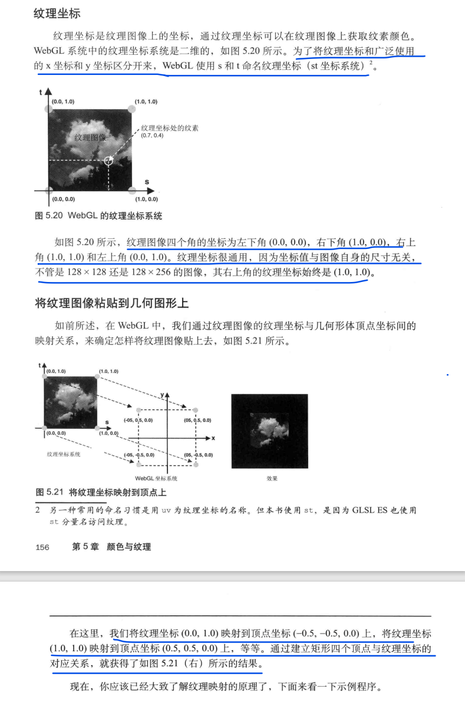

# 进入 WebGL 三维基础

人在观察物体时集中到一点向外扩散，最后形成一个面。

<!-- more -->

## 纹理

### 纹理图像（纹理）

照片称为纹理图像（纹理）

### 纹素

照片中的每一个像素称为纹素

### 纹理坐标

纹理坐标是纹理图像上的坐标

==注意：WebGL 为了区分使用 x 和 y 坐标体系，采用 s(x) 和 t(y) 坐标体系命名纹理坐标(uv 也可以)==

## 类型化数组

##

## 视图矩阵

### 定义

视图矩阵可以表示观察者的状态，含有观察者的视点、观察目标点、上方向等信息

### 观察者的视点

观察者所在的三维空间中位置，视线的起点。

### 观察目标点

被观察目标所在的点。

### 上方向

最终绘制在屏幕上的影像中的向上的方向。

## 模型矩阵

### 模型视图矩阵

模型视图矩阵=视图矩阵 X 模型矩阵

## 可视空间

- 长方形可视空间，也称盒状空间，由==正射投影（正射投影矩阵）==产生。

- 四棱锥/金字塔可视空间，由==透视投影（透视投影矩阵）==产生。

### 公式

模型视图矩阵=视图矩阵 X 模型矩阵

顶点坐标=视图矩阵 X 模型矩阵 X 原始顶点坐标

顶点坐标=模型视图矩阵 X 原始顶点坐标

顶点坐标=正射投影矩阵 X 模型视图矩阵 X 原始顶点坐标

顶点坐标=透视投影矩阵 X 模型视图矩阵 X 原始顶点坐标

顶点坐标=正射投影矩阵 X 视图矩阵 X 模型矩阵 X 原始顶点坐标

顶点坐标=透视投影矩阵 X 视图矩阵 X 模型矩阵 X 原始顶点坐标

### 模型视图投影矩阵

模型视图投影矩阵=正射投影矩阵 X 视图矩阵 X 模型矩阵

模型视图投影矩阵=透视投影矩阵 X 视图矩阵 X 模型矩阵

## 影藏面消除

帮我们消除那些被遮挡的表面（隐藏面），实现正确的绘制。

### 深度缓存区（Z 缓存区）

深度缓存区是一个中间对象，其作用就是帮助 WebGL 进行隐藏面消除

## 深度冲突

### 定义

当几何图形或物体的俩个表面极为接近时，就会出现新的问题，使得表面看上去斑斑驳驳的。这种现象被称为深度冲突。

### 原因

是因为俩个表面过于接近，深度缓存区有限的精度已经不能区分哪个在前，哪个在后了。严格地说，如果创建三维模型阶段就对顶点的深度值加以注意，是能避免深度冲突的。但是，当场景中有多个运动着的物体时，实现这一点几乎不可能的

### 解决

多边形偏移：该机制将自动在 Z 值加上一个偏移量，偏移量的值有物体表面相对于观察者视线的角度来确定的

## 通过顶点索引绘制物体

## 光照

光照射物体上时，发生的俩种重要的现象

- 根据光源和光线方向，物体不同表面的命案程度变的不一致。

- 根据光源和光线方向，物体向地面投下了影子。

### 光照类型

### 反射类型（颜色）

### 点积

### 平行光下的漫反射

### 环境光下的漫反射

==这一节是在上一节的平行光下的漫反射下+环境光下的漫反射实现的==

表面的反色光颜色=环境光下的漫反射+平行光下的漫反射=入射光颜色*表面基地色+入射光颜色*表面基地色\*cosO

### 运动物体的光照效果

==逆转置矩阵==

### 点光源

==逐顶点：更逼真==

