# WebGL 必须掌握的 API（暂时不讨论 WebGL2.0 只列出）

<!-- more -->

## 设置背景色 gl.clearColor()

在清空绘图区之前需要设置背景色。一旦指定了背景色后，背景色就会驻存在 WebGL 系统中，在下次调用 gl.clearColor()方法前不会改变

```
函数功能：指定绘图区域的背景色
-----------------------------------------------------------
调用示例：gl.clearColor(red, green, blue, alpha)
-----------------------------------------------------------
参数
			red		指定红色值（从0.0到1.0）
			green	指定绿色值（从0.0到1.0）
			blue	指定蓝色值（从0.0到1.0）
			alpha	指定透明度值（从0.0到1.0）
			小于0.0的值会被截断为0.0，大于1.0的值会被截断为1.0
-----------------------------------------------------------
返回值		无
-----------------------------------------------------------
错  误		无
```

## 清空绘图区 gl.clear()

清空绘图区实际上是清空颜色缓冲区，在 WebGL 中缓冲区有三类： 颜色缓冲区、深度缓冲区、模板缓冲区。

==同时清除俩个缓存区，可以使用按位或符号"|"。
例如 gl.clear(gl.COLOR_BUFFER_BIT|gl.DEPTH_BUFFER_BIT)==

```
函数功能：将指定缓冲区设置为预定的值-预定的值指的是gl.clearColor()设置的值
-----------------------------------------------------------------------------------
调用示例：gl.clear(buffer)
-----------------------------------------------------------------------------------
参数
			buffer					指定待清空的缓冲区，位操作位|可以用来指定多个缓冲区
			gl.COLOR_BUFFER_BIT		代表清空颜色缓冲区
			gl.DEPTH_BUFFER_BIT		代表清空深度缓冲区
			gl.STENCIL_BUFFER_BIT	代表清空模板缓冲区
-----------------------------------------------------------------------------------
返回值		无
-----------------------------------------------------------------------------------
错  误		INVALID_VALUE			缓冲区不是以上三种类型
```

如果没有指定背景色（没有调用 gl.clearColor()函数），直接调用 gl.clear(),那么使用的默认值如下所示

| 缓冲区名称 |        默认值        |                相关函数                |
| :--------: | :------------------: | :------------------------------------: |
| 颜色缓冲区 | (0.0, 0.0, 0.0, 0.0) | gl.clearColor(red, green, blue, alpha) |
| 深度缓冲区 |         1.0          |          gl.clearDepth(depth)          |
| 模板缓冲区 |          0           |           gl.clearStencil(s)           |

## 绘制操作 gl.drawArrays()

建立了着色器之后，我们就要进行绘制了，gl.drawArrays()是一个强大的函数，可以用来绘制各种图形，该函数的规范如下所示

```
函数功能：执行顶点着色器，按照mode参数指定的方式绘制图形
--------------------------------------------------------------------------
调用示例：gl.drawArrays(mode, first, count)
--------------------------------------------------------------------------
参数
			mode		指定绘制的方式，可以接收以下常量符号：
						  gl.POINTS,
              gl.LINES,gl.LINE_STRIP,gl.LINE_LOOP
						  gl.TRIANGLES,gl.TRIANGLE_STRIP,gl.TRIANGLE_FAN
			first		指定从哪个点开始绘制-整形数
			count		指定要绘制多少个顶点-整形数
--------------------------------------------------------------------------
返回值		无
--------------------------------------------------------------------------
错  误	  INVALID_ENUM			传入的mode参数不是指定参数
			    INVALID_VALUE			参数first或count是负数
```

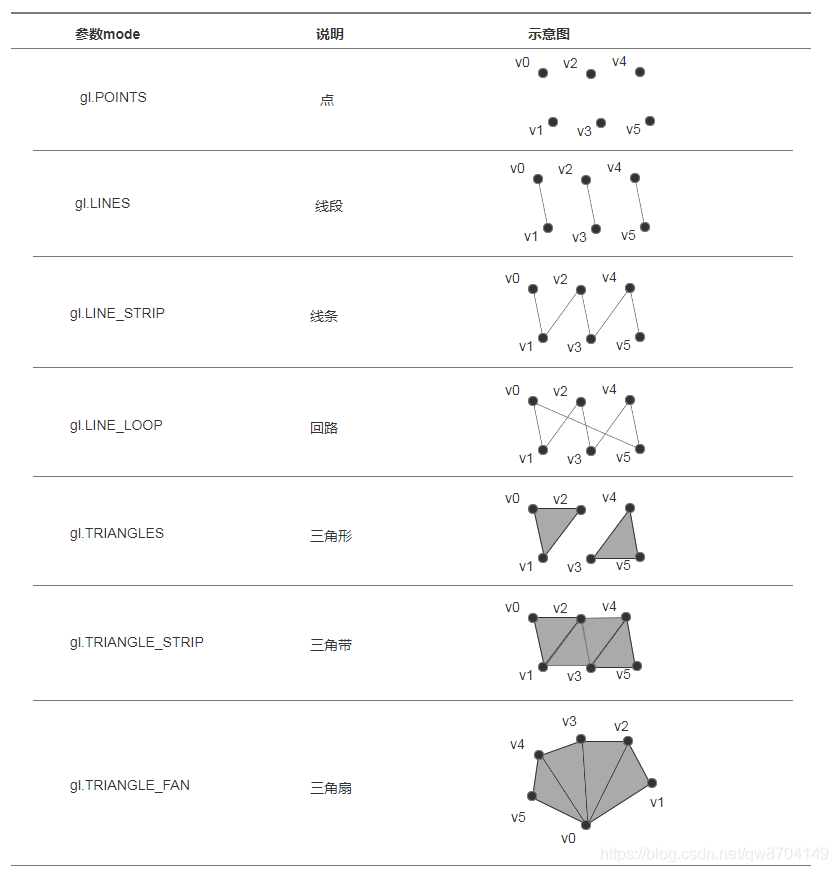

## 缓冲区对象（VBO）

==WebGL 系统 缓存区必须指定类型，类型不同功能也不同。存储的数量大小、类型等也会有差异==

==WebGL 系统 缓存区类型是有限的，在一个应用程序中可以同时使用多个不同类型，例如前期的 ARRAY_BUFFER，后期的 ELEMENT_ARRAY_BUFFER 同时使用==

### 创建、删除缓冲区对象 gl.createBuffer()，gl.deleteBuffer(buffer);

```js:no-line-numbers
const buffer = gl.createBuffer();

gl.deleteBuffer(buffer);
```

### 绑定缓冲区 gl.bindBuffer(type,buffer)

|   等级   |             type             |
| :------: | :--------------------------: |
| WebGL1.0 |       gl.ARRAY_BUFFER        |
| WebGL1.0 |   gl.ELEMENT_ARRAY_BUFFER    |
| WebGL2.0 |     gl.COPY_READ_BUFFER      |
| WebGL2.0 |     gl.COPY_WRITE_BUFFER     |
| WebGL2.0 | gl.TRANSFORM_FEEDBACK_BUFFER |
| WebGL2.0 |      gl.UNIFORM_BUFFER       |
| WebGL2.0 |     gl.PIXEL_PACK_BUFFER     |
| WebGL2.0 |    gl.PIXEL_UNPACK_BUFFER    |

补：获取缓存区绑定的数据参数${type}\_BINDING

```js:no-line-numbers
gl.getParameter(gl.ARRAY_BUFFER_BINDING);

gl.getParameter(gl.ELEMENT_ARRAY_BUFFER_BINDING);
```

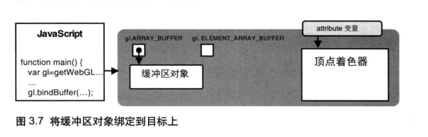

### 向目标类型缓冲区对象写入数据 gl.bufferData()

注意：

- 指定类型的缓存区
- 数据类型也是确认的

```js:no-line-numbers
// WebGL1
gl.bufferData(type, usage)
gl.bufferData(type, size, usage) // gl.bufferData(gl.ARRAY_BUFFER, 1024, gl.STATIC_DRAW);
gl.bufferData(type, srcData?, usage)【推荐】 // gl.bufferData(gl.ARRAY_BUFFER, 1024, gl.STATIC_DRAW);

// WebGL2
gl.bufferData(type, usage, srcOffset)
gl.bufferData(type, srcData?, usage, srcOffset)【推荐】
gl.bufferData(type, srcData?, usage, srcOffset, length?)


```

- size

设定 Buffer 对象的数据存储区大小。

- srcData 可选

一个 ArrayBuffer，SharedArrayBuffer 或者 ArrayBufferView 类型的数组对象，将被复制到 Buffer 的数据存储区。如果为 null，数据存储区仍会被创建，但是不会进行初始化和定义。

- srcOffset

指定读取缓冲时的初始元素索引偏移量。

- length 可选

默认为 0。

- type

|   等级   |             type             |
| :------: | :--------------------------: |
| WebGL1.0 |       gl.ARRAY_BUFFER        |
| WebGL1.0 |   gl.ELEMENT_ARRAY_BUFFER    |
| WebGL2.0 |     gl.COPY_READ_BUFFER      |
| WebGL2.0 |     gl.COPY_WRITE_BUFFER     |
| WebGL2.0 | gl.TRANSFORM_FEEDBACK_BUFFER |
| WebGL2.0 |      gl.UNIFORM_BUFFER       |
| WebGL2.0 |     gl.PIXEL_PACK_BUFFER     |
| WebGL2.0 |    gl.PIXEL_UNPACK_BUFFER    |

- usage

提示 WebGL 我们将怎么使用这些数据。WebGL 会根据提示做出一些优化。例如： gl.STATIC_DRAW 提示 WebGL 我们不会经常改变这些数据。

|   等级   |      usage      |                                      描述                                      |
| :------: | :-------------: | :----------------------------------------------------------------------------: |
| WebGL1.0 | gl.STATIC_DRAW  |    缓冲区的内容可能经常使用，而不会经常更改。内容被写入缓冲区，但不被读取。    |
| WebGL1.0 | gl.DYNAMIC_DRAW |    缓冲区的内容可能经常被使用，并且经常更改。内容被写入缓冲区，但不被读取。    |
| WebGL1.0 | gl.STREAM_DRAW  |          缓冲区的内容可能不会经常使用。内容被写入缓冲区，但不被读取。          |
| WebGL2.0 | gl.STATIC_READ  |     缓冲区的内容可能经常使用，而不会经常更改。内容从缓冲区读取，但不写入。     |
| WebGL2.0 | gl.DYNAMIC_READ |      缓冲区的内容可能经常使用，并且经常更改。内容从缓冲区读取，但不写入。      |
| WebGL2.0 | gl.STREAM_READ  |           缓冲区的内容可能不会经常使用。内容从缓冲区读取，但不写入。           |
| WebGL2.0 | gl.STATIC_COPY  | 缓冲区的内容可能经常使用，而不会经常更改。用户不会从缓冲区读取内容，也不写入。 |
| WebGL2.0 | gl.DYNAMIC_COPY |  缓冲区的内容可能经常使用，并且经常更改。用户不会从缓冲区读取内容，也不写入。  |
| WebGL2.0 | gl.STREAM_COPY  |       缓冲区的内容可能不会经常使用。用户不会从缓冲区读取内容，也不写入。       |

### 将缓冲区对象分配给 attribute 变量 gl.vertexAttribPointer()

```js:no-line-numbers
gl.vertexAttribPointer(location, size, type, normalized, stride, offset);
```

- location
- size

指定每个顶点属性的组成数量，必须是 1，2，3 或 4。如果 size 比 attribute 指定的分量少，则会采用

 <!-- [给 attribute 变量传值 gl.vertexAttrib3f()的同族函数补存规则进行补存](./4.md#给-attribute-变量传值-gl-vertexattrib3f-的同族函数)。 -->

- type

|   等级   |              type              |  类型化数组  |
| :------: | :----------------------------: | :----------: |
| WebGL1.0 |            gl.BYTE             |  Int8Array   |
| WebGL1.0 |        gl.UNSIGNED_BYTE        |  UInt8Array  |
| WebGL1.0 |            gl.SHORT            |  Int16Array  |
| WebGL1.0 |       gl.UNSIGNED_SHORT        | UInt16Array  |
| WebGL1.0 |             gl.INT             |  Int32Array  |
| WebGL1.0 |        gl.UNSIGNED_INT         | UInt32Array  |
| WebGL1.0 |            gl.FLOAT            | Float32Array |
| WebGL2.0 |         gl.HALF_FLOAT          |   暂无结论   |
| WebGL2.0 |     gl.INT_2_10_10_10_REV      |   暂无结论   |
| WebGL2.0 | gl.UNSIGNED_INT_2_10_10_10_REV |   暂无结论   |

- normalized

指定整数数据值在强制转换为浮点值时是否应规范化为某个范围。

对于类型 gl.BYTE 和 gl.SHORT，如果为 true，则将值规范化为[-1，1]。

对于类型 gl.UNSIGNED_BYTE 和 gl.UNSIGNED_SHORT，如果为 true，则将值规范化为[0，1]。

对于 gl.FLOAT 和 gl.HALF_FLOAT 类型，此参数无效。

- stride(案例看图)

单个顶点所有数据的字节数（以字节为单位），也就是相邻俩个顶点间的距离，即步进参数

- offset(案例看图)

指定缓存区对象的偏移量（以字节为单位），即 attribute 变量从缓存区中的何处开始存储。如果 从起始位置开始，该参数设置为 0

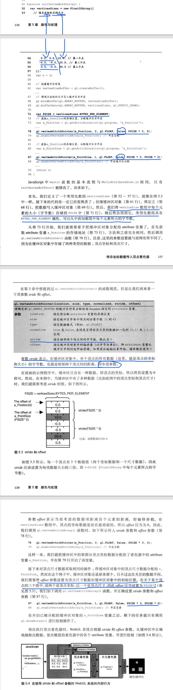

### 开启 attribute 变量 gl.enableVertexAttribArray()

```js:no-line-numbers
gl.enableVertexAttribArray(location);
```

## 内置变量

vec4 表示有 4 个 float 组成的矢量
vec2 表示有 2 个 float 组成的矢量

|   内置变量    |                含义                | 值数据类型 |
| :-----------: | :--------------------------------: | :--------: |
| gl_PointSize  | 点渲染模式，方形点区域渲染像素大小 |   float    |
|  gl_Position  |            顶点位置坐标            |    vec4    |
| gl_FragColor  |             片元颜色值             |    vec4    |
| gl_FragCoord  |         片元坐标，单位像素         |    vec2    |
| gl_PointCoord |      点渲染模式对应点像素坐标      |    vec2    |

## attribute 变量

- 只能出现在顶点着色器中，只能被声明为全局变量，被用来表示逐顶点的信息

  - 逐顶点：比如，如果线段有俩个顶点，这里俩个顶点坐标会传递个 attribute 变量。而线段上的其他点，比如中心点，虽然也被画出来，但他不是顶点，坐标未曾传递给 attribute 变量，也未曾被顶点着色器处理过。如果你想要让顶点着色器处理它，你就需要将它作为一个顶点添加到图形中来。

- attribute 变量的类型只能是 float、vec2、vec3、vec4、mat2、mat3 和 mat4.

- 数量限制：一个很模糊的概念（暂时没有搞懂）

### 获取 attribute 变量地址 gl.getAttribLocation()

==getAttribLocation(program, name)==

```js:no-line-numbers
attribute vec4 a_position;
void main() {
   gl_Position = a_position + u_offset;
}
==>>let a_Position=gl.getAttribLocation(program, "a_Position");
```

### 给 attribute 变量传值 gl.vertexAttrib3f()

```js:no-line-numbers


attribute vec4 a_position;
void main() {
   gl_Position = a_position + u_offset;
}
==>>let a_Position=gl.getAttribLocation(program, "a_Position");
==>>gl.getAttribLocation(a_Position,v0,v1,v2);
```

你可能已经注意到，a_position 变量是 vec4 类型的，但是 gl.getAttribLocation(a_Position,v0,v1,v2)传入了三个分量值（v0,v1,v2）而不是 4 个。实际上如果你省略了第 4 个参数，这个方法就会默认将第 4 个分量设置为 1.0

### 给 attribute 变量传值 gl.vertexAttrib3f()的同族函数

```js:no-line-numbers
gl.vertexAttrib1f(location, v0)
gl.vertexAttrib2f(location, v0, v1)
gl.vertexAttrib3f(location, v0, v1, v2)
gl.vertexAttrib4f(location, v0, v1, v2, v3)

gl.vertexAttrib1fv(location, value)
gl.vertexAttrib2fv(location, value)
gl.vertexAttrib3fv(location, value)
gl.vertexAttrib4fv(location, value)
```

gl.vertexAttrib1f(location, v0)仅传输一个值，这个值被填充到 attribute 变量的第一个分量中，第 2，3 个分量被设为 0.0.第四个分量将被设置为 1.0。类似的,gl.vertexAttrib2f(location, v0, v1)将填充俩个分量，第三个分量为 0.0，第 4 个分量为 1.0。gl.vertexAttrib4f(location, v0, v1, v2, v3)填充了所有四个分量。

你也可以使用这些方法的矢量版本，它们的名字以"V"结尾，并接受类型化数组作为参数。函数名中的数组表示数组中的元素个数。

## Uniforms 全局变量

- uniform 变量可以用在顶点着色器和片元着色器中，且必须是全局变量。

* 顶点着色器和片元着色器中声明了同名的 uniform 变量，那么它就会被这俩中着色器共享。

- 数量限制：一个很模糊的概念（暂时没有搞懂）

### 获取 uniform 变量地址 gl.getUniformLocation()

==getUniformLocation(program, name)==

```js:no-line-numbers
attribute vec4 a_position;
uniform vec4 u_offset;
void main() {
   gl_Position = a_position + u_offset;
}
==>>let a_Position=gl.getAttribLocation(program, "a_Position");
==>>let u_offset=gl.getUniformLocation(program, "u_offset");

```

### 向 uniform 变量传值 gl.uniform4f()

```js:no-line-numbers
attribute vec4 a_position;
uniform vec4 u_offset;
void main() {
   gl_Position = a_position + u_offset;
}
==>>let a_Position=gl.getAttribLocation(program, "a_Position");
==>>let u_offset=gl.getUniformLocation(program, "u_offset");
==>>gl.uniform4f(u_offset,v0,v1,v2,v3);
```

### 向 uniform 变量传值 gl.uniform4f()的同族函数

```js:no-line-numbers
uniform1f(location, v0)
uniform1fv(location, value)
uniform1i(location, v0)
uniform1iv(location, value)

uniform2f(location, v0, v1)
uniform2fv(location, value)
uniform2i(location, v0, v1)
uniform2iv(location, value)

uniform3f(location, v0, v1, v2)
uniform3fv(location, value)
uniform3i(location, v0, v1, v2)
uniform3iv(location, value)

uniform4f(location, v0, v1, v2, v3)
uniform4fv(location, value)
uniform4i(location, v0, v1, v2, v3)
uniform4iv(location, value)
```

==同 attribute 变量传值 gl.vertexAttrib3f()的同族函数说明==

## varying 变量使用

- 在 WebGL 中，如果顶点着色器与片元着色器中有类型和命名都相同的 varying 变量，那么顶点着色器赋给该变量的值就会被自动地传入片元着色器。

```js:no-line-numbers
attribute vec2 a_texCoord;
varying vec2 v_texCoord;
void main() {
   // 将纹理坐标传给片段着色器
   // GPU会在点之间进行插值
   v_texCoord = a_texCoord;
}
precision mediump float;
// 纹理
uniform sampler2D u_image;
// 从顶点着色器传入的纹理坐标
varying vec2 v_texCoord;
void main() {
   // 在纹理上寻找对应颜色值
   gl_FragColor = texture2D(u_image, v_texCoord);
}
```

- varying 变量只能 float（以及相关的 vec2、vec3、vec4，mat2、mat3 和 mat4）类型

## 向 4\*4 矩阵传值 gl.uniformMatrix4fv()

```js:no-line-numbers
调用示例：gl.uniformMatrix4fv(location, transpose, array)
----------------------------------------------------------------------------------
函数功能：将array表示的4*4矩阵分配给由location指定的uniform变量
----------------------------------------------------------------------------------
参数
			location			uniform变量的存储地址
			transpose			在WebGL中必须指定为false
			array				待传输的类型化数组，4*4矩阵按列主序

----------------------------------------------------------------------------------
返回值		无
----------------------------------------------------------------------------------
错误		INVALID_OPERATION	不存在当前程序对象
			INVALID_VALUE		transpose不为false，或者数组的长度小于16
————————————————
```

## 纹理对象使用

### 补（纹理坐标）

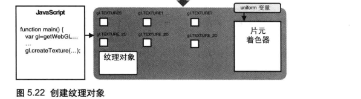

### 创建、删除纹理对象 gl.createTexture()、gl.deleteTexture()

==类似创建缓存区方法，只是创建一片内存区域等待类型绑定==

```js:no-line-numbers
var canvas = document.getElementById('canvas');
var gl = canvas.getContext('webgl');
var texture = gl.createTexture();
gl.deleteTexture(texture);
```


### 处理加载的纹理图像 gl.pixelStorei()

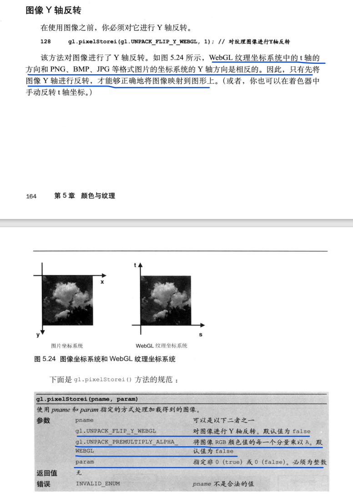

### 激活纹理单元 gl.activeTexture()

==全局变量默认为 0 所以 u_image 默认使用纹理单元 0 。 纹理单元 0 默认为当前活跃纹理，所以调用 bindTexture 会将纹理绑定到单元 0 。==

==所有支持 WebGL 的环境，在片段着色器中至少有 8 个纹理单元，顶点着色器中可以是 0 个。 所以如果你使用超过 8 个纹理单元就应该调用 gl.getParameter(gl.MAX_TEXTURE_IMAGE_UNITS) 查看单元个数，或者调用 gl.getParameter(gl.MAX_VERTEX_TEXTURE_IMAGE_UNITS) 查看顶点着色器中可以用几个纹理单元。超过 99% 的机器在顶点着色器中至少有 4 个纹理单元。==

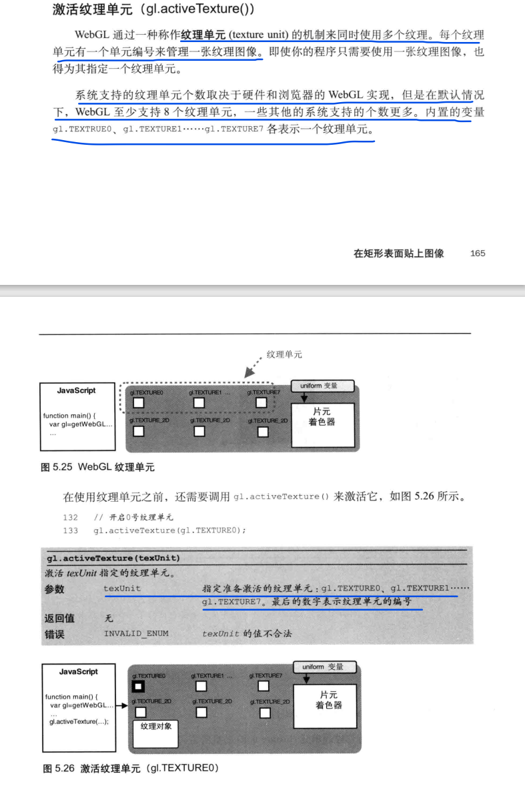

### 绑定纹理对象 gl.bindTexture()


### 设置纹理填充方式 gl.texParameteri()

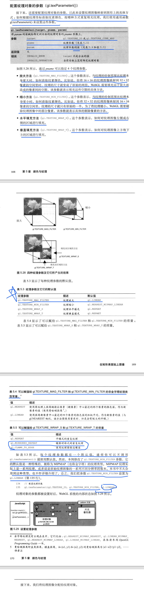

### 纹理图像分配 gl.texImage2D()

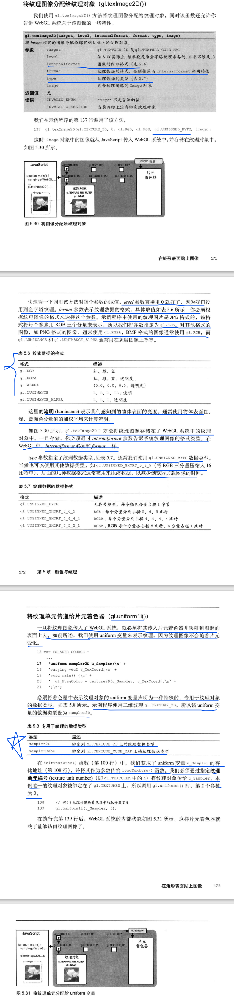

### 内置函数 texture2D()

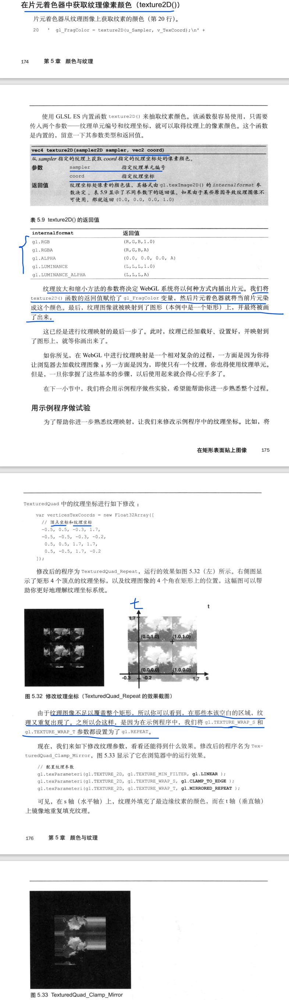

### 多副纹理

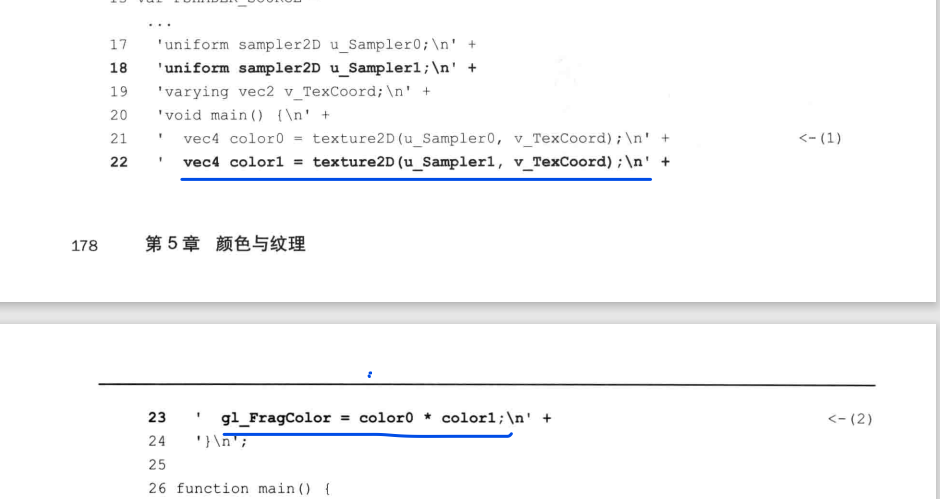

### 注意

[为什么 u_image 没有设置还能正常运行？](https://webglfundamentals.org/webgl/lessons/zh_cn/webgl-image-processing.html)

## 隐藏面消除

这个功能会帮助我们消除那些被遮挡得到表面（隐藏面），你可以放心地绘制场景而不必顾及个物体在缓存区中的顺序，因为那些远处的物体会自动被近处的物体遮挡，不会被绘制出来。

==应当注意的是，隐藏面的消除前提是正确设置可是空间，否则就可能产生错误的结果。不管是盒状的正射投影空间，还是金字塔状的透视投影空间，你必须使用一个==

- 开启隐藏面消除 gl.enable()

```js:no-line-numbers
函数功能：开启cap表示的功能
-----------------------------------------------------------------------------------
调用示例：gl.enable(cap)
-----------------------------------------------------------------------------------
参数
			cap						指定需要开启的功能，可以是以下几个
			gl.DEPTH_TEST			隐藏面消除
			gl.BLEND				混合
			gl.POLYGON_OFFSET_FILL	多边形位移

-----------------------------------------------------------------------------------
返回值		无
-----------------------------------------------------------------------------------
错误		INVALID_ENUM			cap的值无效
```

- 关闭隐藏面消除 gl.disable()

```js:no-line-numbers
函数功能：关闭cap表示的功能
-----------------------------------------------------------------------------------
调用示例：gl.disable(cap)
-----------------------------------------------------------------------------------
参数
			cap						指定需要开启的功能，可以是以下几个
			gl.DEPTH_TEST			隐藏面消除
			gl.BLEND				混合
			gl.POLYGON_OFFSET_FILL	多边形位移

-----------------------------------------------------------------------------------
返回值		无
-----------------------------------------------------------------------------------
错误		INVALID_ENUM			cap的值无效

```

### 步骤

- 开启隐藏面消除功能

```js:no-line-numbers
gl.enable(gl.DEPTH_TEST)
```

- 在绘制之前，清除深度缓存区

```js:no-line-numbers
gl.clear(gl.COLOR_BUFFER_BIT|gl.DEPTH_BUFFER_BIT)
```

## 深度冲突

因为俩个表面过于接近，深度缓存区有限的精度已经不能区分哪个在前，哪个在后了。

## 解决深度冲突设置多边形偏移 gl.polygonOffset()

```js:no-line-numbers
函数功能：指定加到每个顶点绘制后Z值上的偏移量，偏移量按照公式 m*factor+r*units计算，其中
m表示顶点所在表面相对于视线的角度，r表示硬件能够区分两个Z值之差的最小值
-----------------------------------------------------------------------------------
调用示例：gl.polygonOffset(factor, units)
-----------------------------------------------------------------------------------
参数
			factor		指定每个多边形的可变深度偏移的比例因子，默认0
			units		指定与顶点所在表面相对于视线的角度相乘的偏移乘数，默认0

--------------------------------------------------------------------------------
返回值		无
--------------------------------------------------------------------------------
错误		无
```

### 步骤

- 开启多边形偏移

```js:no-line-numbers
gl.enable(gl.POLYGON_OFFSET_FILL)
```

- 在绘制之前，清除深度缓存区

```js:no-line-numbers
gl.polygonOffset(factor, units)
```

## Matrix4 对象的方法和属性

这里我们介绍一下 cuon-matrix.js 中的 Matrix4 对象的图形变换相关方法和属性

|                           方法/属性名称                           |                                                                    描述                                                                    |
| :---------------------------------------------------------------: | :----------------------------------------------------------------------------------------------------------------------------------------: |
|                       Matrix4.setIdentity()                       |                                                      将 Matrix4 实例初始化为单位矩阵                                                       |
|                    Matrix4.setTranslate(x,y,z)                    |                            将 Matrix4 实例设置为平移矩阵，参数 x，y，z 分别代表在 X 轴，Y 轴，Z 轴上平移的距离                             |
|                  Matrix4.setRotate(angle,x,y,z)                   |                                     将 Matrix4 实例设置为旋转矩阵，旋转的角度为 angle，旋转轴为(x,y,z)                                     |
|                      Matrix4.setScale(x,y,z)                      |                                     将 Matrix4 实例设置为缩放矩阵，在三个轴上的缩放因子分别是 x，y，z                                      |
|                     Matrix4.translate(x,y,z)                      |          将 Matrix4 实例乘以一个平移矩阵，该平移矩阵在 X 轴上平移 x，Y 轴上平移 y，Z 轴上平移 z，相乘的结果还是储存在 Matrix4 中           |
|                    Matrix4.rotate(angle,x,y,z)                    |              将 Matrix4 实例乘以一个旋转矩阵，该旋转矩阵旋转的角度为 angle，旋转轴为(x,y,z)，相乘的结果还是储存在 Matrix4 中               |
|                       Matrix4.scale(x,y,z)                        |              将 Matrix4 实例乘以一个缩放矩阵，该缩放矩阵在三个轴上的缩放因子分别是 x，y，z 。相乘的结果还是储存在 Matrix4 中               |
|                          Matrix4.set(m)                           |                                            将 Matrix4 实例设置为 m，m 必须也是一个 Matrix4 实例                                            |
|                         Matrix4.elements                          |                                保存了 Matrix4 实例的矩阵元素的类型化数组，该类型化数组的种类为 Float32Array                                |
| Matrix4.setLookAt(eyeX, eyeY, eyeZ, atX, atY, atZ, upX, upY, upZ) | 根据视点（eyeX, eyeY, eyeZ）、观察点（atX, atY, atZ）、上方向（upX, upY, upZ）创建视图矩阵，视图矩阵的类型是 Matrix4，观察点映射到的中心点 |
|       Matrix4.setOrtho(left, right, bottom, top, near, far)       |                                        根据参数 top、bottom、left、right、near、far 计算正投影矩阵                                         |
|          Matrix4.setPerspective(fov, aspect, near, far)           |                                              根据参数 fov, aspect, near, far 计算透视投影矩阵                                              |
|                      Matrix4.setInverseOf(m)                      |                                                         使自身称为矩阵 m 的逆矩阵                                                          |
|                        Matrix4.transpose()                        |                                               对自身进行转置操作，并将自身设置为转置后的结果                                               |

从上表中发现，包含 set 前缀的方法会更加参数计算出变换矩阵，并将该矩阵写入到自身中，即你可以通过 Matrix4.elements 获取该矩阵的内容，而不包含 set 前缀的方法，会先根据参数计算出变换矩阵，然后将自身和得到的变换矩阵相乘，最后把相乘后的矩阵写入到自身中，也就是说如果你需要对一个图形进行复合变换需要使用没有 set 前缀的方法。

## gl.drawElements()

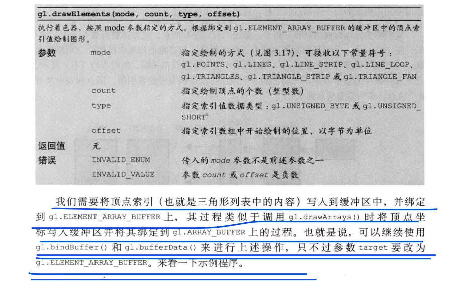

## gl.readPixels()

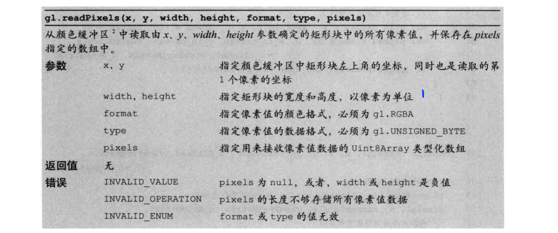

## 参考链接

- [点燃火柴](https://blog.csdn.net/qw8704149/article/details/115152067)
