# GLSL

<!-- more -->

## 基本类型和基本类型间转换

- int
- float
- bool

==如果等号左侧与右侧的值类型不一致，就会出差错==

## 矢量和矩阵

### 赋值

==赋值运算符左右俩边的变量/值得类型必须一致，左右俩边得(矢量或矩阵的)元素个数必须相同。==

### 矢量构造函数

==参数个数不止 1 个时，矢量数大于参数数，出现异常==

### 矩阵构造函数

==主序排序（行是列，列是行）==

==参数个数不止 1 个时，矩阵数大于参数数，出现异常==

## 访问元素

### 矢量访问

==混合==

### 矩阵访问

## 精度限定符

==在很多程序中，大多是在片元着色器中对 float 类型做出限定。这是因为，对于其他类型，着色器以实现默认的精度，只有片元着色器中 float 类型没有默认精度。==

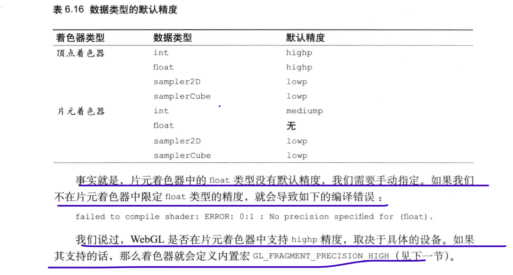

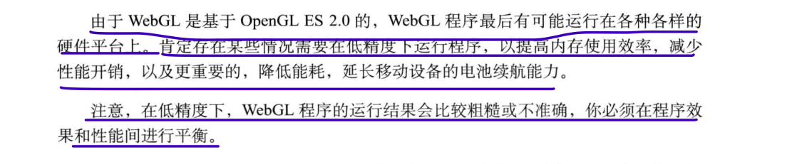

### 精度限定符规则

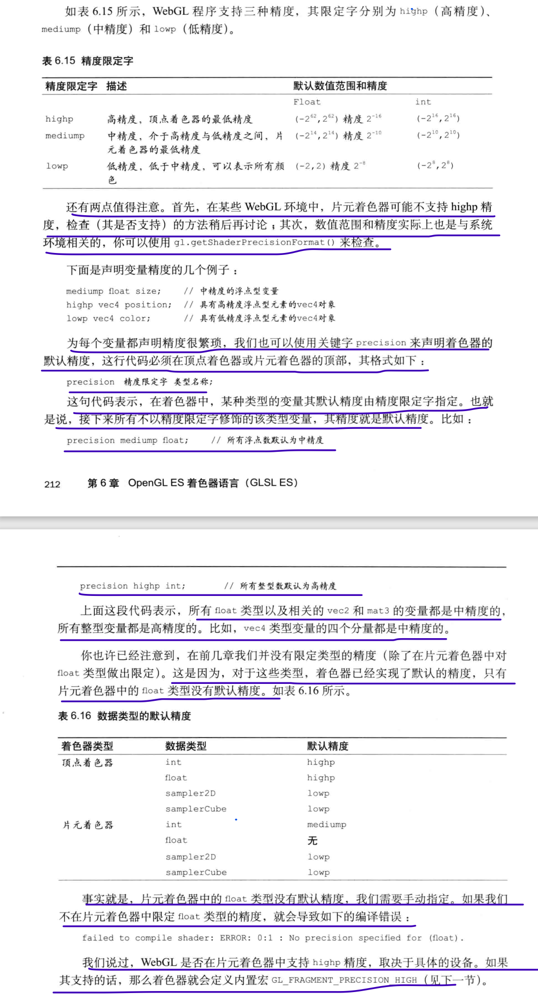

### 检查是否支持

### 获取系统支持的数值范围和精度

## 预处理指令

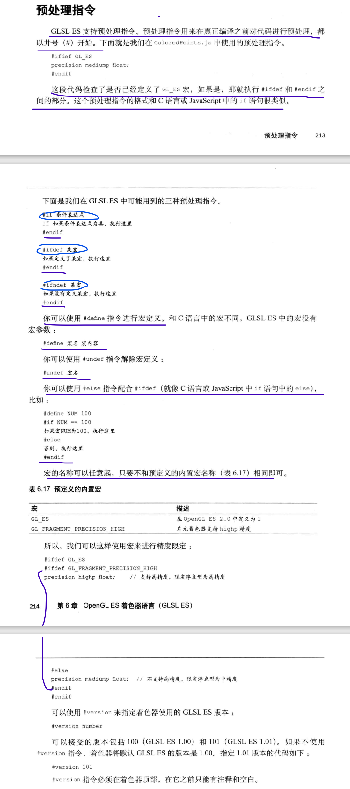

## 运算符

==注意，对于矢量和矩阵，只可使用比较运算符中的\==和!=，不可使用>、<、>=和<=。如果比较矢量和矩阵的大小，应该使用内置函数，比如 lessThan()等==

==注意，对于\==，如果俩个操作数的每一个分量都相同，那么返回 true；对于!=，如果俩个操作数的任何一个分量不同，则返回 true[1]==

### 矢量运算

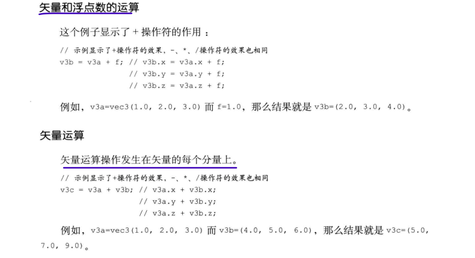

### 矩阵运算

==不论矩阵左乘还是右乘矢量都得矢量==

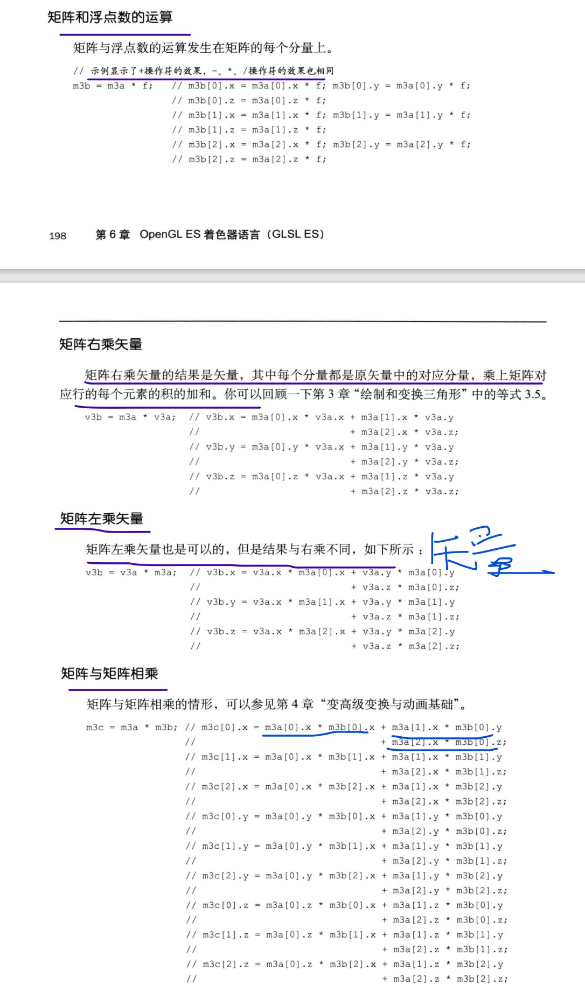

## 结构体赋值、构造、访问、运算符

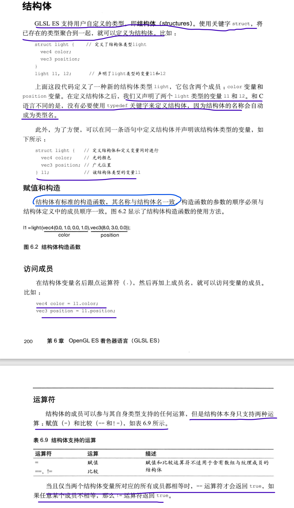

## 取样器（纹理）

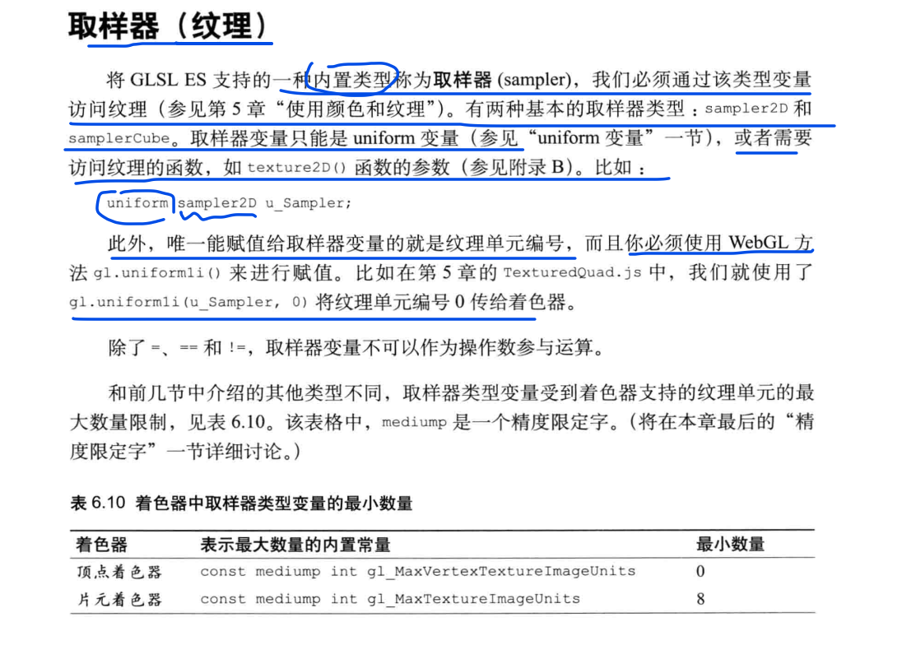

## 变量和存储限定符

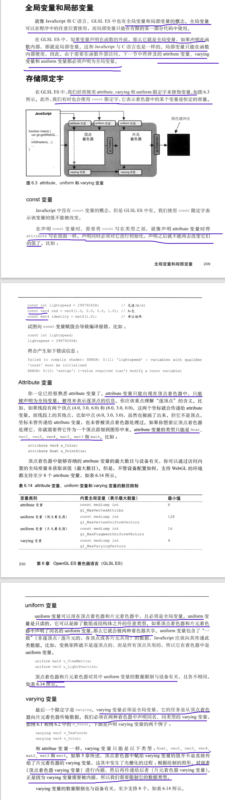

## 函数

==只能函数返回类型或者 void，参数要指明类型==

### 内置函数

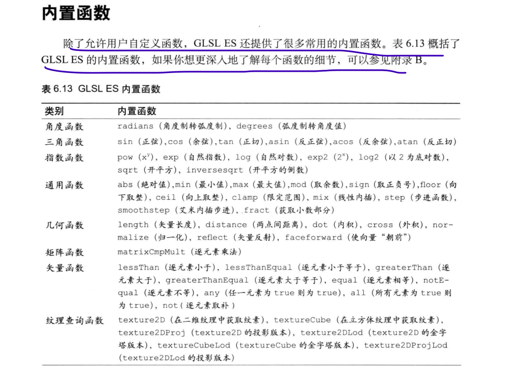

## 运算符

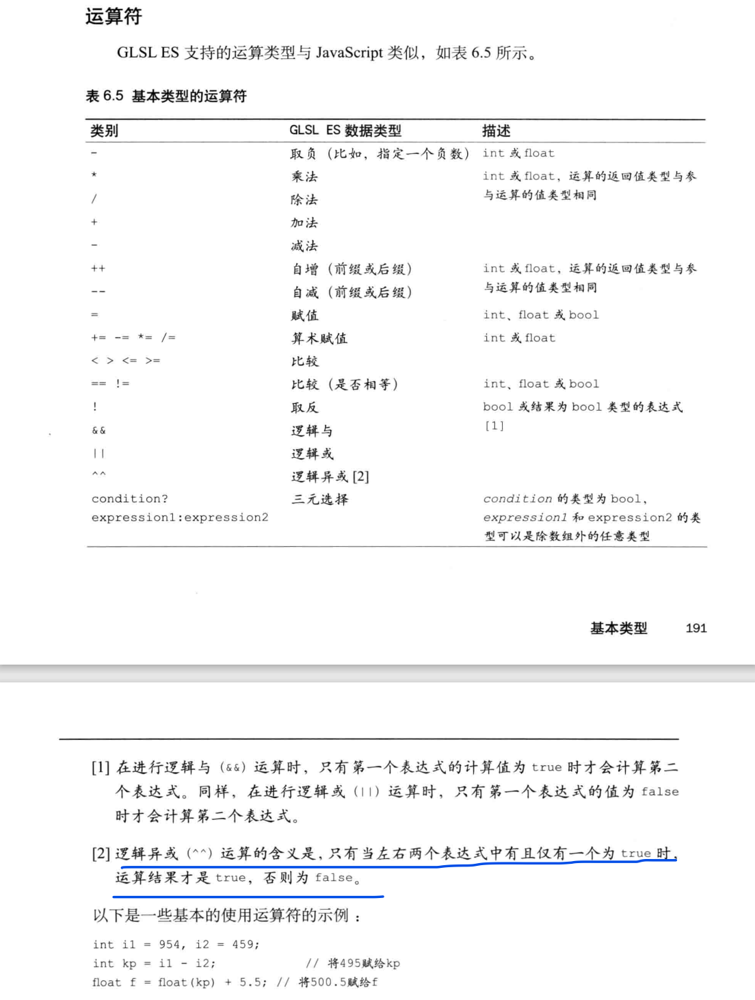

## 流程程序

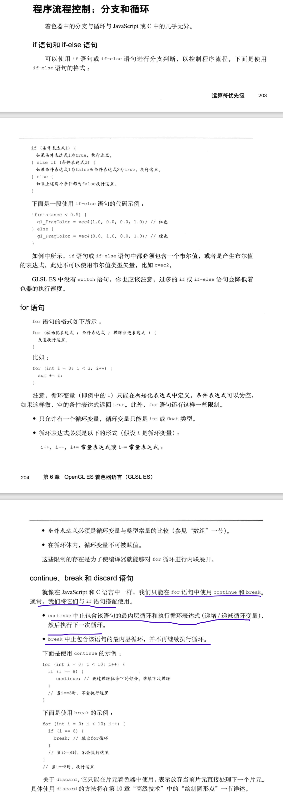
